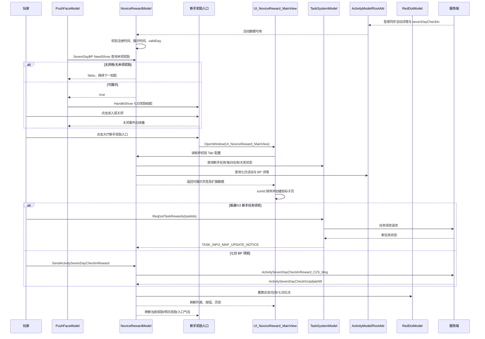

# LetsGo 客户端学习指导：活动模板、换皮、新手奖励系统、拍脸系统全链路

## 文档信息

| 项目 | 内容 |
|---|---|
| 文档名称 | 客户端学习指导：活动模板、换皮、新手奖励系统、拍脸系统全链路 |
| 面向对象 | 初入 LetsGo 项目的客户端开发新人；需要承担主题活动、活动换皮、新手奖励或拍脸接入的开发同学 |
| 文档性质 | 独立学习交付文档，不属于项目知识库，不作为正式设计规范替代品 |
| 当前版本 | v1.2，活动模板 iWiki 正文与源码交叉验证版 |
| 验证基线 | 当前工作区 `d:/LetsGoDevelop/LetsGo` 的可读 Lua、Proto 与资源文件；iWiki 活动模板首页及本文列出的子页 |
| 路径约定 | 本文所有源码路径均相对 `d:/LetsGoDevelop/LetsGo` 展示 |
| iWiki 授权状态 | 已通过 OAuth 授权访问 [活动资料首页](https://iwiki.woa.com/p/4025863003) |
| iWiki 读取状态 | **已于 2026-07-30 阅读首页、14 项活动的策划向/程序向子页及 [活动实例UMG与脚本对照整理](https://iwiki.woa.com/p/4026223343)**；首页正文为动态 `page_tree` 宏，具体规则来自逐页读取的子页正文 |
| 证据边界 | iWiki 证明文档口径，源码证明当前分支静态实现，运行时证明实际行为；三层证据分别记录，**iWiki 已读不等同于运行实测** |

### 适用对象

阅读者应能完成基础 Lua 阅读，并了解 UMG 是界面资产、Lua View 是交互逻辑、Model 是状态与协议承接层。本文不要求读者已经熟悉整个活动系统，但要求所有结论最终落到“配置、协议、状态、UI、入口、资源、测试”七类证据上。

### 学习总目标

完成学习后，应具备以下能力：

1. 从需求反推活动模板，而不是先复制一个“看起来像”的活动。
2. 读懂活动中心配置、任务组、商城、跳转、协议数据和实例扩展之间的关系。
3. 判断一次需求属于 L1/L2/L3 换皮还是应当新建业务。
4. 读懂新手奖励主框架、新手任务、七日签到、七日 BP、入口推荐奖励、领奖状态和红点刷新。
5. 把活动或新手奖励拍脸接入统一仲裁链，能解释候选、过滤、排序、互斥、频控及关闭续播。
6. 能完成“新手奖励配置 + 任务/活动数据 + Model + View/UMG + 入口 + 红点 + 拍脸”的端到端联调和发布验收。
7. 能用本文模板向导师或 AI 汇报：读了什么、验证了什么、还缺什么证据、下一步做什么。

### 资料状态与证据等级

| 标记 | 含义 | 使用方式 |
|---|---|---|
| **iWiki 已确认** | 2026-07-30 读取的页面正文明确陈述 | 作为配置/开发文档口径；若与源码冲突，进入差异校准，不直接判定运行结果 |
| **源码已验证** | 当前工作区文本源码或 Proto 可直接证明 | 可作为当前分支静态实现说明，仍需留意分支变化 |
| **资源已定位** | `.uasset` 路径已定位，但无法在文本环境解析蓝图内部结构 | 需在编辑器核对控件、动画与绑定 |
| **运行时未验证** | iWiki 与/或源码已有静态证据，但尚无日志、抓包、编辑器或真机结果 | 不得写成线上实测结论 |
| **未确认** | iWiki 正文、当前源码或可读资源仍无法闭环 | 明确列出缺口，禁止推测 |

---

## 目录

1. [全局学习地图](#一全局学习地图)
2. [学习前置](#二学习前置)
3. [固定九步学习法](#三每个主题固定九步学习法)
4. [活动公共框架](#四活动公共框架)
5. [活动模板逐项学习](#五活动模板逐项学习)
6. [换皮分级与案例](#六换皮分级与案例)
7. [新手奖励系统](#七新手奖励系统)
8. [拍脸系统](#八拍脸系统)
9. [四系统交叉链路与冲突矩阵](#九四系统交叉链路与冲突矩阵)
10. [模板选型决策树](#十模板选型决策树)
11. [六周计划与四周压缩版](#十一六周计划)
12. [学习与工程记录模板](#十二学习与工程记录模板)
13. [向 AI 与导师汇报模板](#十三汇报模板)
14. [最终结业任务与评分](#十四最终结业任务)
15. [iWiki 阅读状态与差异校准](#十五iwiki-阅读状态与差异校准)
16. [附录](#十六附录)

---

# 一、全局学习地图

## 1.1 一条主链

```text
需求
  → 模板选型
  → 活动/任务/商城/跳转等配置
  → 请求、通知与服务端时间
  → Model 缓存和状态归一化
  → 公共模板 View
  → 活动实例 View（差异化逻辑）
  → UMG 控件、动画与资源
  → 活动入口与 Pak/Chunk 就绪
  → 新手奖励入口、页签、任务与七日奖励
  → 红点聚合与消除
  → 首次/回流拍脸仲裁
  → 客户端—配置—服务端联调
  → 测试矩阵
  → Pak、配置、协议、版本发布
```

## 1.2 每一段必须回答的问题

| 环节 | 必答问题 | 证据 |
|---|---|---|
| 需求 | 核心循环是什么？奖励、期限、入口和首次触达是什么？ | 需求文档、验收用例 |
| 模板选型 | 哪个模板覆盖 80% 以上流程？哪些差异必须放实例层？ | 模板源码、代表实例 |
| 配置 | 主键、时间、任务组、商城、跳转、扩展字段如何解释？ | Proto、配置导出、实例读取代码 |
| 协议 | 谁发请求、谁收通知、失败如何恢复？ | Model、事件、抓包/日志 |
| Model | 状态源是 RootAttr、活动详情、任务系统还是本地缓存？ | Model 与状态字段 |
| 模板 View | 模板规定了哪些生命周期、控件命名和事件？ | `Public/Template/View` |
| 实例 View | 改了哪些流程、控件、配置解释和 Model？ | `Instance/*` / `HistoryActivity/*` |
| UMG | Lua 字段是否存在？动画/可见性/点击区是否正确？ | `.uasset` + 编辑器 |
| 入口/Pak | 入口在何时可见？Pak 未就绪时谁拦截？ | Activity ViewMgr、PakDownloadModel |
| 红点 | 数据源、聚合、刷新、消除、跨天各是什么？ | RedDotModel、任务/活动事件 |
| 新手奖励 | 页签如何开放？普通任务、七日免费/付费奖励如何领取并收口？ | NoviceRewardModel、任务系统、七日活动详情 |
| 拍脸 | 场景、候选、过滤、排序、频控、互斥和续播是什么？ | PushFace 主线 |
| 联调 | 配置、客户端、服务端和资源是否同版本？ | 联调清单 |
| 测试 | 正常、边界、异常、跨天、重登、弱网、低配是否覆盖？ | 测试矩阵 |
| 发布 | Pak/Chunk、配置生效、协议兼容、灰度与回滚如何做？ | 发布单；待 iWiki 补齐 |

---

# 二、学习前置

## 2.1 必读源码与验收问题

| 前置主题               | 源码路径                                                                                                         | 最小阅读范围                                             | 验收问题                                                      |
| ------------------ | ------------------------------------------------------------------------------------------------------------ | -------------------------------------------------- | --------------------------------------------------------- |
| BaseViewClass      | `Content/LetsGo/Script/Core/Class/BaseViewClass.lua`                                                         | 生命周期、`AddView`、事件/点击/Timer 清理                      | `OnOpen/OnShow/PreClose/OnClose` 各做什么？子 View 引用何时清？       |
| UIManager          | `Content/LetsGoSDK/Script/Core/UI/UIManager.lua`                                                             | Open/Close、可见性、默认层判断                               | 为什么拍脸前要判断“仅默认窗口”？窗口关闭如何触发续播？                              |
| EventManager       | `Content/LetsGo/Script/Core/Event/EventManager.lua`                                                          | 注册、派发、按对象反注册                                       | 同一事件重复注册如何避免？View 关闭后如何证明无泄漏？                             |
| TableHelperDeclare | `Content/LetsGo/Script/Config/TableHelperDeclare.lua`                                                        | `Loader:Declare`、`GetDataByKey`、自定义查询              | 为什么推荐按 Key 读而不推荐遍历全表？新表在哪里声明？                             |
| 活动 Proto           | `Plugins/MOE/GameFramework/GamePlugins/AI/AILabExporter/Source/AILabExporter/Public/proto/ResActivity.proto` | `ActivityMainConfig` 相关字段                          | `timeInfo`、`activityTaskGroup`、`activityShopType` 的类型是什么？ |
| 新手奖励配置             | `Content/LetsGo/Script/TableHelper/NoviceRewardConfTable.lua`                                                | Tab/Page/PageA/PageB/TaskXM/BigPrize/TaskMap/Extra | 注册时间、展示时间、个人有效期为何必须分开？三个任务组分别由谁消费？                        |
| 新手奖励 Model         | `Content/Feature/System/Script/Model/NoviceRewardModel.lua`                                                  | 页签开放、任务聚合、七日 BP、入口奖励、红点                            | 哪些状态来自任务系统，哪些来自 RootAttr 活动详情？                            |
| 拍脸 Proto           | `Plugins/MOE/GameFramework/GamePlugins/AI/AILabExporter/Source/AILabExporter/Public/proto/ResPushFace.proto` | `PushFaceData`                                     | `fequency` 三种值是什么？`sceneIds` 与 `sortId` 分别负责什么？           |
| Timer              | `Content/LetsGo/Script/Core/Timer/TimerManager.lua`                                                          | AddTimer/AddLoopTimer/RemoveTimer                  | View 关闭、跨天、切场景时 Timer 如何回收？倒计时为什么应用服务端时间？                 |
| 红点                 | `Content/LetsGo/Script/Model/RedDotModel.lua`                                                                | Update、类型聚合、入口刷新                                   | “可领取”与“可参与”红点是否同一语义？何时消点？                                 |
| Pak/Chunk          | `Content/Feature/System/Script/Model/Sundry/PakDownloadModel.lua`                                            | `CheckPakReady` 及模块资源就绪                            | 活动主界面打开前为什么必须检查 Pak？失败/下载中 UI 如何表现？                       |
| 服务端时间              | `Content/LetsGo/Script/Model/HeartBeatModel.lua`                                                             | `GetServerTime`                                    | 客户端本地时间跳变时，活动结束和频控是否仍正确？                                  |

## 2.2 前置自测

- [ ] 能画出 `UIManager → BaseViewClass → 子 View` 生命周期图。
- [ ] 能写出一个“注册事件—响应—关闭反注册”的伪代码。
- [ ] 能解释 `GetDataByKey` 与遍历全表的成本和维护差异。
- [ ] 能说明客户端本地时间不适合作为活动截止时间的原因。
- [ ] 能指出入口打开前 Pak 检查的实际源码位置。
- [ ] 能区分全局红点类型、局部控件红点和本地一次性提示。

---

# 三、每个主题固定九步学习法

无论学习一个活动模板、换皮案例、新手奖励模块还是拍脸项，都按以下九步，禁止只读 View：

1. **定边界**：一句话写出玩法或奖励模块的输入、核心循环、输出和终止条件。
2. **找入口**：定位活动 ID、新手奖励 `systemId/uiName` 或 PushFace ID 从哪里进入。
3. **查配置**：列出主配置、扩展配置、任务组、商城、跳转和时间字段。
4. **追数据**：从协议/RootAttr/任务系统追到 Model 缓存和事件。
5. **读模板**：记录模板提供的生命周期、默认行为、控件契约。
6. **比实例**：对照代表实例，区分“继承复用”“覆盖扩展”“复制遗留”。
7. **验 UMG/资源**：核对控件名、动画、资源引用、Pak/Chunk；文本环境无法解析处标记验证。
8. **跑场景**：至少覆盖首次、重复、领奖、倒计时结束、跨天、重登、弱网、资源未就绪。
9. **做输出**：提交一页链路图、字段表、事件表、状态机、测试证据和未决项。

**完成定义**：九步中每步 1 分；达到 8/9 且第 3、4、8 步不得缺失，才算该主题“已掌握”。

---

# 四、活动公共框架

## 4.1 三个核心文件

### 4.1.1 `ActivityModel_ViewMgr.lua`

路径：`Content/Feature/System/Script/System/Activity/Public/Model/ActivityModel_ViewMgr.lua`

职责（源码已验证）：

- 统一组装打开参数；按活动 ID、一级页签、二级页签分发。
- `OpenMainView` 是唯一直接打开 `UI_Events_Main` 的集中方法。
- 打开前调用 `PakDownloadModel:CheckPakReady(UI_Events_Main, callback)`。
- 通过 `ActivityModel_JumpFirstTag`、`ActivityModel_JumpSecondTag` 事件切页。
- 打开优先级为 `jumpActivityId > SelectOneTabId > 默认活动`。
- 可在 ABTest 选择后再决定首个活动或指定活动。

新人验收：能够从“大厅活动入口点击”追到 `OpenMainView`，并说明 Pak 未就绪时为何不会立即 OpenWindow。

### 4.1.2 `ActivityModelPath.lua`

路径：`Content/Feature/System/Script/System/Activity/Public/ActivityModelPath.lua`

职责（源码已验证）：

- 以 `Model 名 → require 路径` 建立活动子 Model 注册映射。
- 当前可见映射包括 `UI_ActivityInstance_DrawLinear_Model`、`UI_ActivityInstance_NationalDayLottery_Model`、`Activity_Instance_WerewolfAnswerNew_Model` 等。
- 新活动需要独立状态和协议时，必须确认 Model 是否在此类注册链中可被加载；本批已读程序向子页未给出统一注册 SOP，仍需结合目标实例源码和模块 Owner 规范确认。

### 4.1.3 `ActivityTable.lua`

路径：`Content/LetsGo/Script/TableHelper/ActivityTable.lua`

职责（源码已验证）：

- 由 `ResActivity.proto`/配置产物生成的 TableHelper。
- 合并多个 `ActivityMainConfigForLetsGo_*` 分表，提供 `GetActivityMainConfig`、`GetActivityMainConfigById`。
- 包含大量活动专项查询函数；实例应优先复用已有查询，不在 View 重复遍历全表。
- 自动生成区不可手工修改；自定义查询应遵循工程生成与 Custom Code 规则。

## 4.2 活动主配置字段解释

> 原则：Proto 只证明类型与通用注释；数组下标和扩展字段的业务语义必须以**具体模板/实例读取代码**为准。

| 字段 | 当前可确认含义 | 证据/注意事项 |
|---|---|---|
| `activityTaskGroup` | 活动关联任务组数组 | Proto 为 `repeated int32`。不同模板下标完全不同：如 ReserveWatchShare 新规则 `[进度,预约,分享,观赛...]`；VoteTask 把最后一组当进度组。 |
| `activityParam` | 活动扩展整数参数 | Proto 为 `repeated int32`。iWiki 子页确认 TreasureExchange `[1]=MallId/[2]=探宝铲ID/[3]=暴击类型`，DrawLinear `[1]=代币ID/[2]=单次消耗`，CountDown `[1]=开始偏移天数`，WerewolfAnswerNew `[2]=代币ID`；NationalDayLottery/SpringFestival 源码读取 `[1]` 为保底/多抽次数。**不得跨实例套用。** |
| `clientParams` | 客户端显示扩展字符串数组 | Proto 为 `repeated string`。已确认示例：LotteryBuff `[1]=入口CDN图`，TreasureExchange `[1]=大奖预览商品/[2]=首次分享任务`，CountDown `[1]=自定义标题`，WerewolfAnswerNew 为页签名称数组；其他实例仍须逐页/逐代码确认。 |
| `activityShopType` | 商城/兑换配置数组 | Proto 注释为“商城配置”。ExchangeTask 取 `[1]` 作为 MallId；QingMing 同样读取 `[1]`；WerewolfAnswerNew 文档以该字段配置兑换商城类型。仍应以实例为准。 |
| `moduleConfigs` | 活动模块组合/模块配置扩展 | WerewolfAnswerNew 子页确认 `type=AMT_Quiz` 且 `params[1]` 指向 `quizConfigId`；该语义不能推广到其他模块类型，其他实例继续按消费代码确认。 |
| `backgroundUrl` | 活动背景资源字符串数组 | Proto 为 `repeated string`；数组每项对应哪一层背景，**待具体实例/UMG 验证**。 |
| `timeInfo` | 活动时间结构 | Proto 类型为 `ActivityTimeData`；实例通常读取 `startTime/endTime.seconds`，活动判断应用服务端时间。 |
| `taskGroupsDrawBase` | 与抽取/分享/进度等相关的扩展任务组 | CountDown 读取 `[1]` 为分享/订阅任务组、`[2]` 为进度任务组；WerewolfAnswerNew 读取 `[1]` 为分享组。字段总体语义需以实例读取为准。 |
| `jumpId` | 通用跳转配置 ID | Proto 为 `int64`；交由跳转系统处理。ReserveWatchShare 还有源码默认直播跳转 ID `10228`，实际配置覆盖规则待验证。 |

## 4.3 公共活动状态模型

```text
未开放 → 可见未开始 → 进行中 → 领奖期/结束态 → 下线
               │           │
               ├─任务刷新──┤
               ├─协议详情──┤
               ├─红点刷新──┤
               └─服务端时间校准
```

检查点：入口可见时间、玩法可操作时间、领奖截止时间可能不同，不能只用一个 `endTime` 推断全部规则；优先采用具体模板子页已给出的时间字段，正文未说明处继续由配置导出、模块 Owner 和运行结果闭环。

---

# 五、活动模板逐项学习

## 5.0 证据与阅读规则

本章按 [iWiki 活动资料首页](https://iwiki.woa.com/p/4025863003) 的目录顺序覆盖 14 项。首页正文是动态 `page_tree` 宏，规则来自 2026-07-30 逐页读取的策划向、程序向子页；源码路径和当前实现结论保留原有交叉验证价值。每项按 **iWiki 文档口径 / 当前分支源码 / 运行时** 三层理解：若正文与源码不一致，列入“差异/风险”，不静默覆盖；本章没有把静态阅读写成运行实测。

补充引用：[活动实例UMG与脚本对照整理](https://iwiki.woa.com/p/4026223343) 的 iWiki 正文只说明整理目的并提供[腾讯文档企业版表格外链](https://saas.docs.qq.com/sheet/DWkZ2Sk9WRG9NU2pHdXhRQXpr)，**没有内嵌表格正文**。本文不据此外链杜撰 UMG—脚本对照；下列控件和资产仅写入各模板子页正文或当前源码/资源已能确认的内容。

## 5.1 大富翁 GridWalking

- **模板/实例定位**：`UI_Activity_BaseView → UI_ActivityTemplate_GridWalkingView → UI_ActivityInstance_NationalMonopoly_MainView / UI_Activity_Arena_HeroMonopoly_SubView`；全民实例 Model 为 `Activity_Instance_NationalMonopolyModel`（`SystemSubModel`）。当前源码另见 `Instance/NationalMonopoly/`、Arena/FarmZillionaire 实例。
- **业务玩法**：在矩形环形棋盘消耗道具掷骰，逐格移动并触发普通、贵重、抽奖、累计宝藏、前进/跳转、双倍骰、如意骰等格子；步数、圈数、格子、抽奖和任务奖励并存。
- **策划配置**：`activityParam[1]`=圈数奖励中的大奖记录 ID；`clientParams` 配 Dice/Walk 音效；`ActivityMonopolyMainData.costItem={itemId,itemNum}`；格子表关键字段 `index/type/moveDir/baseRewards/forwardCfg.step/poolId/cumulativeRewards/cumulativeCountLimit`，其中 `index` 必须与 UMG 数字控件名一致；步数/圈数表分别用 `step/round` 阈值。`IsShowStepRewrard` 为源码既有拼写，禁止换皮时自行改名。
- **程序架构/Model/API/事件/协议**：Model 承接 `AGMTMonopolyRun`、`AGMTMonopolyReceiveGridReward`、`AGMTMonopolyReceiveStepReward{rewardId}`、`AGMTMonopolyReceiveRoundReward{rewardId}`；返回含 `monopolyActivityData` 与 `activityMonopolyRunResInfo.beforeIndex/afterIndex/step[]`。事件包括 `OnActivityUpdateEvent/OnDrawDiceSuccessEvent/OnFinishedRoundNumEvent/OnFinishedStepNumEvent/OnReqRewardSuccessEvent/OnSelectedDicePointEvent/OnJumpToGridEvent`，并监听任务更新、`LotteryModel.ActivitySvrReward`。错误码 `10041050` 时文档称 Model 会补领格子奖励，仍需运行验证。
- **UMG/资产契约**：`w_btn_Dice`、`w_btn_Acquire`、`w_switcher_DiceIcon`（0普通/1双倍/2如意）、`w_canvas_Role`、`SpineWidget_Left/Right`、`w_txt_RoundCount`、圈/步数奖励列表、`UI_RedDot_Task`；格子 `w_switch_Grid` 的 Index 与格子枚举对应，方向动画按 `moveDir=1/2/3/4` 映射上下左右。
- **红点/时间/奖励**：任务红点由任务通知刷新；步数/圈数进度是“当前档位增量”，不是全局百分比；大奖由 `activityParam[1]` 单独放大展示。结束口径应继续以服务端时间和活动详情为准。
- **换皮边界**：实例层可替换棋盘、角色、Spine、弹窗和奖励表现并配置 ChildData；格子索引、Switcher 枚举、Model 协议和服务端步数权威性不可仅靠换资源改变。
- **最小测试集**：普通/双倍/如意骰；每类格子；动画中连点；步/圈奖励边界；`10041050` 补领；断线重登后位置恢复；活动结束；关闭后 Timer/事件清理。
- **差异/风险**：iWiki 给出协议枚举和错误码，原文只写“协议名待验证”的旧结论已修正；但服务端返回与本地动画在当前环境未抓包，仍属运行时未验证。
- **原始资料**：[策划向 4025863005](https://iwiki.woa.com/p/4025863005) · [程序向 4025863006](https://iwiki.woa.com/p/4025863006)

## 5.2 英雄试炼 QuizTrial

- **模板/实例定位**：`UI_ActivityTemplate_QuizTrialView`；代表实例 `Instance/NewHeroTrain/SubView/UI_ActivityInstance_NewHeroTrainView.lua`，组合英雄试炼、英雄问答和任务页签。
- **业务玩法**：多标签切换英雄试炼/问答，向题目 Model 请求题目、限时作答并领取任务、英雄或皮肤相关奖励。
- **策划配置**：正文关联 `table_ResNewHeroTrainConfig`、英雄/题目数据和 `activityTaskGroup`；任务组按数量规则拆分玩法组。当前读取结果未闭环每个数组下标的完整映射，本文明确标为**未确认**，不得沿用其他模板下标。
- **程序架构/Model/API/事件/协议**：调用 `QuestionsModel:ReqQingShuangTrialGetQuiz`；监听 `ResQuestionInfos`、`ResAnswerQuestion`、任务和活动更新；答案权威结论应以回包为准。模板维护普通 Timer 与答题 Timer，切页和关闭均须 Remove。
- **UMG/资产契约**：正文确认多 Tab、题目/选项、任务奖励和红点区域；本次未从正文取得唯一 `.uasset` 路径及完整 `bp.w_*` 清单，标为**未确认**，需编辑器对照。
- **红点/时间/奖励**：`InitRedPoint` 初始化；答题倒计时与任务领奖分链处理，题目回包晚到不得恢复已销毁页面。
- **换皮边界**：可改英雄、题面、文案、图片和实例 UMG；不得改变 QuestionsModel 请求/回包契约、任务组拆分或 Timer 生命周期。
- **最小测试集**：题目成功/空题/迟到；答对/答错/超时；切 Tab 后旧 Timer 无回调；重复提交；任务可领/已领红点；活动结束与重登。
- **差异/风险**：iWiki 已读但数组逐项映射和唯一资产仍未由可见正文闭环；保留源码现状，不把缺口猜成固定下标。
- **原始资料**：[策划向 4025863008](https://iwiki.woa.com/p/4025863008) · [程序向 4025863009](https://iwiki.woa.com/p/4025863009)

## 5.3 Buff 解锁 BuffUnlock

- **模板/实例定位**：`UI_ActivityTemplate_BuffUnlockView`；代表实例 `FarmPass/SubView/UI_ActivityInstance_FarmPass_RewardView.lua`。实例创建独立 Model，调用 `SetSubDataCallback` 并写入 `GetChildData().Model`。
- **业务玩法**：完成周/累计任务获得经验，提升等级自动解锁 Buff 和分档奖励；支持单档领取、一键领取、大奖预览、奖励总览和任务弹窗。
- **策划配置**：`clientParams` 的每项包含 `level/freeRewards[{itemId,itemNum}]/isFlag/needExp`，`isFlag=true` 的等级进入 `SubData.PreviewTable`；`activityTaskGroup` 提供周任务和累计任务；服务端详情暴露当前等级、经验和最高已领等级。`GetRewardedReq(LVL_ALL)` 为一键领取，`LVL_ALL` 数值正文未给出。
- **程序架构/Model/API/事件/协议**：`ReqGetActivityData()`、`GetRewardedReq`、`OpenGetTaskView`、`OpenPreviewPoolView`；事件含 `OnActivityInfoUpdate/OnRewardItemClick/OnTotalShowRewardItemClick/OnSelectTaskTab/OnChangeTaskWeek/OnRewardBuffCbEvent`，并监听 `TASK_INFO_UPDATE_FINISH`。具体网络消息名正文未列，标为**未确认**。
- **UMG/资产契约**：任务按钮、`UI_CommonBtn_GetAll`、`w_btn_PreViewPool`、`w_list_ShowRewardsSingle`、奖励预览和标题组件；实例扩展 3D 预览、`w_switcher_Arrow` 四态（1 Finish/2 Lock/3 Active/4 ToGet）、`UI_RedDot_Task`、`w_nameSlot_RewardSpecial`。后者是否所有换皮必需，正文未完全确认。
- **红点/时间/奖励**：任务可领奖且 `IsHideAllReddotShow()==false` 时亮；`GetCanRewardGot()` 控制一键领取；打开任务页时用 `endTime.seconds` 判结束；0.1 秒 Update 以 `ScrollOffset+4` 联动大奖预览。
- **换皮边界**：实例层实现 Model 注入、奖励卡、标题、任务面板、Buff/升级表现；模板的列表、一键领和预览联动不可直接破坏。大奖 Spine 需延迟 2 帧展示。
- **最小测试集**：经验升级；Buff 四态；单领/全领/无可领置灰；大奖滚动预览；任务双 Tab；过期提示；关闭后 `bp`、`child.SubData`、Timer 清理。
- **差异/风险**：原文“领奖协议待 iWiki”已改为“iWiki 正文未给消息名”；`ScrollOffset+4` 与 Item 尺寸耦合，换皮必须回归。
- **原始资料**：[策划向 4025863011](https://iwiki.woa.com/p/4025863011) · [程序向 4025863012](https://iwiki.woa.com/p/4025863012)

## 5.4 农场 Buff 抽取 LotteryBuff

- **模板/实例定位**：`UI_ActivityTemplate_LotteryBuffView`；唯一明确实例 `UI_ActivityInstance_ReturnFarmBuff_MainView`，子组件含 BuffPanel/BuffItem/RewardPanel。
- **业务玩法**：农场回流页展示多种 Buff 增益、当前/下一等级农场币奖励和 UGC 农场跳转入口；首次进入 UGC 后消除提示红点。
- **策划配置**：`clientParams[1]`=跳转入口 CDN 图片；`jumpId`=目标玩法；`FarmReturningBuffConfig` 配 Buff 名称/图标/描述，`FarmReturnWelfareBuffConfig` 配倍率，`MiscFarmReturning.farmRetuningLevelUpRewardRate` 配等级奖励比率；详情 `farmReturnWelfareData.enterUgcFarm/farmBuff` 为状态源。
- **程序架构/Model/API/事件/协议**：优先读 RootAttr 缓存，再走 `NewActivityModel:GetNewActivityInfoById/ReqGetActivityInfoById`；跳转使用 `CommonJumpPageModel:JumpTo`。事件含 `OnActivityUpdateEvent/OnActivityNeedUpdateEvent/OnEnterOtherGameEvent/OnPlayGetBuffEvent`；上报协议为 `FarmReturnWelfareActivityEnterUGCFarm_C2S_Msg`，详情通知为 `OnActivityInfoUpdateNtf`。
- **UMG/资产契约**：BuffPanel、RewardPanel、`w_btn_Go`、`w_img_Icon`、`UI_CommonComp_RedDot`；实例另有时间区和 `w_canvas_safeZone`。唯一 `.uasset` 路径正文未确认。
- **红点/时间/奖励**：`enterUgcFarm==0` 时入口红点亮，上报成功后灭；活动结束隐藏安全内容区；农场币奖励按等级比率计算。
- **换皮边界**：实例可换图、Buff/奖励面板和跳转表现；模板不含任务、商城、抽奖页签，不应借换皮塞入这些流程。
- **最小测试集**：缓存命中/网络请求；缺失详情兜底；Buff 状态；等级奖励；首次进入前后红点；结束态；`OnShow` 重开刷新；OnClose 清理。
- **差异/风险**：模板名含 Lottery，但正文玩法重点是 Buff/等级福利而非通用抽奖协议；不得按名称推导抽奖能力。`OnShow` 调父类 `OnReOpen` 的差异需回归。
- **原始资料**：[策划向 4025863014](https://iwiki.woa.com/p/4025863014) · [程序向 4025863015](https://iwiki.woa.com/p/4025863015)

## 5.5 任务兑换 ExchangeTask

- **模板/实例定位**：`BaseViewClass → UI_Activity_BaseView → UI_ActivityTemplate_TaskView → UI_ActivityTemplate_ExchangeTaskView`；代表实例 `Instance/ExchangeTask/SubView/UI_ActivityInstance_ExchangeTaskView.lua`。
- **业务玩法**：任务页签产出兑换代币，兑换页签展示 Mall 商品并购买；商城购买和任务领奖是两条状态链。
- **策划配置**：`activityShopType[1]`=MallId；`activityTaskGroup`=任务页签来源；实例设置 `ExchangeTabIndex` 及页签名称/样式。其他扩展下标正文未确认，不跨活动套用。
- **程序架构/Model/API/事件/协议**：继承父任务模板的数据、领奖与列表刷新；监听 `MallModel_ShopDataSuccess`、`MallModel.ItemBuySuccess`，购买后刷新商品和兑换红点。商城实际购买协议由 MallModel 封装，子页正文未给消息名，标为**未确认**。
- **UMG/资产契约**：任务/兑换 Tab、任务列表、商城商品区、货币栏和红点为必需区域；唯一同名 `.uasset` 与完整控件清单本次正文未闭环，需以实例蓝图核对。
- **红点/时间/奖励**：任务 Tab 绑定任务 ID；兑换红点在商城数据到达和购买成功后重算，现有源码调用 `RedDotModel:UpdateRedDotByType(E_RDT_TYPE.KingView_Exchange)`；活动倒计时沿用基类。
- **换皮边界**：可换页签资源、商品卡和文案；MallId、任务组、购买状态、Tab Index 解释不可只改 UMG。
- **最小测试集**：任务完成/领奖得币；商城首次异步加载；可买/不足/售罄/限购；购买成功刷新；Tab Index；跨天商城刷新；结束态和重登。
- **差异/风险**：iWiki 已确认 Mall/任务组合，但商城协议名仍未由正文给出；若 `ExchangeTabIndex` 与 UMG 顺序不一致会错页或错红点。
- **原始资料**：[策划向 4025863017](https://iwiki.woa.com/p/4025863017) · [程序向 4025863018](https://iwiki.woa.com/p/4025863018)

## 5.6 寻宝 TreasureExchange

- **模板/实例定位**：`UI_ActivityTemplate_TreasureExchangeView`；实例 `RichTreasureHuntMainView`、`FarmTreasureHunt`、MayDayIncome。
- **业务玩法**：消耗探宝铲挖宝，按时段触发暴击；宝藏进入活动背包，可一键售卖成兑换币，再进商城兑换，并查看记录。
- **策划配置**：`activityParam[1]`=MallId，`[2]`=探宝铲道具 ID，`[3]`=暴击类型（0 每日/非 0 每周）；`clientParams[1]`=大奖预览商品 ID，`[2]`=首次分享任务 ID（可选）；消耗表 `itemNum`；奖池含 `itemId[]/sellObtainItemIds[]/sellObtainItemNums[]`；每日 `critTimeRange=HH:MM:SS~HH:MM:SS`，每周 `critWeeklyTimeRange=周-HH:MM~周-HH:MM`。
- **程序架构/Model/API/事件/协议**：Mall/Bag Model 查询商品、物品和货币；监听任务、购买成功、商城数据成功；`ActivityTreasureHuntExcavate_C2S_Msg{activityId,isOneKey=false}` 挖宝，`ActivityTreasureHuntSell_C2S_Msg` 售卖；`TreasureEvent` 打开任务/记录弹窗。
- **UMG/资产契约**：大奖预览、售卖、获取、挖掘、兑换、记录按钮；双货币、跳过动画、活动背包、四类红点、暴击提示/背景、`Ani_Wabao`。既有拼写 `w_txt_Curency` 不可在只换皮时擅自“纠正”。
- **红点/时间/奖励**：Task/Dig/Exchange/Sale 四红点；商城无可兑换商品时 Task 红点强制隐藏；暴击 Timer 按距目标 >1 小时/1 分钟~1 小时/<1 分钟分频；宝藏按品质排序并可售卖。
- **换皮边界**：实例设置首次分享/暴击提示开关、弹窗名和事件绑定；协议、双状态锁、暴击解析、活动背包边界不可改变。
- **最小测试集**：日/周暴击边界；挖宝/跳动画/防连点；售卖合并奖励；商城售罄；四红点；弱网回包；OnClose `UnBindTimer(CritTimeHandle)`。
- **差异/风险**：原文只写 `activityParam[1]/[3]` 的旧说明已由 iWiki 补齐 `[2]`；`DicReddotCommodityIdList` 等商城回调懒加载，提前读取需判空。
- **原始资料**：[策划向 4025863020](https://iwiki.woa.com/p/4025863020) · [程序向 4025863021](https://iwiki.woa.com/p/4025863021)

## 5.7 连线 LineDrawing

- **模板/实例定位**：`UI_ActivityTemplate_LineDrawingView`；实例 PeachCatBingo、CapyBaraBingo。
- **业务玩法**：消耗道具揭开 3×3 的 1~9 格；行/列/斜线组成 7 条连线奖励，全部揭开并领完连线后领取章节大奖，支持多章节和阶梯消耗。
- **策划配置**：`activityTaskGroup`=任务；`StickerConfData` 含 `chapterId/atDraw/coinType/coinNum`，消耗取 `atDraw≤当前揭开数` 的最后一条；普通格、Bingo、章节奖励分别来自三张表。`rewardType=1/2/3` 对应普通/连线/章节大奖。
- **程序架构/Model/API/事件/协议**：配置 API 为 `Xiaowanzi_GetCostByActivityId/GetChaptureReward/GetConnectReward/GetNormalReward`；详情 `stickerData.chapters[].chapterRewarded/normalRewards/bingoRewards/drawCount`；协议 `StickerGetReward_C2S_Msg{activityId,chapterId,positionId,rewardType}`；监听 `GET_TASK_REWARD` 和货币变化。
- **UMG/资产契约**：`w_tile_stiker` 固定 16 元素（N1~N9、C1~C7）；章节大奖三态 Switcher、品质 Switcher、角色大奖图和消耗货币；实例必须在 `super:InitData()` **之前**执行 `InitCoverIconListData()`，提供 `[chapter][1..9]` 图标。
- **红点/时间/奖励**：任务可领奖时 `UI_Task_DrawRedDot` 亮；章节奖励三态为不可领/可领/已领；活动结束仍按服务端时间和 `timeInfo.endTime` 收口。
- **换皮边界**：可换 9 张贴纸、角色图和任务弹窗；3×3、7 连线及 16 元素排列是硬逻辑，改规模不是纯换皮。
- **最小测试集**：阶梯消耗；9 格逐格揭开；7 条连线；章节大奖；多章切换；任务红点；协议重复点击；关闭清理。
- **差异/风险**：历史拼写 `stiker/Coint/chapture` 是现有契约；不要单边改名。阶梯配置需按 `atDraw` 升序。
- **原始资料**：[策划向 4025863023](https://iwiki.woa.com/p/4025863023) · [程序向 4025863024](https://iwiki.woa.com/p/4025863024)

## 5.8 预约观赛分享 ReserveWatchShare

- **模板/实例定位**：`UI_ActivityTemplate_ReserveWatchShareView`；实例 WerewolfWatchEvents、TournamentBooking；分享组件 `UI_ActivityBtn_ShareWithTips`。
- **业务玩法**：赛事预约、直播观赛、分享、周任务和进度领奖组合；多周观赛时选择当前未完成周任务组。
- **策划配置**：`activityTaskGroup` 数量 `≤4` 走旧规则 `[进度,观赛,预约,分享]`；`>4` 走新规则 `[进度,预约,分享,观赛1,观赛2...]`。观赛组依 `beginDoTime` 和周边界选择；直播 `jumpId` 未配时文档默认 `10228`。
- **程序架构/Model/API/事件/协议**：`CalendarModel:GetCalendarConfigListDataByActivity` 取首个未结束预约；预约成功后 `ReportCompleteTask_C2S_Msg`；观赛跳转 `CommonJumpPageModel:JumpTo`；分享走 `JumpShareTimesTaskTypeByIdWithExtraParams({ActivityID=activityId})`。平台日历具体系统回调仍需真机验证。
- **UMG/资产契约**：预约按钮/状态 Switcher/提示/红点、观赛倒计时、进度列表、分享按钮或通用分享组件（二选一）、结束时隐藏的内容画布。
- **红点/时间/奖励**：预约提示时间 `endTime - serverTime - 172800`；观赛前往红点依任务状态和 jumpId；预约红点本地键 `CalendarSavedReddotShow_{activityId}_{reserveDataId}`，首次进入后消除；多周任务跨周使用统一服务端时间。
- **换皮边界**：可换赛事图、按钮和进度样式；新旧数组规则、日历状态、直播时段和任务上报不可只改资源。
- **最小测试集**：新旧规则各一套；预约成功/已预约/失败；提前 2 天边界；直播前/中/后；周日到周一；分享任务；重登与红点消除。
- **差异/风险**：旧文档把“新规则”当单一真相，iWiki 明确按数组数量兼容两套索引；配置错误会交换预约与分享组。
- **原始资料**：[策划向 4025863026](https://iwiki.woa.com/p/4025863026) · [程序向 4025863027](https://iwiki.woa.com/p/4025863027)

## 5.9 召集邀请抽奖 InvitationLottery

- **模板/实例定位**：`UI_ActivityTemplate_InvitationLotteryView`；实例 SummerCallUp、CallUp；活动 Model 由实例 `GetActivityModel()` 注入。
- **业务玩法**：回归、邀请、累计登录、邀请码/召集好友、8 格转盘抽奖和获奖记录组合。
- **策划配置**：任务页签、抽奖活动/池、双货币和分享由实例 SubData 配置；**8 格顺时针映射固定为 `RewardItemIndex={1,6,2,7,3,8,4,5}`**，不是自然 1~8。具体活动主表数组下标未在本次可见正文摘要中完整列出，标为**未确认**。
- **程序架构/Model/API/事件/协议**：`DrawRaffle_C2S_Msg` 发起抽奖；`DrawRequestSended` 启动动画和 2 秒等待；AMS 采用 **FirstNotify + SecondNotify 双 Notify**，抽奖响应先缓存为 `storedMessage`，跑马灯可定位后再结算。
- **AMS 四类弹窗规则**：① 双 Notify + 单奖励：只弹 AMS 定制窗；② 双 Notify + 多奖励：先通用窗再 AMS 窗；③ 第二 Notify 超时 + 单奖励：只 Toast；④ 第二 Notify 超时 + 多奖励：通用窗 + Toast；双 Notify 都未到为失败静默。该规则是 iWiki 文档口径，弱网实际时序仍需抓包。
- **UMG/资产契约**：`w_Reward1~8` 含跑马灯/获奖动画，抽奖按钮、特效层，Return/Invite/Login 页签及列表，双币栏和四组红点。若无 `w_btn_Return`，`aIsShowReturnTabIndex=1`，`w_switcher_Task` 需减 1 补偿；有回归页签时偏移为 0。
- **红点/时间/奖励**：邀请、登录、回归任务和实物奖地址四组红点；每日刷新 Timer；抽奖请求期防连点。
- **换皮边界**：可换奖格、页签和弹窗皮肤；Notify 汇合、2 秒超时、8 格映射、回归页签偏移不可改变。`OnOpen` 需深拷贝 Data。
- **最小测试集**：8 格定位；普通抽奖；AMS 四类弹窗；第二 Notify 超时；三页签与隐藏回归页签；实物地址红点；跨天；弱网；关闭泄漏。
- **OnClose 必查**：依次清 Daily Timer，并置空 SelfMoney/Button View、Data、ActivityInfo、`bp`、`child.SubData`、`child`；其中 `bp=nil` 是 LayoutUI 清理重点。
- **差异/风险**：旧文档只笼统写“AMS 一、二等奖通知”，现已补齐双 Notify 汇合、四类弹窗和失败静默；2 秒阈值在弱网下存在降级风险。
- **原始资料**：[策划向 4025863029](https://iwiki.woa.com/p/4025863029) · [程序向 4025863030](https://iwiki.woa.com/p/4025863030)

## 5.10 步进式线性兑换 DrawLinear

- **模板/实例定位**：`UI_ActivityTemplate_DrawLinearView → UI_ActivityInstance_DarwLinearView`；Model `UI_ActivityInstance_DrawLinear_Model` 注册于 `ActivityModelPath.lua`。资源已定位 `Activity_DrawLinear/Blueprints/UI_Activity_DrawLinear_Main.uasset`，另有 02/03 变体。
- **业务玩法**：消耗代币随机得到步数，按服务端结果推进分段进度，达到里程碑领取阶段/最终奖励；代币不足跳转任务。
- **策划配置**：`activityParam[1]`=代币 ID、`[2]`=单次消耗；SuperLinear Redeem 表用 `targetValue/rewardInfo`，Random 表用 `minValue/maxValue/randomValue/desc1/desc2`，每个可能结果需配文案；标题表用 `titleIcon`；`activityTaskGroup`=获取代币任务。
- **程序架构/Model/API/事件/协议**：Model 提供 Coin/Cost/最大步数、抽取、按 `targetValue` 领奖和任务红点；协议为 `SuperLinearDraw_C2S_Msg{actId}`、`SuperLinearGetReward_C2S_Msg{actId,targetValue}`、`SuperLinearActivityConfig_C2S_Msg{actId}`；事件含 `DrawSuccess/DrawFail/GetRewardSuccess/ReqActivityConfig` 和任务更新。
- **UMG/资产契约**：奖励节点 `UI_Activity_DrawLinear_Reward_N`，分段进度 `Progress_N.w_progress_Section`，总状态 `w_switcher_Progress`（进行中/完成），节点 `w_switcher_State` **三态 0未达成/1可领取/2已领取**，结果弹窗和双红点组件。
- **分段进度规则**：每段填充率 `clamp((curValue-preValue)/(targetValue-preValue),0,1)`；上一段满才推进下一段；到最大值切完成态。随机结果、进度和领奖以 SuperLinear 回包/详情为权威。
- **红点/时间/奖励**：余额 ≥ cost 时抽取红点；`HasTaskReward()` 控任务红点；到最大进度后两处隐藏。
- **换皮边界**：可换标题、节点、弹窗和动画；不能把服务端随机改成本地随机，不能破坏分段进度与三态。
- **最小测试集**：最小/最大步数；跨多个里程碑；刚好/超过终点；三态领取；失败不扣币；重登恢复；持币与任务红点；完成收口。
- **差异/风险**：旧文档没有写出协议名和三态，现已由 iWiki 补齐；类名既有拼写 `DarwLinear` 与模板名 `DrawLinear` 并存，勿单边重命名。
- **原始资料**：[策划向 4025863032](https://iwiki.woa.com/p/4025863032) · [程序向 4025863033](https://iwiki.woa.com/p/4025863033)

## 5.11 答题线性兑换 QuizExchangeLinear

- **模板/实例定位**：`BaseViewClass → UI_Activity_BaseView → UI_ActivityTemplate_TaskView → UI_ActivityTemplate_PackageExchangeLinearView → UI_ActivityTemplate_QuizExchangeLinearView → WerewolfAnswer/WerewolfAnswerNew 实例`。该模板组合答题页与线性任务/兑换页。
- **业务玩法**：一个页签承载答题，另一个承载进度任务/兑换；模板负责页签、任务和红点壳，题库、倒计时、排行、历史由实例 Model 扩展。
- **策划配置**：`activityTaskGroup` 为进度/任务来源，`ExchangeTabIndex` 默认 1；实例用 `HasExchangeLinearTask/HasAnswerTask` 控制模块存在性。其他数组下标必须以实例文档为准，不能从 WerewolfAnswerNew 反推所有实例。
- **初始化强约束**：实例须在 `super:InitData()` **之前**设置模板会读取的参数，至少包括 `ExchangeTabIndex`、`HasExchangeLinearTask`、`HasAnswerTask` 及该实例的答题/任务 SubData、Model 回调；`super` 之后再设会导致模板按默认值建错页签/红点。正文未完整列出的实例专属参数标为**未确认**。
- **程序架构/Model/API/事件/协议**：模板监听 `QuestionsModelEvent.TodayAnswered` 和任务更新；`IsAllProgressTaskFinish` 控任务收口。题目请求、答案、排行、历史和挑战协议不固定在公共模板，必须由实例 Model 提供。
- **UMG/资产契约**：至少包含答题/兑换页签、内容 Switcher、任务/进度区、红点和货币区；WerewolfAnswerNew 主资产已定位，通用模板唯一资产和完整控件名仍需按实例 UMG 核对。
- **红点/时间/奖励**：Tab 数据携带任务 ID；全部进度任务完成可隐藏红点；答题 Timer 属实例，不得由公共模板假定。
- **换皮边界**：可换页签资源、题面和奖励表现；继承链、参数前置、父模板任务语义和实例协议边界不能改变。
- **最小测试集**：有/无两个模块；不同 `ExchangeTabIndex`；参数在 super 前后对照；今日已答事件；进度全完成；切页 Timer；重登和活动结束。
- **差异/风险**：旧文档只写“继承 PackageExchangeLinear”，现明确完整继承链和前置参数约束；具体实例参数若正文未列，必须查实例代码，禁止猜测。
- **原始资料**：[策划向 4025863035](https://iwiki.woa.com/p/4025863035) · [程序向 4025863036](https://iwiki.woa.com/p/4025863036)

## 5.12 投票任务 VoteTask

- **模板/实例定位**：`UI_ActivityTemplate_VoteTaskView`；代表实例 LightningMatch，Model `Activity_Instance_LightningMatchModel`。
- **业务玩法**：完成普通任务获得投票券，为候选角色投票，累计投票推动分段进度并领取奖励。
- **策划配置**：`activityTaskGroup` **最后一项固定为进度任务组**，其余为普通任务组；FlashRaceCheering 配 `costItemId/voteIdList`，候选名/图/大图来自 AICommentary；进度任务按 `taskTotalValue` 升序。
- **程序架构/Model/API/事件/协议**：Model 缓存 `voteInfoMap`，提供领先判断、道具数和任务跳转；投票走 **`ActivityGeneral_C2S_Msg`**：`AGMFlashRaceCheeringVote` 拉全量票数，`AGMFlashRaceCheeringVoteOption{key=角色ID,value=投票数}` 提交并返回全量；事件 `OnVoteCountChange` 刷新候选，模板另监听任务、活动奖励和详情更新。
- **UMG/资产契约**：进度奖励列表、累计投票文本、投票券货币栏、获取按钮；候选项优先由 `VoteItemBPNameList` 指定蓝图逐个 AddView，空时可走列表渲染。
- **初始化/换皮边界**：实例必须在 `super:InitData()` **前**设置 `VoteItemBPNameList`、Model/SubData 回调、初次拉取、`VoteCallback`、`EventName`；OnClose 先清实例数据，再按正文要求最后调用 `super:OnClose()`。
- **红点/时间/奖励**：普通任务入口和达到阈值的进度节点显示红点；投票后以回包全量票数刷新，不本地自增当权威。
- **最小测试集**：最后任务组拆分；空/多候选；票券不足；单次/批量投票；领先切换；阶段领奖；请求前空缓存；结束态和关闭清理。
- **差异/风险**：旧文档把实际投票协议写成待验证，iWiki 已确认 ActivityGeneral 枚举；任务组顺序和 super 前置设置是最高风险。
- **原始资料**：[策划向 4025863038](https://iwiki.woa.com/p/4025863038) · [程序向 4025863039](https://iwiki.woa.com/p/4025863039)

## 5.13 倒计时 CountDown

- **模板/实例定位**：`UI_ActivityTemplate_CountDownView`；代表实例 Countdown04，资源已定位 `Activity_Countdown04/Blueprints/UI_Countdown04_MainMainView.uasset`。模板直接复用通用 ActivityModel，无独立专项 Model。
- **业务玩法**：顶部剩余天数，多日逐步解锁分享页签，普通任务、最多默认 4 个进度奖励、末位大奖和可选订阅。
- **策划配置**：`activityParam[1]`=开始时间偏移天数；`activityTaskGroup` 必须以 `type=="TaskType_Unknown"` 的任务组作**分隔符**：之前为 Items，之后为 Tasks，Tasks 末项摘为 FinalTaskId；`taskGroupsDrawBase[1]`=订阅组、`[2]`=进度组；`clientParams[1]`=自定义标题；分享图 `picList[1]=QQ`、`picList[2]=微信`，微信缺图回落 `[1]`。
- **程序架构/API/事件/协议**：任务组拆分由模板完成，订阅/进度组先单独摘取；任务领奖走通用任务系统；分享图异步事件为 `ActivityModel.OnGetCountdownImage`，Tab 事件为 `ON_COUNTDOWN_TAB_SELECT`。专项网络消息名正文未给出。
- **CDN/URL 双加载**：`CDN:` 前缀走 `ImgSetImage` 并立即显示；普通 URL 走 `ActivityModel:GetCountdownImage → DownloadImgModel:GetCDNImage → OnGetCountdownImage → OnShareLoadSuccess`，回调后才显示。多 Tab 快切存在旧图覆盖新图的竞态风险。
- **UMG/资产契约**：倒计时区、`w_txt_day`、分享/锁定 Switcher、`w_img_Content`、开启文案、Tab、进度项、任务列表、大奖、分享/订阅按钮、可领取循环动画和结束时隐藏的内容画布。
- **红点/时间/奖励**：`beginTime/endTime` 控活动，任务组 `beginDoTime` 控解锁；`TS_Completed` 可领、`TS_Finish` 已领；进度组按 `taskTotalValue` 排序。
- **OnClose 精确顺序**：**先 `super:OnClose()`，再 `CleanupData()`**；Cleanup 停动画并清 Data、组件、Items/Tasks/FinalTaskId、选择/结束状态、订阅/进度组，最后置 `child=nil`、`bp=nil`。反序会使父类访问已清 child 而崩溃。
- **换皮边界**：可换标题、分享图和节点资源；TaskType 分隔、平台下标、双加载和 OnClose 顺序不可改。
- **最小测试集**：有/无分隔符；QQ/微信图；CDN/URL/失败/快切；锁定到解锁；阶段/大奖领奖；到期隐藏；OnClose 顺序。
- **差异/风险**：旧文档只写“任务组 type 决定分段”，现明确必须是 `TaskType_Unknown`；图片路径和平台下标已由 iWiki 闭环，但运行时竞态仍待实测。
- **原始资料**：[策划向 4025863041](https://iwiki.woa.com/p/4025863041) · [程序向 4025863042](https://iwiki.woa.com/p/4025863042)

## 5.14 狼人推理大会 WerewolfAnswerNew

- **模板/实例定位**：完整活动实例，不是同名公共模板；主 View 复用 QuizExchangeLinear，Model `Activity_Instance_WerewolfAnswerNew_Model` 注册于 `ActivityModelPath.lua`。主资产已定位 `Activity_WerewolfAnswerNew/Blueprints/UI_ActivityInstance_WerewolfAnswerNew_MainView.uasset`。
- **业务玩法**：消耗票券开启**连续限时挑战**；每题默认独立倒计时，答对自动下一题，答错/超时立即结算；提供每日排行、历史记录、再次挑战和分享战绩。关闭答题页时静默结算。
- **策划配置**：`activityTaskGroup[1]`=进度组，`[2+]`=福星任务组；`taskGroupsDrawBase[1]`=分享组，**不得与 `activityTaskGroup` 重复**，否则导表报 `taskGroup duplicate`；`activityParam[2]`=代币，`activityShopType`=商城，`clientParams`=页签名；`moduleConfigs(type=AMT_Quiz).params[1]` 指向 QuizConfig；`QuizChallengeConfig` 配题数、票券 ID/消耗、历史上限、RankId、每题时间/警告/结果停留；Counter 配每日上限。
- **程序架构/Model/API/事件/协议**：Model 维护 Idle/InProgress、题目、答案、正确数、静默标记和分享组；ActivityGeneral 枚举包括 `AGMQuizChallengeStart/Answer/End/RankList/History`。事件有 `StartSuccess/AnswerResult/ChallengeEnd/RankListUpdate/HistoryUpdate/CountUpdate`。NoSession 错误重置 Idle；AlreadyInSession 先 End 再 Start。
- **票券/每日上限**：开始前依次检查已有会话、背包票券、`todayUsedCount>=dailyLimit`；票券实时读 BagModel。每日上限与排行日切均以服务端口径为准。
- **排行/历史**：文档复合分数为 `correctCount*100000+(99999-totalTimeSec)`，按答对数、耗时、提交先后排序；历史条数由 `historyMaxCount` 控制。具体奖励与线上榜规模仍需运行/配置导出确认。
- **静默结算**：MainView OnClose 调 `SilentEndIfInProgress()`；`silent=true` 仍提交 End，但不派发 `ChallengeEnd`、不弹结算窗；失败回调必须重置 Idle。
- **UMG/资产契约**：主界面、答题 Panel、结算、排行、记录、选项按钮资产；Panel Switcher 区分答题/任务及准备/答题，选项三态含正确/错误动画。
- **红点/时间/奖励**：票券和次数变化派发 `CountUpdate`；进度任务、福星任务与分享气泡分别刷新；每题警告阈值由配置控制。
- **换皮边界**：可换题库、票券、页签、倒计时和视觉；连续挑战终止、服务端结算、静默结束、分享组隔离不可改。
- **最小测试集**：无券/达每日上限；连续答对；答错/超时；重复结束；关闭静默结算；End 失败；NoSession/AlreadyInSession；排行/历史；跨天；分享组不重复。
- **差异/风险**：旧文档将具体消息名写成待补齐，iWiki 已确认 ActivityGeneral 枚举；客户端判题只是交互过程，最终结算仍必须由服务端校验，不能据静态文档宣称安全性已实测。
- **原始资料**：[策划向 4026701384](https://iwiki.woa.com/p/4026701384) · [程序向 4026701448](https://iwiki.woa.com/p/4026701448)

---

# 六、换皮分级与案例

## 6.1 换皮等级

| 等级 | 定义 | 可改范围 | 不应改变 |
|---|---|---|---|
| L1 纯资源 | 只换贴图、字体、音效、粒子、Spine、材质参数 | 资源与样式表 | 控件树、Lua、配置字段语义、协议 |
| L2 UMG | 调整布局、控件树、动画与组件组合，Lua 接口基本不变 | UMG + 资源，少量绑定适配 | 核心玩法、协议、状态机 |
| L3 模板复用业务扩展 | 复用公共模板/同类流程，但有新配置解释、任务、奖励、红点或实例逻辑 | 实例 View/Model、配置、UMG | 公共模板的通用契约，除非评审同意演进 |
| L4 不算换皮 | 核心循环、协议、状态机或服务端权威数据改变 | 应按新业务/新模板立项 | 不应以“换皮”规避设计、测试与发布成本 |

## 6.2 案例一：GiftTree → QingMing

### 源码事实

- GiftTree：`Content/Feature/System/Script/System/Activity/HistoryActivity/Activity_GiftTree/UI_Activity_GiftTree_MainView.lua`
- QingMing：`Content/Feature/System/Script/System/Activity/Instance/QingMing/SubView/UI_Activity_QingMing_SubView.lua`
- GiftTree 继承 `_MOE.UI_ActivityLottery_BaseView`；QingMing 继承 `UI_ActivityTemplate_LotteryDrawViewNew`。
- 两者都具有单抽、任务获取更多、兑换商城、奖励展示、红点、活动时间等同类能力。
- QingMing 不是直接继承 GiftTree；它重建在新版公共 LotteryDraw 模板上。

### 结论

这是“**业务形态与界面资源换皮 + 模板代际迁移 + 实例逻辑重接**”，至少属于 L3，不能按 L1/L2 估时。

### 差异重点

| 维度 | GiftTree | QingMing | 风险 |
|---|---|---|---|
| 基类 | 旧 ActivityLottery Base | LotteryDrawViewNew | 生命周期、数据字段、事件接口不同 |
| Model | 注释指向 ActivityLotteryModel | TempSubSystemModel/新版活动模块 | 协议与缓存入口需重验 |
| 奖励展示 | Model 提供大奖项 | 遍历 `ActivityLotteryDrawRewardConfig` | 配置顺序、空配置保护 |
| 商城 | Model:GetMallId | `activityShopType[1]` | 字段下标语义 |
| 保底 | GiftTree Tips 展示 | 当前 QingMing 明确隐藏保底组件 | 需求与配置是否一致 |
| 红点 | 任务/商城/抽奖多处 | 持币红点 + `HasTaskReward` | 消点时机与结束态 |
| UMG | GiftTree 系列资产 | `Avtivity_QingMing` 系列资产 | 路径拼写、控件名兼容 |

## 6.3 案例二：NationalDayLottery → SpringFestival

### 源码事实

- NationalDayLottery：`Content/Feature/System/Script/System/Activity/Instance/NationalDayLottery/SubView/UI_ActivityInstance_NationalDayLottery_SubView.lua`
- SpringFestival：`Content/Feature/System/Script/System/Activity/Instance/SpringFestival/SubView/UI_ActivityInstance_SpringFestival_SubView.lua`
- 二者都是 `UI_ActivityTemplate_LotteryDrawViewNew` 的兄弟实例，SpringFestival 并不直接继承 NationalDayLottery。
- 二者共享单抽/十连、日常任务、代币、保底、红点等主流程。
- NationalDayLottery 额外有角色选择、预览相机、自定义 Model、登录奖励；SpringFestival 使用通用 LotteryData、代币来源列表、轮播与每日刷新。

### 结论

若需求仅替换春节主题资源且保持国庆角色选择/登录奖励，应优先评估 L2；当前源码中的 SpringFestival 已改变业务组成，属于 L3。

## 6.4 换皮差异矩阵模板

| 维度 | 原活动 | 新活动 | 相同/不同 | 处理层 | 证据 | 风险 |
|---|---|---|---|---|---|---|
| 核心循环 |  |  |  | 模板/实例 |  |  |
| 活动主配置 |  |  |  | 配置 |  |  |
| 任务组下标 |  |  |  | 实例 |  |  |
| 商城/货币 |  |  |  | 配置/Model |  |  |
| 协议/详情字段 |  |  |  | Model |  |  |
| 红点语义 |  |  |  | Model/View |  |  |
| UMG 控件树 |  |  |  | UMG |  |  |
| 动画/资源 |  |  |  | 资源 |  |  |
| 入口/Pak |  |  |  | 系统/构建 |  |  |
| 新手奖励/拍脸 |  |  |  | NoviceReward/PushFace |  |  |

## 6.5 换皮全链路

```text
冻结原活动基线
→ 对齐新需求差异
→ 判定 L1/L2/L3/L4
→ 复制或新建资源目录
→ 保持/调整 UMG 控件契约
→ 建实例 View（优先继承公共模板）
→ 必要时建/注册 Model
→ 配活动、任务、商城、跳转、奖励
→ 配入口/Pak/Chunk
→ 接红点
→ 若需求涉及新玩家福利，接入新手奖励页签/任务/七日奖励
→ 接首次拍脸
→ 做差异回归 + 原模板回归
→ 配置/Pak/代码联合发布
```

## 6.6 换皮验收清单

- [ ] 已判定等级，L3/L4 不按纯美术换皮估时。
- [ ] 原实例没有被直接改坏；公共模板修改已做所有实例回归。
- [ ] Lua 引用的每个 `bp.w_*` 均在 UMG 存在。
- [ ] UMG 动画结束回调、点击区、层级和适配通过。
- [ ] 新旧活动 ID、任务组、商城、货币、奖励池互不串用。
- [ ] 入口时间、活动时间、领奖时间、拍脸时间一致。
- [ ] Pak/Chunk 在冷启动、边下边玩、低配包场景可用。
- [ ] 红点可出现、可消除、跨天可刷新、结束后不残留。
- [ ] 如接入新手奖励，入口、页签、任务/奖励资格和全部完成收口一致。
- [ ] 拍脸不会遮挡关键动画；若外部强引导活跃，拍脸按统一规则等待。
- [ ] 重登、弱网、跨天、活动结束、配置关闭均已验证。

---

# 七、新手奖励系统（NoviceReward）

> **边界纠正**：本学习目标中的“新手奖励系统”特指**新手奖励系统**，不是 `PlayerGuide` 新手引导。`PlayerGuide` 只作为拍脸互斥或展示时机的外部依赖了解，不作为本章学习主线。

## 7.1 业务组成与全局主线

当前源码中的主业务名是 `NoviceReward`，由以下模块组成：

| 模块 | 作用 | 主要页面 |
|---|---|---|
| 新手奖励主框架 | 聚合页签、开放状态、排序、右侧子页面和货币栏 | `UI_NoviceReward_MainView`、`UI_NoviceReward_Tab` |
| 新手奖励总览 | 聚合各子系统大奖和推荐奖励 | `UI_NoviceNavigation_View` |
| 新手任务旧版 | 按天展示任务、每日任务和最终奖励 | `UI_Task_NewBiePage` |
| 新手任务 V2 | 三任务组、七日顶部奖励、每日奖励、有效期 | `UI_Task_NoviceTaskPage` |
| 旧七日签到 | 任务系统驱动的七日奖励 | `UI_SevenDayCheckIn_MainView` |
| 七日签到 BP | 累计登录天数 + 免费/付费双轨奖励 + 购买 | `UI_SevenDayBP_MainView` |
| 星妙指南聚合 | 将玩法任务奖励聚合进新手奖励入口 | `UI_Model_GameGuide_V2` / `Activity_Instance_GameGuideModel` |

主链：

```text
玩家注册时间 + 当前服务端时间
  → ResNoviceRewardTabData / PageData / PageAData / PageBData
  → NoviceRewardModel:CheckNoviceTabActiveStatus
  → 大厅右上入口 UI_Lobby_RightUp_NewBieReward
  → UI_NoviceReward_MainView 组装并排序页签
  → 旧版/新版新手任务、七日签到、七日 BP、星妙指南子页
  → TaskSystemModel 或 sevenDayCheckIn 活动详情
  → 领取普通任务奖励 / 免费奖励 / 付费奖励
  → 任务通知或 ActivitySevenDayCheckInUpdateNtf
  → 刷新页面、入口推荐奖励和红点
  → 全部完成或超过有效期后隐藏对应页签/入口内容
```

核心路径：

- `Content/Feature/System/Script/Model/NoviceRewardModel.lua`
- `Content/LetsGo/Script/TableHelper/NoviceRewardConfTable.lua`
- `Content/Feature/System/Script/System/NoviceReward/NoviceMain/UI_NoviceReward_MainView.lua`
- `Content/Feature/System/Script/System/NoviceReward/NoviceMain/UI_NoviceReward_Tab.lua`
- `Content/Feature/System/Script/System/NoviceReward/NoviceNavigation/`
- `Content/Feature/System/Script/System/NoviceReward/NoviceTask/`
- `Content/Feature/System/Script/System/NoviceReward/SevenDayCheckIn/`
- `Content/Feature/System/Script/System/Lobby/LobbyRightUp/UI_Lobby_RightUp_NewBieReward.lua`

## 7.2 配置分层

配置访问层 `NoviceRewardConfTable.lua` 关联 `ResNoviceRewardConf.proto / NoviceRewardConf.pbin`。当前仓库可读 TableHelper 和配置消费代码已验证；Proto 正文与配置平台填写规则仍需 iWiki 补齐。

| 配置 | 主键/用途 | 源码已确认字段 |
|---|---|---|
| `ResNoviceRewardTabData` | 主界面左侧页签 | `id`、`systemId`、`uiName`、`sortId`、`redDotType`、`redDotParams`、`needHideWhenAllCompleted`、注册时间/展示时间、图标、`currencyCfg`、`tabId` |
| `ResNoviceRewardPageData` | 总览页和入口聚合 | `id`、`systemId`、`uiName`、`sortId`、版本范围、注册时间/展示时间、`needHideWhenAllCompleted` |
| `ResNoviceRewardPageAData/BData` | 两种总览卡片样式 | `systemId`、`taskGroup` 或 `task`、`showStyle`、`image`、`price`、入口推荐文案和奖励文案 |
| `ResNoviceRewardTaskXMData` | 新手任务 V2 | `id`、`taskGroupId1/2/3`、`validDay`、`taskTabId`、`taskUIName`、`reportClickId`、`activityUIDetail`、`price`、注册/展示时间 |
| `ResNoviceRewardBigPrizeData` | 总览大奖筛选与排序 | `id`、`sort`、`isFlag` 等；完整字段待 iWiki 校准 |
| `NoviceRewardTaskMapData` | V2 任务所属天映射 | `id`、`clientBelongDay` |
| `NoviceRewardExtarData` | 入口气泡时长等扩展值 | `clientValue`；已用 Key 包括当前奖励/明日奖励气泡时间 |
| `ActivityMainConfig` + 七日专项表 | 七日活动及 BP | `timeInfo.startTime/endTime/validDay`、`backgroundUrl`、活动 ID；购买配置含 `midasId`、`paidMoney` |
| `SevenDayCheckInRewardConfig` | 七日 BP 每日免费/付费奖励 | `activityId`、`days`、`paidMoney`、`itemId` |

时间口径必须分开：

1. `startTime/endTime`：筛选**玩家注册时间**是否命中目标新手批次；
2. `showStartTime/showEndTime`：筛选**当前服务端时间**是否允许展示页签；
3. `validDay`：从注册日口径计算玩家个人有效期；
4. 七日 BP 同时要求活动公共时间有效，不能只看累计登录天数。

## 7.3 Model 职责与数据来源

`NoviceRewardModel` 不是单一奖励状态的权威源，而是聚合协调层：

- 通过 `CheckTimeRangeValid`、`CheckNoviceTabActiveStatus` 判断页签是否展示；
- 通过 `GetTaskPageCfgDBySystemId` 选择 PageA/PageB 样式配置；
- 从 `TaskSystemModel` 查询新手任务、每日任务和大奖任务；
- 从 `ActivityModel` 获取七日活动是否可见；
- 从 `RootAttrModel:GetActivityDataWithId()` 的 `detailData.sevenDayCheckIn` 读取七日 BP 详情；
- 缓存 `loginCumulativeDays`、免费/付费 `rewardedDays` 和购买状态；
- 汇总入口当前可领奖励、明日奖励及各页面大奖；
- 监听任务、活动红点和星妙指南奖励事件，驱动红点刷新。

权威状态来源：

| 业务 | 权威状态 |
|---|---|
| 普通/V2 新手任务 | `TaskSystemModel` 的任务状态 |
| 旧七日签到 | 七日活动 + 任务组状态 |
| 七日 BP | `RootAttr` 活动详情中的 `sevenDayCheckIn` 服务端数据 |
| 星妙指南 | `Activity_Instance_GameGuideModel` |
| 页签是否展示 | 配置时间 + 对应业务是否还有未完成/未领奖内容 |
| 入口提示 | Model 对各子业务的聚合结果，不应成为发奖权威源 |

## 7.4 协议、事件与刷新链

### 七日 BP 专项协议

| 名称 | 类型 | 作用 |
|---|---|---|
| `ActivitySevenDayCheckInPurchase_C2S_Msg` | C2S | 购买七日 BP，参数含 `activityId`、`midasProductId` |
| `ActivitySevenDayCheckInReward_C2S_Msg` | C2S | 领取七日奖励，参数含 `activityId`、`rewardParam`、`subReason` |
| `ActivitySevenDayCheckInUpdateNtf` | S2C Notify | 回写 `sevenDayCheckInData`，刷新购买态、奖励态和页面 |

### 普通任务领奖

旧版/V2 新手任务通过：

```text
TaskSystemModel:ReqGetTaskRewards({taskId...})
  → 任务状态更新
  → TASK_INFO_MAP_UPDATE_NOTICE
  → 任务列表/每日奖励/进度/红点刷新
```

关键本地事件：

- `TASK_INFO_MAP_UPDATE_NOTICE`：任务数据变化；
- `ON_JOY_GUIDE_REWARD_NOTIFY`：星妙指南奖励变化；
- `ON_UPDATE_ACTIVITY_REDDOT`：活动红点变化；
- `Event_ON_SEVEN_DAY_CHECK_IN_UPDATE_NTF`：七日 BP 详情变化；
- `Event_ON_REQUEST_SEVENDAYBP_DATA`：七日 BP 数据已可用于界面；
- `Event_OnChangeNoviceTab`、`UI_CommonComp_Tab_Click`：主界面页签切换。

## 7.5 主界面、入口与资源

### 大厅入口

`UI_Lobby_RightUp_NewBieReward.lua`：

- 点击前检查 `SystemMini` 基础资源；
- 打开 `UI_NoviceReward_MainView`；
- 展示当前可领奖励、明日奖励或大奖推荐；
- 监听七日奖励弹窗关闭和七日 BP 数据到达后刷新；
- 在小游戏/HUD 场景适配入口宽度和奖励气泡。

### 主界面

`UI_NoviceReward_MainView.lua`：

1. 读取 `ResNoviceRewardTabData`；
2. 对每个页签调用 `CheckNoviceTabActiveStatus`；
3. 根据活动 ID 改写红点参数并补充子页透传数据；
4. 按 `sortId` 升序排列；
5. 动态创建右侧子 Widget；
6. 星妙指南页签额外检查分包是否就绪；
7. 根据页签 `currencyCfg` 刷新货币栏。

已定位 UMG：

- `Content/Feature/System/Assets/System/NoviceReward/Blueprints/NoviceMain/UI_NoviceReward_MainView.uasset`
- `Content/Feature/System/Assets/System/NoviceReward/Blueprints/NoviceTask/UI_Task_NoviceTaskPage.uasset`
- `Content/Feature/System/Assets/System/NoviceReward/Blueprints/NoviceNavigation/UI_NoviceNavigation_View.uasset`
- `Content/Feature/System/Assets/System/NoviceReward/Blueprints/SevenDayCheckIn/UI_SevenDayCheckIn_MainView.uasset`
- `Content/Feature/System/Assets/System/NoviceReward/Blueprints/SevenDayCheckIn/UI_SevenDayBP_MainView.uasset`
- `Content/Feature/System/Assets/System/Lobby/Blueprints/LobbyRightUp/ActivityIcon/UI_ActivityIcon_NoviceReward.uasset`

## 7.6 新手任务旧版与 V2

### 旧版 `UI_Task_NewBiePage`

- `taskGroupId1`：普通新手任务；
- `taskGroupId2`：最终/大奖任务；
- `taskGroupId3`：每日任务；
- 任务所属天主要来自任务数据 `GetTaskBelongDay()`；
- 每日奖励和最终任务通过 `ReqGetTaskRewards` 领取；
- 代码保留固定 30 天倒计时算法，但显示逻辑有注释/历史痕迹，实际线上规则待验证。

### V2 `UI_Task_NoviceTaskPage`

- 同样消费三类任务组；
- 普通任务所属天改由 `NoviceRewardTaskMapData.clientBelongDay` 映射；
- 顶部展示 7 个分日奖励节点；
- 使用 `validDay` + 玩家注册时间 + 服务端时间计算剩余有效期；
- 监听任务变化后分别刷新每日奖励、顶部奖励、任务列表和本地红点；
- `activityUIDetail` 控制页面背景，`price` 控制价值展示。

任务状态机：

```text
未触发/已接受
  → 进行中
  → TS_Completed（可领取，红点出现）
  → ReqGetTaskRewards
  → TS_Finish/TS_Rewarded（已领取，红点消除）
  → 全部任务完成且 needHideWhenAllCompleted=1 时页签隐藏
```

具体枚举字符串/数值在不同任务对象中存在包装差异，学习时应通过 Task Query API 判断，不在 View 手写跨类型比较。

## 7.7 七日签到与七日 BP

### 旧七日签到

- 本质上是活动开放状态 + 任务组；
- 使用 `TaskSystemModel` 获取每日奖励任务；
- 是否仍展示由任务未完成/未领奖状态决定；
- 入口和红点复用活动红点结果。

### 七日 BP

```text
注册时间命中活动批次
  → 当前服务端时间处于活动公共时间
  → 计算个人 validDay 截止时间
  → 读取 RootAttr.detailData.sevenDayCheckIn
  → loginCumulativeDays 决定可领取到第几天
  → rewardedDays 区分免费档/付费档已领取天
  → 未购买：只领取免费档
  → 购买成功：开启付费档
  → ActivitySevenDayCheckInReward_C2S_Msg
  → ActivitySevenDayCheckInUpdateNtf
  → 刷新列表、一键领取、入口提示和红点
```

关键规则：

- 免费和付费奖励分别维护已领取天数；
- `GetSevenDayBPHasUnRewardList` 可汇总当前累计天数范围内的未领奖励；
- “全部模式”会同时用于入口/拍脸判断，但真正点击领取仍应受累计登录天数约束；
- 第 7 天后是否继续保留页面，取决于是否仍有未领奖励；
- IOS、QQ 登录、云游戏/VA 等渠道会影响付费 UMG 是否展示；完整渠道矩阵待 iWiki/运行时校准；
- 购买后是否允许补领此前付费档，源码列表算法支持汇总未领历史天，但必须通过服务端回包实测确认。

## 7.8 红点、拍脸和 PlayerGuide 边界

### 红点

已验证刷新类型包括：

- `NoviceNavigationPage`：新手奖励总览；
- `Task_NewBieTab`：新手任务页签；
- `NoviceRewardSevenDay`：七日奖励；
- `Lobby_GameGuide`：星妙指南。

红点来源可能是普通任务可领奖、七日活动红点、七日 BP 未领列表或星妙指南奖励。必须分别验证“出现—领取—通知—消除—跨天重算”，不能只看入口总红点。

### 拍脸

新手奖励直接关联的拍脸项：

- `Content/LetsGo/Script/PushFace/Items/PushFace_SevenDayBP.lua`
- `Content/LetsGo/Script/PushFace/Items/PushFace_SevenDayBPForWX.lua`
- `Content/LetsGo/Script/PushFace/Items/PushFace_ShowSevenDayCheckin.lua`

`NeedShow` 会检查活动有效、是否存在可领奖励及平台条件；`HandleShow` 交给 `ActivityModel:ShowPushFaceActivity(activityId)`。

### 与 PlayerGuide 的唯一必要交叉知识

微信大厅的七日签到/七日 BP 拍脸会查询 `PlayerGuideModel:HasFinishGuide(900043)`，用于控制展示时机。这只是**新手引导对奖励拍脸的门禁条件**，不代表新手奖励属于 `PlayerGuide`，也不要求本学习目标深入 Guide 配置和步骤执行。

## 7.9 异常与自测

- [ ] 注册时间在 `startTime` 前、区间内、`endTime` 边界分别验证。
- [ ] 当前服务端时间在展示期前、期内、期后分别验证。
- [ ] `validDay` 最后一秒、跨零点和到期后入口/页签/按钮同步收口。
- [ ] 旧版与 V2 配置同时存在时只展示预期页面，任务组不串用。
- [ ] 任务从进行中→可领取→已领取时，列表、大奖、页签和大厅入口同时刷新。
- [ ] 连点领取、弱网、超时、回包晚到不重复发奖。
- [ ] 七日 BP 未购买、购买中、购买成功、购买失败、重登后的付费档状态正确。
- [ ] 累计登录第 1/7/8 天，免费/付费未领奖励列表正确。
- [ ] 购买后历史付费奖励能否补领，以服务端实际回包为准并留证据。
- [ ] 七日奖励领取后 `ActivitySevenDayCheckInUpdateNtf` 只驱动一次有效刷新，不形成事件循环。
- [ ] 全部完成后 `needHideWhenAllCompleted` 的 0/1 两种配置符合预期。
- [ ] 红点、入口气泡、当前奖励、明日奖励在领取后和跨天后无残留。
- [ ] `SystemMini` 或星妙指南分包未就绪时有阻断提示，不打开空白子页。
- [ ] 七日拍脸受统一频控和微信引导门禁控制，关闭后正常续播。
- [ ] 活动公共时间结束但个人 `validDay` 尚未结束，以及反向组合，均按产品口径处理；冲突项待 iWiki 明确。

---

# 八、拍脸系统

## 8.1 核心文件

- `Content/LetsGo/Script/PushFace/PushFaceModel.lua`
- `Content/LetsGo/Script/TableHelper/PushFaceTable.lua`
- `Plugins/MOE/GameFramework/GamePlugins/AI/AILabExporter/Source/AILabExporter/Public/proto/ResPushFace.proto`
- 拍脸项：`Content/LetsGo/Script/PushFace/Items/PushFace_*.lua`
- 精细化：`Content/Feature/System/Script/Model/PrecisionFaceModel.lua`

## 8.2 标准仲裁链

```text
场景触发
→ 按 sceneId 收集配置候选
→ 开关/去重/等级/平台/场景时间过滤
→ 动态加载 PushFace_{codeName}
→ NeedShow 业务过滤
→ fequency 频控过滤
→ sortId 排序
→ 全局互斥 CheckCanNextShow
→ HandleShow
→ 保存拍脸时间
→ 窗口关闭事件
→ TryShowNextAutoShowWindow 续播
```

## 8.3 配置字段与频控

| 字段 | 含义 | 当前实现 |
|---|---|---|
| `id` | 拍脸配置主键 | 频控和去重 Key |
| `sortId` | 排序 ID | 先按 `a.sortId > b.sortId` 降序；展示时取数组尾部，因此**实际较小 sortId 先展示** |
| `codeName` | 拍脸实现名 | 动态加载 `PushFace_{codeName}.lua` |
| `fequency=1` | Always | 仍会检查“今日点击后不再显示”类本地状态 |
| `fequency=2` | OneDayOnce | 当天展示过即过滤 |
| `fequency=3` | Once | 永久展示过即过滤 |
| `open` | 开关 | false 直接过滤 |
| `activityId` | 关联活动 | 传给 `NeedShow/HandleShow` |
| `needLevel` | 最低等级 | 特定云环境 ABTest 可忽略等级 |
| `sceneIds` | 可触发场景 | PushFaceTable 按 sceneId 建候选表 |
| `featureName` 等扩展 | 动态模块路径/平台等 | 当前 Proto 未列全部扩展，但运行代码消费；**待配置导出校准** |

### sortId 重要说明

当前实现不是简单的“降序后取第一项”，而是：

1. `CollectPushFaceListBySceneId` 将候选按 `sortId` **降序**排列；
2. `HandleShowByList` 取 `CheckList[#CheckList]`，即数组尾部；
3. 因而当前实际先展示 `sortId` 较小的项。

配置文档若写“数值越大越优先”，即与当前源码冲突，必须通过运行日志和产品规则做差异裁决。

## 8.4 候选和过滤

前置过滤（源码已验证）：

- 配置 `open`；同 ID 是否已在任一队列；等级；平台。
- 场景配置有效性与场景专属 `checkFunc`。
- `CheckCanShow(SceneId, id, codeName)` 时间/场景检查。
- 拍脸项 `NeedShow(SceneId, activityId, id)`。
- 频控 `_checkFrequencyLimit`。

场景定义来自 `PushFaceSceneData`，按 sceneId 数字升序进入 `ProcessOrder`。常见场景包括 LoginDone、BackToLobby、WaitInLobby、WaitInHUDLobby、EnterToFarm、EnterArena、EnterFarmCrazy、UGCSettlement 等；具体 ID 值**待配置导出验证**。

## 8.5 全局互斥

`CheckCanNextShow` 当前明确阻塞：

- CommonLoading 打开；
- 正处于强引导（`IsInGuide() and not IsInWeakGuide()`）；
- 回流系统要求屏蔽；
- LiteAndroid `SystemMini` 资源未就绪。

此外各场景检查会要求当前窗口层满足“仅默认窗口/指定主界面”等条件。关闭普通窗口时，`ON_CLOSE_WINDOW_IMMEDIATELY` 驱动下一项；部分提示窗口在忽略表中，不触发续播。

## 8.6 NeedShow、HandleShow 与队列语义

每个 `PushFace_*.lua` 是小型策略对象：

- `NeedShow`：业务是否满足，不应在这里直接打开 UI。
- `HandleShow`：真正打开界面或发起异步请求。
- `ShouldKeepInQueue`：可选；返回 true 时本项不移出，适合一个配置连续承载多个通知。
- `HandleShow` 返回 false：表示没有实际打开，系统立即尝试下一项。
- 返回 nil/true：默认等待关闭事件驱动续播。

注意：当前 `HandleShow` 后会调用 `SavePushFaceTime`。如果异步请求最终未打开但没有返回 false/恢复频控，可能产生“未展示却记频控”的风险，接入时必须验证。

## 8.7 PandoraPixUI / UniPop

`PushFace_PandoraNotice.lua` 已验证：

- `NeedShow` 从 `PandoraPixUIModel:GetPandoraRegisterUniPopData()` 获取待弹通知。
- `HandleShow` 调 `PushFaceModel:ShowTopPandoraNotice()`。
- 当 UniPop 数据多于一条，`ShouldKeepInQueue` 返回 true，使同一拍脸项留在队列继续播。

这类通知已经进入统一 PushFace 队列；PixUI 内部页面生命周期、灵犀侧优先级与关闭协议仍需 iWiki/运行时验证。

## 8.8 PrecisionFace

- Web 配置由 `PushFaceTable.LoadWebConfig` 异步加载，动态形成 `TriggerPrecisionActivity` 拍脸项。
- `PushFace_TriggerPrecisionActivity.lua` 检查登录后 delay、频控，并调用 `PrecisionFaceModel:GetCurrentTriggerPrecisionActivityReq`。
- `PrecisionFaceModel` 请求当前精细化活动，使用服务端 begin/end time 判断有效期，通过 PandoraManager 打开 PixUI Page `7262`。
- 收到 `closePushPixUI` 后调用 PushFace 关闭续播；`clearPushReddot` 更新精细化红点。
- PixUI 未 Ready 时会等待 `ON_PANDORA_ENTRANCE_SHOW_STATE_UPDATED`。

## 8.9 独立 UGC Popup

当前目标源码只确认 PushFace 有 `EnterUGCSettlement` 场景检查；搜索到多个 UGCEditor Popup View，但未证明它们进入统一 PushFace 仲裁。因此：

- 统一 PushFace 中配置的 UGC Settlement 拍脸：受队列、频控、强引导阻塞。
- UGCEditor 内独立 `UI_UGC*_Popup*.lua`：视为普通独立窗口，**不能默认认为受 PushFace 仲裁**。
- 若需求要接“独立 UGC Popup”，必须选择：迁入 `PushFace_*.lua`，或在独立系统补等价互斥；具体方案**待开发向 iWiki/运行时验证**。

## 8.10 仲裁表模板

| 拍脸 ID | codeName | 场景 | sortId | 实际顺序 | open | 等级/平台 | NeedShow | 频控 | 互斥 | 关闭事件 | 失败续播 |
|---|---|---:|---:|---:|---|---|---|---|---|---|---|
|  |  |  |  |  |  |  |  |  |  |  |  |

## 8.11 拍脸自测

- [ ] 同场景至少 3 个不同 sortId，日志证明实际顺序。
- [ ] Always、每日一次、永久一次分别跨重登/跨天测试。
- [ ] 外部强引导阻塞、结束后可续播；七日奖励微信 Guide 门禁符合需求。
- [ ] 七日 BP 已领取、已过期或无资格时跳过并续播。
- [ ] Loading、回流屏蔽、SystemMini 未就绪均不展示。
- [ ] `NeedShow=false` 不记错误频控。
- [ ] `HandleShow=false` 立即续播，不死队列。
- [ ] 异步请求失败能续播；未打开时频控不被错误消费。
- [ ] 关闭事件仅触发一次；忽略窗口不误驱动。
- [ ] Pandora 多条 UniPop 可连续播放并最终移出队列。
- [ ] PrecisionFace 的 delay、服务端时间、PixUI Ready、红点清除均通过。
- [ ] 切场景/关闭所有窗口会清空队列和 Pending 标记。

---

# 九、四系统交叉链路与冲突矩阵

## 9.1 四系统职责边界

| 系统 | 负责 | 不负责 |
|---|---|---|
| 活动模板 | 玩法通用 UI、状态呈现、配置解释和共性事件 | 主题资源、所有实例差异与新手奖励聚合 |
| 换皮实例 | 资源、UMG、实例配置解释与差异化业务 | 随意修改公共模板影响其他实例 |
| 新手奖励系统 | 聚合新手任务、七日登录/BP、大奖、入口、红点和领奖状态 | 教学步骤、手势高亮或统一拍脸排序 |
| 拍脸系统 | 在合适场景主动曝光活动/新手奖励并统一仲裁 | 决定任务是否完成、奖励是否可发 |

## 9.2 冲突矩阵

| 冲突 | 默认规则/源码事实 | 建议 |
|---|---|---|
| 活动任务组 vs 新手奖励任务组 | 都消费 TaskSystemModel，配置错误可能串任务或重复展示 | 记录每个 groupId 的唯一业务归属，联调时按 taskId 反查消费页面 |
| 注册时间 vs 当前展示时间 | 新手奖励同时校验注册批次与当前服务端时间 | 分别构造边界账号，不把两种时间合成一个“活动时间” |
| 个人 validDay vs 活动公共结束 | 两个条件均可能使七日 BP 失效 | 由 iWiki/产品明确交集口径，客户端所有入口、页签、拍脸使用同一判断 |
| 新手任务旧版 vs V2 | 两套 View 和所属天来源不同 | 配置只命中目标版本；回归旧数据、升级账号和热更切换 |
| 奖励已领 vs 红点/入口气泡 | 领奖回包、任务通知与入口刷新存在时序差 | 只以服务端任务/活动详情为权威，通知后重算，不提前永久消点 |
| 全部完成 vs 页签隐藏 | `needHideWhenAllCompleted` 决定是否隐藏 | 同时验证主界面当前选中页切换与大厅入口收口 |
| 七日 BP 购买 vs 历史付费奖励 | 客户端能生成历史未领列表，服务端是否允许补领需实测 | 购买成功后用服务端回包重建状态，禁止客户端自行认定发奖 |
| 七日奖励拍脸 vs 页面资格 | 拍脸 NeedShow 依赖未领奖励和活动有效性 | 展示前重新取资格；活动过期或已领取后立即跳过并续播 |
| PlayerGuide vs 七日拍脸 | 微信大厅仅以 Guide 900043 作为展示门禁 | 视为外部依赖测试，不把 Guide 当作新手奖励主系统 |
| Pak/SystemMini 未就绪 vs 入口/拍脸 | 大厅入口有 SystemMini 检查，专项资源未必都统一覆盖 | 打开主界面/星妙指南/拍脸前分别验证资源就绪与失败续播 |
| 跨天 vs 任务/登录天数/频控 | 三类状态来源不同 | 使用服务端时间，分别验证任务刷新、累计登录、入口红点和拍脸频控 |
| 配置热更 vs Model/View 缓存 | 页签、七日奖励、拍脸队列可能保留旧值 | 重开窗口/切场景时重取；配置版本切换做专项回归 |

## 9.3 新手奖励端到端时序图



## 9.4 与普通活动模板的共同底座

普通活动和新手奖励并不是同一个框架，但共享：任务系统、活动有效期、服务端时间、RootAttr 活动详情、红点、Pak/Chunk、PushFace 和领奖防重。学习时应比较“共用基础设施”和“各自页面聚合层”，不要把 `NoviceRewardModel` 当作 Activity Template，也不要把七日 BP 当成纯任务页。

---

# 十、模板选型决策树

```text
需求核心是否只是资源替换？
├─ 是 → 控件树和 Lua 契约是否不变？
│       ├─ 是 → L1 纯资源
│       └─ 否 → 仅布局/动画变化且状态机不变？
│               ├─ 是 → L2 UMG
│               └─ 否 → 进入模板匹配
└─ 否 → 进入模板匹配

模板匹配：
├─ 任务 + 商城兑换 → ExchangeTask / QuizExchangeLinear
├─ 进度解锁 Buff/奖励 → BuffUnlock
├─ 回流农场 Buff 展示 + 等级福利 → LotteryBuff
├─ 随机步进 + 线性奖励 → DrawLinear
├─ 任务产道具 + 候选投票 → VoteTask
├─ 预热倒计时 + 阶段/最终奖励 → CountDown
├─ 预约 + 观赛 + 分享 → ReserveWatchShare
├─ 连线/翻格 + 章节奖励 → LineDrawing
├─ 骰子走格 + 步数/圈数奖励 → GridWalking
├─ 挖宝 + 暴击时段 + 活动背包/兑换 → TreasureExchange
├─ 答题 + 兑换/线性任务 → QuizExchangeLinear / WerewolfAnswerNew
├─ 英雄试炼 + 问答 → QuizTrial
└─ 邀请/回流 + 登录任务 + 抽奖 → InvitationLottery

匹配后：
├─ 80% 以上状态机、协议和配置语义相同 → 继承模板建实例（L3）
└─ 核心循环/权威状态/协议显著不同 → L4，新业务/新模板评审
```

选型评审必须附：候选模板 2 个、差异矩阵、为何不选另一个、公共模板是否需要演进、受影响实例回归范围。

---

# 十一、六周计划

## 11.1 六周标准版

| 周 | 目标 | 阅读范围 | 实践任务 | 交付物 | 验收标准 |
|---|---|---|---|---|---|
| 第 1 周 | 建立 UI/配置/协议基础 | BaseViewClass、UIManager、EventManager、TableHelper、Timer、HeartBeat | 追一个简单活动从入口到关闭 | 全局链路图、前置问题答案 | 能现场解释生命周期、事件清理、服务端时间 |
| 第 2 周 | 掌握活动框架与前 7 模板 | ViewMgr、ModelPath、ActivityTable；ExchangeTask 至 ReserveWatchShare | 每个模板做九步卡片；跑 2 个代表实例 | 模板对比表、字段/API/事件表 | 选型准确；未验证项不编造 |
| 第 3 周 | 掌握后 7 模板与换皮 | LineDrawing 至 WerewolfAnswerNew；四个换皮案例文件 | 完成 GiftTree/QingMing、NationalDay/SpringFestival 差异矩阵 | 换皮方案、回归清单 | 能判 L1-L4；说明两组不是直接继承 |
| 第 4 周 | 掌握新手奖励系统 | NoviceRewardConfTable→NoviceRewardModel→主框架→旧/V2 任务→七日签到/BP→入口/红点 | 跑通一次普通任务领奖和一次七日 BP 免费/付费领奖；验证注册时间、validDay、跨天 | 配置字段表、领奖时序、状态机、红点与测试证据 | 能区分任务权威状态和 sevenDayCheckIn 活动详情；入口/页签/奖励正确收口 |
| 第 5 周 | 掌握拍脸仲裁 | PushFaceModel/Table/Proto、七日奖励拍脸、Pandora、PrecisionFace | 配 3 个候选验证 sortId/频控；验证七日 BP NeedShow、已领奖跳过和关闭续播 | 仲裁表、日志、状态机 | 用日志证明顺序与频控；无资格/失败可续播 |
| 第 6 周 | 端到端结业 | 四系统交叉链路、发布资料 | 完成主题活动与新手奖励综合结业任务 | 代码/配置/资源/测试/汇报包 | 按 100 分标准 ≥80，阻断项为 0 |

### 每周节奏建议

- 周一：读主链、列问题。
- 周二：读配置和 Proto。
- 周三：读 Model 与事件。
- 周四：读 View/UMG 并运行验证。
- 周五：补测试、向导师演示、更新进度。

## 11.2 可压缩四周版

| 周 | 合并内容 | 必做实践 | 不可压缩验收 |
|---|---|---|---|
| 第 1 周 | 前置 + 公共框架 + 前 7 模板 | 跑通一个任务兑换活动 | 入口/Pak/配置/Model/View 链完整 |
| 第 2 周 | 后 7 模板 + 两组换皮 | 完成两个差异矩阵 | 正确判 L1-L4，公共模板回归范围明确 |
| 第 3 周 | 新手奖励 + 拍脸 | 普通任务领奖、七日 BP 免费/付费领奖；3 拍脸顺序/频控实验 | 注册/展示/validDay 边界、服务端奖励状态、sortId 实际行为、无资格续播 |
| 第 4 周 | 结业项目 + 联调发布 | 主题活动 + 新手奖励综合链路 | 测试矩阵通过；资料缺口全部显式记录 |

压缩原则：可以减少横向模板运行数量，但不能跳过配置、协议、异常路径和端到端联调。

---

# 十二、学习与工程记录模板

## 12.1 源码阅读记录表

| 日期 | 主题 | 文件/函数 | 上游调用 | 下游状态/事件 | 已验证结论 | 未决项 | 证据（日志/截图/行号） |
|---|---|---|---|---|---|---|---|
|  |  |  |  |  |  | 待 iWiki/运行时验证 |  |

## 12.2 配置字段表

| 表/结构 | 字段 | 类型 | 示例值 | 通用含义 | 本实例下标语义 | 消费代码 | 默认/空值 | 验证状态 |
|---|---|---|---|---|---|---|---|---|
| ActivityMainConfig | activityTaskGroup | int[] |  | 任务组 |  |  |  |  |

## 12.3 API/事件表

| 名称 | 类型（请求/通知/事件/API） | 发送/派发方 | 接收方 | 参数 | 成功结果 | 失败/超时 | 生命周期 |
|---|---|---|---|---|---|---|---|
|  |  |  |  |  |  |  |  |

## 12.4 状态机表

| 当前状态 | 触发 | 条件 | 动作 | 下一状态 | UI | 红点 | 异常恢复 |
|---|---|---|---|---|---|---|---|
| 未开始 | 到达开始时间 | 配置开启 | 刷新入口 | 进行中 | 可见 | 按业务 | 重取服务端时间 |

## 12.5 测试矩阵

| 维度 | 用例 | 前置 | 操作 | 期望 | 实际 | 证据 | 结果 |
|---|---|---|---|---|---|---|---|
| 首次 | 首次登录首次拍脸 | 未展示、活动有效 | 登录 | 按仲裁显示一次 |  |  |  |
| 重复 | 当日再次登录 | 已展示 | 重登 | 每日一次不再显示 |  |  |  |
| 时间 | 活动结束边界 | 距结束 5 秒 | 等待 | 入口/操作/红点正确收口 |  |  |  |
| 网络 | 领奖超时 | 弱网 | 点击领奖 | 不重复发奖，可重试 |  |  |  |
| 资源 | Pak 未就绪 | 冷包 | 点入口 | 下载/等待，不开空 View |  |  |  |
| 新手奖励 | 个人有效期截止 | validDay 最后一秒 | 跨越截止点 | 入口、页签、红点和拍脸同步失效 |  |  |  |
| 七日 BP | 购买后补领历史付费档 | 先累计登录后购买 | 购买并领取 | 仅按服务端允许范围发奖，不重复 |  |  |  |
| 拍脸门禁 | 外部强引导中触发七日奖励拍脸 | 强 Guide 活跃 | 触发场景 | 拍脸阻塞，结束后续播 |  |  |  |
| 跨天 | 任务、累计登录与频控跨天 | 23:59 | 跨 0 点 | 分别刷新且不串状态 |  |  |  |

## 12.6 学习进度百分比规则

按可验证交付物计分，不按“看过”计分：

| 项目 | 权重 | 完成条件 |
|---|---:|---|
| 前置能力 | 10% | 10 个验收问题可独立回答 |
| 活动公共框架 | 10% | 能从入口追到模板实例并解释 Pak |
| 14 个模板 | 30% | 每个完成九步卡片；每个占约 2.14% |
| 换皮 | 10% | 两组差异矩阵 + L1-L4 评审 |
| 新手奖励系统 | 15% | 普通任务与七日 BP 领奖证据 + 时间/状态/红点说明 |
| 拍脸系统 | 15% | 仲裁/频控/sortId/七日奖励资格与续播实验 |
| 端到端结业 | 10% | 通过结业项目验收 |

进度状态：

- 0%：未开始。
- 25%：已定位源码，未形成链路。
- 50%：已读并形成表格，未运行。
- 75%：正常路径运行通过，异常/边界不足。
- 100%：九步完成、测试证据齐、未决项已关闭或明确归属。

总体进度只能由上述权重加权，不允许主观填写“感觉 80%”。

---

# 十三、汇报模板

## 13.1 后续向 AI 汇报固定模板

```markdown
# LetsGo 学习进度汇报

## 1. 本次目标
- 主题：
- 计划验证的问题：

## 2. 已阅读源码
- `相对路径`：函数/字段/结论

## 3. 已运行验证
- 环境/分支：
- 操作步骤：
- 日志或截图：
- 实际结果：

## 4. 当前链路
需求 → 配置 → 协议 → Model → View → UMG → 入口/红点/NoviceReward/PushFace

## 5. 已确认结论
- [源码已验证] 
- [运行时已验证] 

## 6. 未决项
- [待 iWiki/运行时验证] 问题、已有证据、希望 AI 协助范围

## 7. 修改/交付物
- 文件：
- 是否修改公共模板：否/是（影响实例列表）
- 测试矩阵：通过 X/Y

## 8. 下一步
- 
```

## 13.2 每日记录模板

```markdown
## YYYY-MM-DD
- 今日目标：
- 阅读：
- 实践：
- 新确认：
- 卡点：
- 未验证：
- 证据：
- 九步完成度：__/9
- 明日第一任务：
```

## 13.3 每周复盘模板

```markdown
# 第 N 周复盘

## 计划与实际
| 目标 | 计划 | 实际 | 偏差原因 |
|---|---|---|---|

## 本周能力增量
- 能独立完成：
- 仍需指导：

## 源码与运行证据
- 链路图：
- 配置表：
- 日志/截图：
- 测试通过率：

## 风险与未决项
- 待 iWiki：
- 待服务端：
- 待 UMG/资源：

## 下周调整
- 保留：
- 停止：
- 开始：
```

## 13.4 向导师汇报模板

```markdown
# 导师审阅：{主题}

## 一句话结论

## 业务与技术链路

## 我已独立完成
1. 

## 关键源码证据
| 结论 | 路径/函数 | 运行证据 |
|---|---|---|

## 方案与取舍
- 模板选择：
- 不选择其他模板的原因：
- 是否修改公共层及影响面：

## 风险
1. 

## 希望导师决策
1. 问题：
   - 方案 A：
   - 方案 B：
   - 我的建议：

## 下阶段交付日期
```

---

# 十四、最终结业任务

## 14.1 任务描述

完成一个“主题活动 + 新手奖励承接”的综合需求：

### A. 主题活动

- 基于一个已有公共模板完成独立主题资源与 UMG；
- 接入活动入口及 Pak/Chunk 就绪处理；
- 至少跑通一条任务—领奖或任务—兑换核心链路；
- 入口或活动内红点可正确出现、消除并在活动结束时收口。

### B. 新手奖励承接

- 在 `NoviceReward` 中新增或复用一个有效页签/聚合卡片；
- 接入一组新手任务，或设计一组七日免费/付费奖励；
- 明确注册时间、当前展示时间、个人 `validDay` 和活动公共时间；
- 跑通领取、任务/活动通知、入口推荐奖励、红点与全部完成隐藏；
- 登录后可由统一拍脸曝光，且无资格、已领取、已过期时跳过并续播；
- 验证跨天、重登、弱网、重复点击和资源未就绪。

建议主题活动选型：ExchangeTask、DrawLinear 或 CountDown；新手奖励侧建议先选“V2 新手任务页签”或“七日 BP”之一，不建议首次结业同时改两套奖励状态源。

## 14.2 完整交付物

1. 需求拆解与活动模板选型决策树结果。
2. 原模板—新实例差异矩阵及换皮等级。
3. 活动配置字段表、任务组表、商城/奖励/跳转表。
4. 新手奖励 Tab/Page/TaskXM/七日奖励配置表及四种时间口径说明。
5. 协议/API/事件表和端到端时序图。
6. 实例 View/Model、NoviceReward 子页与 UMG/资源清单。
7. 活动入口、新手奖励入口、Pak/Chunk 与发布清单。
8. 普通任务或七日 BP 奖励状态机、服务端权威状态与防重说明。
9. 红点聚合/消点、入口当前/明日奖励和全部完成收口说明。
10. PushFace 仲裁表、七日/新手奖励 `NeedShow` 资格、频控和 sortId 日志。
11. 测试矩阵、缺陷清单、回归报告。
12. iWiki—源码差异记录。
13. 5 分钟演示视频或现场演示脚本。
14. 一页导师汇报总结。

## 14.3 评分标准（100 分）

| 项 | 分值 | 评分点 |
|---|---:|---|
| 需求理解与活动模板选型 | 8 | 选型合理、有候选对比，不把 L4 当换皮 |
| 活动配置与数据模型 | 12 | 字段/下标有消费代码证据，时间与空值清晰 |
| 活动协议、View/UMG 与资源 | 15 | 请求/通知/失败闭环，生命周期、控件、动画、适配正确 |
| 新手奖励配置与时间资格 | 12 | Tab/Page/TaskXM/七日配置清楚，注册/展示/validDay/公共时间不混淆 |
| 新手奖励状态与领奖 | 13 | 普通任务或七日 BP 状态源明确，购买/领取/通知/重登/防重闭环 |
| 入口/Pak/Chunk | 8 | 活动与新手奖励冷包、资源未就绪可用 |
| 红点与完成收口 | 10 | 出现、聚合、消除、跨天、全部完成、结束正确 |
| 拍脸 | 10 | 统一仲裁、资格重检、频控、sortId、门禁和续播正确 |
| 测试与质量 | 8 | 边界/异常证据充分，无阻断缺陷 |
| 文档与汇报 | 4 | 链路清楚，未验证项诚实标记 |

**通过线**：80 分；且以下为一票否决：重复发奖风险、客户端伪造奖励资格、购买后状态错误、过期仍可领取、Pak 缺失导致崩溃、永久频控误记、修改公共模板却未回归受影响实例。

---

# 十五、iWiki 阅读状态与差异校准

## 15.1 本批活动资料阅读状态（2026-07-30）

| 资料 | 页面 | 状态 | 已写入位置 |
|---|---|---|---|
| 活动资料首页 | [4025863003](https://iwiki.woa.com/p/4025863003) | 已读；正文为动态 `page_tree` 宏，本身没有模板规则正文 | 5.0、本文档信息 |
| GridWalking | [策划 3005](https://iwiki.woa.com/p/4025863005) / [程序 3006](https://iwiki.woa.com/p/4025863006) | 已读 | 5.1 |
| QuizTrial | [策划 3008](https://iwiki.woa.com/p/4025863008) / [程序 3009](https://iwiki.woa.com/p/4025863009) | 已读；完整任务组下标和唯一资产仍未闭环 | 5.2 |
| BuffUnlock | [策划 3011](https://iwiki.woa.com/p/4025863011) / [程序 3012](https://iwiki.woa.com/p/4025863012) | 已读 | 5.3 |
| LotteryBuff | [策划 3014](https://iwiki.woa.com/p/4025863014) / [程序 3015](https://iwiki.woa.com/p/4025863015) | 已读 | 5.4 |
| ExchangeTask | [策划 3017](https://iwiki.woa.com/p/4025863017) / [程序 3018](https://iwiki.woa.com/p/4025863018) | 已读；商城消息名和唯一资产仍未确认 | 5.5 |
| TreasureExchange | [策划 3020](https://iwiki.woa.com/p/4025863020) / [程序 3021](https://iwiki.woa.com/p/4025863021) | 已读 | 5.6 |
| LineDrawing | [策划 3023](https://iwiki.woa.com/p/4025863023) / [程序 3024](https://iwiki.woa.com/p/4025863024) | 已读 | 5.7 |
| ReserveWatchShare | [策划 3026](https://iwiki.woa.com/p/4025863026) / [程序 3027](https://iwiki.woa.com/p/4025863027) | 已读 | 5.8 |
| InvitationLottery | [策划 3029](https://iwiki.woa.com/p/4025863029) / [程序 3030](https://iwiki.woa.com/p/4025863030) | 已读；AMS 与生命周期重点已写入 | 5.9 |
| DrawLinear | [策划 3032](https://iwiki.woa.com/p/4025863032) / [程序 3033](https://iwiki.woa.com/p/4025863033) | 已读；SuperLinear 重点已写入 | 5.10 |
| QuizExchangeLinear | [策划 3035](https://iwiki.woa.com/p/4025863035) / [程序 3036](https://iwiki.woa.com/p/4025863036) | 已读；实例专属参数仍应逐实例查源码 | 5.11 |
| VoteTask | [策划 3038](https://iwiki.woa.com/p/4025863038) / [程序 3039](https://iwiki.woa.com/p/4025863039) | 已读；ActivityGeneral 协议已写入 | 5.12 |
| CountDown | [策划 3041](https://iwiki.woa.com/p/4025863041) / [程序 3042](https://iwiki.woa.com/p/4025863042) | 已读；平台图片、加载和 OnClose 重点已写入 | 5.13 |
| WerewolfAnswerNew | [策划 4026701384](https://iwiki.woa.com/p/4026701384) / [程序 4026701448](https://iwiki.woa.com/p/4026701448) | 已读；挑战/票券/排行/静默结算重点已写入 | 5.14 |
| 活动实例 UMG 与脚本对照整理 | [4026223343](https://iwiki.woa.com/p/4026223343) | 已读；正文仅提供[腾讯文档表格外链](https://saas.docs.qq.com/sheet/DWkZ2Sk9WRG9NU2pHdXhRQXpr)，未提供表格正文 | 5.0 |

以上“已读”只代表 iWiki 正文阅读完成，不代表配置平台、客户端运行、服务端协议或线上表现已经实测。第五章中标记“未确认/运行时未验证”的项目仍需按证据层补齐。

## 15.2 活动模板仍需补齐的证据

- [ ] 在编辑器逐项核对各实例 `.uasset`、`bp.w_*`、动画、子 View、WindowName、Atlas/Spine/材质和 Pak/Chunk；4026223343 的腾讯文档外链尚未在本文展开，不能当作已读取表格正文。
- [ ] 对 SuperLinear、ActivityGeneral、AMS 双 Notify、Sticker、Monopoly、TreasureHunt、QuizChallenge 等协议做抓包/日志验证，核对失败码、弱网、重复请求与重登恢复。
- [ ] 对 CountDown 的 URL 异步图竞态、InvitationLottery 的 2 秒 AMS 超时、ReserveWatchShare 的真机日历预约、GridWalking 的补领错误码做运行时裁决。
- [ ] 对 QuizTrial 的任务组精确下标、ExchangeTask 的商城消息名/唯一资产、QuizExchangeLinear 的每个实例专属初始化参数继续查证；未确认前不写固定值。
- [ ] 对公共模板修改建立“所有继承实例”回归清单，避免只验证新换皮。

## 15.3 其他系统待确认项（本批未删除）

以下新手奖励、拍脸和发布资料不属于本批活动模板子页阅读范围，继续保留：

- [ ] 配置平台字段与生效规则、活动入口、页签、ABTest、红点类型申请与消点规范。
- [ ] Pak/Chunk、轻量包、热更、资源发布与回滚。
- [ ] 新手奖励配置工具：Tab/Page/PageA/PageB/TaskXM/BigPrize/TaskMap/Extra 的字段、版本和时间口径。
- [ ] 旧版/V2 新手任务切换、七日签到、七日 BP 购买/补领/渠道限制、线上资格与奖励状态排查。
- [ ] PushFace sceneId、sortId、频控、七日奖励拍脸、Pandora/UniPop、PrecisionFace。
- [ ] 新手奖励注册时间/展示时间/validDay/公共时间冲突口径，以及七日 BP 历史付费奖励是否允许补领。

## 15.4 三层证据校准流程

1. **建 iWiki 陈述清单**：把正文拆为字段、数组下标、流程、默认值、异常和生命周期。
2. **逐条找当前源码**：精确搜索字段、函数、事件、协议枚举和控件名，记录分支与路径。
3. **静态差异分类**：一致；iWiki 领先；源码领先；双方均不完整。任何冲突都保留，禁止静默覆盖。
4. **运行时裁决**：用配置导出、编辑器、日志、抓包和真机验证排序、时间、平台、频控、弱网和资源行为。
5. **保留来源**：结论必须能回到 iWiki 原始 URL、源码路径/函数及运行环境/证据。
6. **Owner 决策**：线上配置语义、协议兼容或发布规则冲突由模块 Owner 裁决。

### 差异/风险记录表

| 主题 | iWiki 陈述 | 当前源码/资源 | 运行实际 | 当前结论 |
|---|---|---|---|---|
| InvitationLottery AMS | 双 Notify；按单/多奖励和超时分四类弹窗，双丢失静默 | 已定位 LotteryModel/实例事件，仍需逐函数复核 | 未验证 | 保留 2 秒弱网风险 |
| DrawLinear | SuperLinear 三协议、分段进度、里程碑三态 | Model 与主资产已定位 | 未验证 | 静态一致项写入 5.10 |
| VoteTask | 最后一任务组为进度组；投票走 ActivityGeneral | 当前源码原说明只到实例回调层 | 未验证 | 以差异项继续查 Model/Proto |
| CountDown | TaskType_Unknown 分隔；`picList[1/2]`；CDN/URL 双路径；先 super 再 Cleanup | Countdown04 资产和模板源码已定位 | 未验证 | 异步快切需专项测试 |
| WerewolfAnswerNew | 分享组不得与 activityTaskGroup 重复；静默结算 | Model/View/资产已定位 | 未验证 | 客户端判题不等于客户端发奖 |
| PushFace sortId | 本批活动页未覆盖 | 源码为降序后取尾，小值先 | 未验证 | 保留原有待裁决项 |

---

# 十六、附录

## A. 关键源码索引

### 活动公共

- `Content/Feature/System/Script/System/Activity/Public/Model/ActivityModel_ViewMgr.lua`
- `Content/Feature/System/Script/System/Activity/Public/ActivityModelPath.lua`
- `Content/LetsGo/Script/TableHelper/ActivityTable.lua`
- `Plugins/MOE/GameFramework/GamePlugins/AI/AILabExporter/Source/AILabExporter/Public/proto/ResActivity.proto`

### 模板

- `Content/Feature/System/Script/System/Activity/Public/Template/View/UI_ActivityTemplate_ExchangeTaskView.lua`
- `Content/Feature/System/Script/System/Activity/Public/Template/View/UI_ActivityTemplate_BuffUnlockView.lua`
- `Content/Feature/System/Script/System/Activity/Public/Template/View/UI_ActivityTemplate_LotteryBuffView.lua`
- `Content/Feature/System/Script/System/Activity/Public/Template/View/UI_ActivityTemplate_DrawLinearView.lua`
- `Content/Feature/System/Script/System/Activity/Public/Template/View/UI_ActivityTemplate_VoteTaskView.lua`
- `Content/Feature/System/Script/System/Activity/Public/Template/View/UI_ActivityTemplate_CountDownView.lua`
- `Content/Feature/System/Script/System/Activity/Public/Template/View/UI_ActivityTemplate_ReserveWatchShareView.lua`
- `Content/Feature/System/Script/System/Activity/Public/Template/View/UI_ActivityTemplate_LineDrawingView.lua`
- `Content/Feature/System/Script/System/Activity/Public/Template/View/UI_ActivityTemplate_GridWalkingView.lua`
- `Content/Feature/System/Script/System/Activity/Public/Template/View/UI_ActivityTemplate_TreasureExchangeView.lua`
- `Content/Feature/System/Script/System/Activity/Public/Template/View/UI_ActivityTemplate_QuizExchangeLinearView.lua`
- `Content/Feature/System/Script/System/Activity/Public/Template/View/UI_ActivityTemplate_QuizTrialView.lua`
- `Content/Feature/System/Script/System/Activity/Public/Template/View/UI_ActivityTemplate_InvitationLotteryView.lua`

### 换皮案例

- `Content/Feature/System/Script/System/Activity/HistoryActivity/Activity_GiftTree/UI_Activity_GiftTree_MainView.lua`
- `Content/Feature/System/Script/System/Activity/Instance/QingMing/SubView/UI_Activity_QingMing_SubView.lua`
- `Content/Feature/System/Script/System/Activity/Instance/NationalDayLottery/SubView/UI_ActivityInstance_NationalDayLottery_SubView.lua`
- `Content/Feature/System/Script/System/Activity/Instance/SpringFestival/SubView/UI_ActivityInstance_SpringFestival_SubView.lua`

### 新手奖励

- `Content/LetsGo/Script/TableHelper/NoviceRewardConfTable.lua`
- `Content/Feature/System/Script/Model/NoviceRewardModel.lua`
- `Content/Feature/System/Script/System/NoviceReward/NoviceMain/UI_NoviceReward_MainView.lua`
- `Content/Feature/System/Script/System/NoviceReward/NoviceMain/UI_NoviceReward_Tab.lua`
- `Content/Feature/System/Script/System/NoviceReward/NoviceNavigation/UI_NoviceNavigation_View.lua`
- `Content/Feature/System/Script/System/NoviceReward/NoviceTask/UI_Task_NewBiePage.lua`
- `Content/Feature/System/Script/System/NoviceReward/NoviceTask/UI_Task_NoviceTaskPage.lua`
- `Content/Feature/System/Script/System/NoviceReward/SevenDayCheckIn/UI_SevenDayCheckIn_MainView.lua`
- `Content/Feature/System/Script/System/NoviceReward/SevenDayCheckIn/UI_SevenDayBP_MainView.lua`
- `Content/Feature/System/Script/System/Lobby/LobbyRightUp/UI_Lobby_RightUp_NewBieReward.lua`
- `Content/LetsGo/Script/PushFace/Items/PushFace_SevenDayBP.lua`
- `Content/LetsGo/Script/PushFace/Items/PushFace_SevenDayBPForWX.lua`
- `Content/LetsGo/Script/PushFace/Items/PushFace_ShowSevenDayCheckin.lua`

### 拍脸

- `Content/LetsGo/Script/PushFace/PushFaceModel.lua`
- `Content/LetsGo/Script/TableHelper/PushFaceTable.lua`
- `Plugins/MOE/GameFramework/GamePlugins/AI/AILabExporter/Source/AILabExporter/Public/proto/ResPushFace.proto`
- `Content/LetsGo/Script/PushFace/Items/PushFace_PandoraNotice.lua`
- `Content/LetsGo/Script/PushFace/Items/PushFace_TriggerPrecisionActivity.lua`
- `Content/Feature/System/Script/Model/PrecisionFaceModel.lua`

## B. 术语表

| 术语 | 解释 |
|---|---|
| Template View | 提供同类活动共性 UI 流程和扩展点的 Lua View |
| Instance View | 为具体活动 ID/主题实现差异的 View |
| RootAttr | 服务端同步的玩家根属性集合，新手奖励七日 BP 详情来自其活动数据 |
| NoviceReward | 新手奖励聚合系统，组合新手任务、七日奖励、大奖、入口与红点 |
| validDay | 从玩家注册日口径计算的新手奖励个人有效天数 |
| sevenDayCheckIn | 七日 BP 的服务端活动详情，包含累计登录、免费/付费已领奖天数和购买态 |
| UMG | Unreal UI 蓝图资产；Lua 通过 `bp` 字段操作控件 |
| Pak/Chunk | 资源打包和按需下载单元 |
| 红点 | 对“可领取/可参与/新内容”等状态的提醒，不等同奖励资格 |
| 拍脸 | 在特定场景主动弹出的运营/系统窗口 |
| NeedShow | 拍脸项业务资格判断 |
| HandleShow | 拍脸项实际展示动作 |
| UniPop | PandoraPixUI 提供的待弹通知集合，当前由 PandoraNotice 拍脸项接入 |
| PrecisionFace | 服务端精细化活动 + Web 配置 + PixUI 页面的一类拍脸 |
| DoD | Definition of Done，完成定义 |

## C. 常见误区

1. **把数组字段写成固定语义**：`activityTaskGroup[1]` 在不同模板可能是进度、兑换或普通任务。
2. **只复制 UMG 不读实例 View**：控件名相似不代表状态机相同。
3. **认为同类换皮就是直接继承旧活动**：两组案例源码都证明可能是兄弟实例或模板代际迁移。
4. **把客户端倒计时当权威时间**：活动结束、新手奖励有效期和频控应基于服务端时间。
5. **把新手奖励当成 PlayerGuide**：前者负责任务/七日奖励与领奖，后者只可能成为拍脸门禁。
6. **混淆注册时间、展示时间、validDay 和活动公共时间**：会导致错误放量、提前隐藏或过期仍可领。
7. **把入口聚合值当发奖权威状态**：普通任务以 TaskSystemModel 为准，七日 BP 以服务端活动详情为准。
8. **客户端认定购买成功或可补领**：必须等待服务端购买/奖励回包重新构建状态。
9. **认为红点和拍脸可替代奖励资格**：两者只负责提醒与曝光，不能决定发奖。
10. **把 sortId 降序误读为大值先展示**：当前实现降序后从尾部弹，小值先。
11. **HandleShow 异步失败不续播**：会卡住后续拍脸或错误消费频控。
12. **修改公共模板只测新活动**：必须回归所有继承实例。
13. **手改自动生成 TableHelper**：应通过配置/生成流程和允许的 Custom Code 扩展。
14. **只测热环境**：入口/Pak 问题常在冷包、轻量包、首次下载暴露。
15. **把“已读 iWiki”写成“已运行验证”**：文档口径、当前源码和运行实测必须分层；页面只有宏或外链时，只记录实际返回内容。

## D. DoD（完成定义）

### 单模板学习 DoD

- [ ] 九步学习法达到 8/9，配置/数据/运行三项不缺。
- [ ] 路径、代表实例和 UMG 验证状态明确。
- [ ] 配置字段按消费代码解释，不跨实例套用。
- [ ] 协议/事件、红点、领奖、倒计时各有记录。
- [ ] 至少 1 条正常和 2 条异常运行证据。

### 换皮 DoD

- [ ] L1-L4 定级通过评审。
- [ ] 差异矩阵、UMG 对照、配置隔离和公共层影响面完成。
- [ ] 入口/Pak、红点、NoviceReward（如涉及）、PushFace 全回归。

### 新手奖励 DoD

- [ ] Tab/Page/TaskXM/七日奖励配置及注册/展示/validDay/公共时间口径明确。
- [ ] 普通任务或七日 BP 的资格、领取、通知、重登和防重闭环。
- [ ] 入口推荐奖励、页签、红点、全部完成隐藏和活动过期同步收口。
- [ ] 免费/付费档、购买状态、历史补领与渠道限制均有服务端/运行证据。
- [ ] 七日奖励拍脸的 NeedShow、门禁、频控和关闭续播经运行验证。

### 拍脸 DoD

- [ ] 候选、过滤、排序、互斥、NeedShow、HandleShow、关闭续播、频控均有证据。
- [ ] sortId 实际顺序经日志验证。
- [ ] 异步失败不误记频控、不阻塞后续。
- [ ] Pandora/Precision/独立 UGC Popup 边界明确。

### 结业 DoD

- [ ] 完整交付物 14 项齐全。
- [ ] 评分 ≥80，所有一票否决项为 0。
- [ ] 所有“未确认/运行时未验证”均有 Owner、补齐方式和截止时间。
- [ ] 导师可在 15 分钟内依据本文与证据复现核心链路。

---

## 结语

学习这四个部分的关键不是记住某个文件，而是建立稳定的方法：用需求确定活动模板，用实例读取解释扩展字段，用 Model 和协议确认权威状态，用 UMG/Pak 保证可展示；对新手奖励则额外分清注册批次、展示窗口、个人有效期、任务状态和七日 BP 服务端详情，再用红点持续提醒、用 PushFace 管理首次触达，最后以跨天、重登、购买/领奖失败、重复点击和结束态证明链路真实可靠。iWiki 文档口径、当前分支源码和运行时结果必须分别留证；任何尚未闭环的结论都应明确标为“未确认”或“运行时未验证”，不能因页面已读而省略实测。

---

> 本文从 [LearnByCompany 原始文档](https://github.com/Sarfffff/LearnByCompany/blob/main/%E5%AE%A2%E6%88%B7%E7%AB%AF%E5%AD%A6%E4%B9%A0%E6%8C%87%E5%AF%BC_%E6%B4%BB%E5%8A%A8%E6%A8%A1%E6%9D%BF_%E6%8D%A2%E7%9A%AE_%E6%96%B0%E6%89%8B%E7%B3%BB%E7%BB%9F_%E6%8B%8D%E8%84%B8%E7%B3%BB%E7%BB%9F.md) 自动同步。
