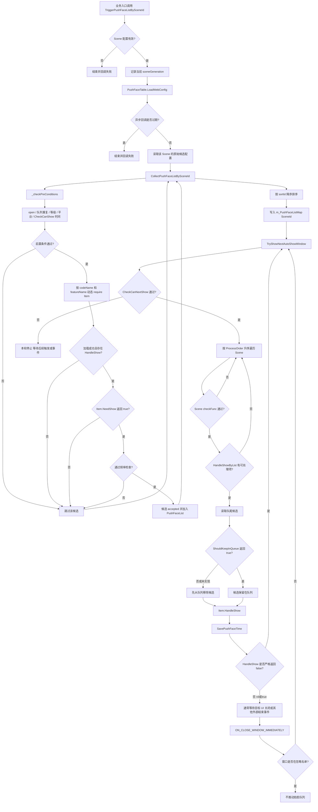
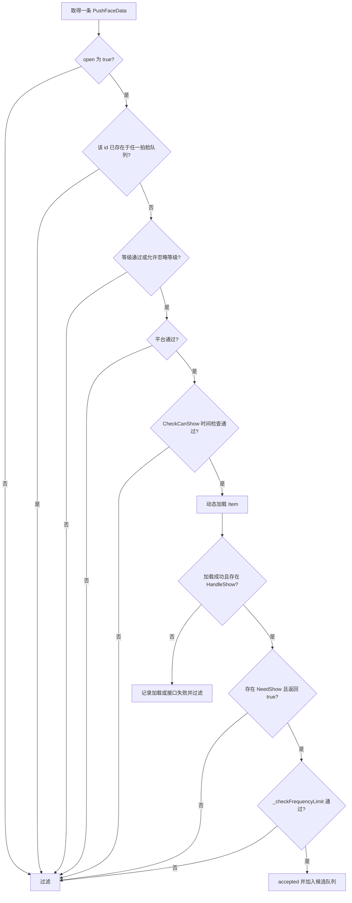
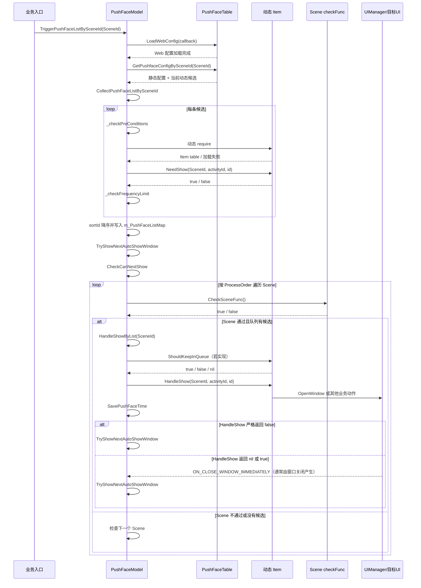

# 拍脸系统运行原理（易懂版）

> 本文依据 iWiki `docid=4021586551` 的主题结构整理，并使用当前工作区源码、导出配置和本地运行日志交叉验证。若 iWiki、旧知识库与当前实现存在差异，以本文“来源与事实分级”中列出的当前源码和配置为准。

---

## 0. 阅读说明

### 0.1 阅读目标

本文说明拍脸系统如何完成以下过程：

1. 业务时机触发一个 Scene；
2. 框架加载静态配置和 Web 动态候选；
3. 候选项依次经过通用条件、业务条件和频率检查；
4. 通过检查的候选项进入分 Scene 队列并排序；
5. 调度器根据全局状态和 Scene 状态选择下一项；
6. 通用入口调用动态 Item 的 `HandleShow`；
7. 根据返回值或窗口关闭事件继续处理下一项。

### 0.2 适用读者

- 需要接入新拍脸配置的客户端开发者；
- 需要定位“配置存在但没有弹出”的开发者或测试人员；
- 需要理解 Scene、配置行、Lua Item、目标 UI 之间关系的维护人员；
- 需要核对 Scene19 本地教学实例执行链路的人员。

### 0.3 阅读完可以回答的问题

- Scene、SceneId、sceneKey 和 checkFunc 分别负责什么？
- 拍脸候选来自哪些数据源？
- 一条配置按什么顺序被过滤？
- `sortId` 为 30、20、10 时，当前分支为什么是 10 先处理？
- 每个通过通用队列实际执行的拍脸必经哪个接口？
- `HandleShow` 返回 `false`、`nil` 或 `true` 时，队列如何继续？
- Scene19 为什么能够打开 `UI_NoviceReward_MainView`？
- 频率缓存与 Scene19 的 Model 生命周期标志有什么区别？

### 0.4 文档事实范围

| 事实层级       | 范围                                                                      | 使用方式                                |
| ---------- | ----------------------------------------------------------------------- | ----------------------------------- |
| **框架事实**   | 当前 `PushFaceModel.lua`、`PushFaceTable.lua`、`ResPushFace.proto` 所体现的通用机制 | 用于说明收集、过滤、排序、调度、频控和续链               |
| **当前分支事实** | 当前导出的 `PushFaceSceneData.txt`、`PushFaceData_Total.txt`                  | 用于说明当前 Scene 1～19 和配置字段；未来重新导表后可能变化 |
| **本地教学实例** | Scene19、配置 `1000128`、`NoviceRewardEntryReadyLocalTest`                  | 仅用于演示完整接入和验证链路，不能直接视为正式业务方案         |
| **运行验证事实** | 当前 `LetsGo/Saved/Logs/LetsGo_PIE.log` 中可复核的本地时间线                        | 证明当前本地运行曾完成收集、入队和窗口打开，不代表所有环境均必然成功  |

---

## 1. 核心概念与职责

| 概念 | 定义 | 当前实现中的职责 | Scene19 示例 |
|---|---|---|---|
| **Scene** | 一类拍脸触发和展示语境 | 表示“在哪个业务时机收集”，并在真正展示前执行对应场景检查 | 新手奖励入口准备完成 |
| **SceneId / sceneKey / checkFunc** | Scene 的数字 ID、语义键和检查函数名 | `sceneKey → SceneId` 用于触发；`checkFunc` 用于调度时确认当前环境仍适合展示 | `19` / `NoviceRewardEntryReady` / `CheckNoviceRewardReady` |
| **PushFaceData** | 一条拍脸通用配置 | 提供开关、排序、频率、等级、平台、时间、Scene、Item 名称等元数据 | `id=1000128`、`codeName=NoviceRewardEntryReadyLocalTest` |
| **PushFaceModel** | 通用拍脸调度 Model | 初始化 Scene、触发加载、收集过滤、维护队列、调度 Item、保存频率并处理续链 | `CollectPushFaceListBySceneId`、`TryShowNextAutoShowWindow`、`HandleShowByList` |
| **Item** | 每种拍脸独立的 Lua 行为模块 | 通过 `NeedShow` 判断业务条件，通过 `HandleShow` 执行实际展示；可选提供 `ShouldKeepInQueue` | `PushFace_NoviceRewardEntryReadyLocalTest.lua` |
| **目标 UI** | Item 最终打开的游戏内窗口 | 展示具体业务内容；关闭事件通常推动下一项 | `UI_NoviceReward_MainView` |
| **频控缓存** | 客户端保存的展示或“不再展示”时间 | 支持每天一次、永久一次及特定“今日不再展示”判断 | Scene19 的 `fequency=1` 不写每天/永久展示缓存 |

核心职责边界如下：

- **Scene 配置**定义场景身份及调度时检查函数，但不自动产生业务触发；
- **PushFaceData**定义通用限制和 Item 定位信息；
- **Item**定义业务条件与实际动作；
- **PushFaceModel**统一决定候选何时入队、何时出队、如何继续下一项。

---

## 2. 数据来源与组合方式

### 2.1 数据来源表

| 数据来源 | 当前载体 | 主要内容 | 进入运行时的方式 |
|---|---|---|---|
| **Excel / Pbin 静态配置** | 源表 `P_拍脸.xlsx`；运行时表 `PushFaceData_Total.pbin`、`PushFaceSceneData.pbin` | 拍脸配置行、Scene 定义 | `PushFaceTable` 读取 `PushFaceData_Total`；`PushFaceModel:InitSceneIdConfig` 读取 `PushFaceSceneData` |
| **Web 动态候选** | CommonKV 的 `TriggerPrecisionKey` | 精准触达候选的开关、排序、频率、等级、Scene、平台等字段 | `PushFaceTable.LoadWebConfig` 异步获取后组装为 `codeName="TriggerPrecisionActivity"` 的候选，并按 Scene 合入 |
| **Lua Item** | `PushFace_{codeName}.lua` | `NeedShow`、`HandleShow`，以及可选的 `ShouldKeepInQueue` | `PushFaceModel:_getConfigByCodeName` 根据 `codeName/featureName` 动态 `require` |

当前实现**不是**通过旧式 `PushConfigs` 总注册表查找 Item。Item 路径由配置动态拼接：

```text
featureName 为空：
LetsGo.Script.PushFace.Items.PushFace_{codeName}

featureName 非空：
Feature.{featureName}.Script.PushFace.Items.PushFace_{codeName}
```

加载过程使用 `pcall(require, fullPath)`：

- 加载失败或返回值不是 table：该候选不能进入队列；
- 模块缺少 `HandleShow`：视为无效 Item；
- 加载成功：按 `codeName` 缓存在 `_loadedConfigs`；
- 清理子 Model 时 `_loadedConfigs` 被清空，后续可重新加载热更后的模块。

### 2.2 `PushFaceData` 主要字段

字段定义以 `letsgo_common/excel/proto/ResPushFace.proto` 为准。

| 字段 | 含义 | 当前框架使用方式 |
|---|---|---|
| `id` | 配置唯一 ID | 队列去重、频控缓存键、Item 入参 |
| `sortId` | 同一 Scene 队列的排序值 | 先降序排列，再从队尾处理，因此当前实现中较小值先处理 |
| `codeName` | Item 代码名 | 拼接 `PushFace_{codeName}` 动态加载路径 |
| `fequency` | 频率，字段名在协议中即为此拼写 | `1` 总是、`2` 每天一次、`3` 永久一次 |
| `open` | 通用开关 | `false` 时在前置条件阶段直接过滤 |
| `activityId` | 可选关联活动 ID | 传给 `NeedShow/HandleShow`；协议为 optional，可能为 `nil` |
| `needLevel` | 最低等级 | 非忽略等级场景下进行检查 |
| `sceneIds` | 可收集该项的 SceneId 列表 | `PushFaceTable` 据此建立 Scene 到候选列表的索引 |
| `loginPlatArr` | 登录平台白名单 | 空列表表示不限制；非空时必须命中允许平台 |
| `beginTime/endTime` | 总体有效时间 | `CheckCanShow` 中检查服务器时间 |
| `showPeriod` | 星期及日内时段 | 仅在配置了总体开始或结束时间时，由当前 `CheckCanShow` 继续检查 |
| `featureName` | Item 所属 Feature | 决定动态 `require` 的目录前缀 |

### 2.3 Web 配置的准确边界

`LoadWebConfig` 当前会把 Web 返回值组装为一条 `TriggerPrecisionActivity` 候选。它不是一个对所有 Excel 配置逐行、逐字段覆盖的通用系统。当前组装字段包括：

- `id`、`codeName`；
- `sortId`、`fequency`、`delayTime`；
- `open`、`needLevel`；
- `sceneIds`、`loginPlatArr`。

因此分析某一普通静态配置时，应先以 `PushFaceData_Total` 为准；分析精准触达候选时，再结合 `LoadWebConfig` 的组装逻辑。

---

## 3. 触发场景：Scene 1～19

### 3.1 Scene 配置的运行时作用

`PushFaceModel:InitSceneIdConfig` 对每一行进行校验。有效行会生成：

- `_sceneKeyToIdMap[sceneKey] = id`；
- `Enum_SceneId[sceneKey] = id`；
- `CheckSceneFuncNameMap[id] = checkFunc`；
- `ProcessOrder` 中的 SceneId，最后按数字升序排序。

一行只有在以下条件均满足时才有效：

1. `id` 是大于 0 的数字；
2. `sceneKey` 是非空字符串；
3. `checkFunc` 是非空字符串；
4. `PushFaceModel[checkFunc]` 是实际存在的函数。

### 3.2 当前完整 Scene 表

下表严格依据当前 `PushFaceSceneData.txt`。其中“场景语义”是对 key 的技术性说明，不替代实际触发源码。

| ID | sceneKey | checkFunc | 场景语义 / 当前核验说明 |
|---:|---|---|---|
| 1 | `LoginDone` | `CheckLoginDone` | 登录完成；当前主 Model 的 `OnLobbyCreate` 首次进入大厅时可触发 |
| 2 | `BackToLobby` | `CheckBackToLobby` | 回到大厅；当前主 Model 的 `OnLobbyCreate` 非首次分支可触发 |
| 3 | `WaitInLobby` | `CheckWaitInLobby` | 停留普通大厅；当前主 Model 的大厅定时检查可触发 |
| 4 | `EnterToFarm` | `CheckEnterToFarm` | 进入农场；具体业务入口需从农场相关源码查证 |
| 5 | `DsConnect` | `CheckLoginDone` | DS 首次连接成功；当前主 Model 的 `OnCommunityDSFirstConnectSuccess` 可触发 |
| 6 | `WaitInHUDLobby` | `CheckWaitInHUDLobby` | 停留 HUD 大厅；当前主 Model 的 HUD 大厅定时检查可触发 |
| 7 | `EnterArena` | `CheckEnterArena` | 进入 Arena；具体业务入口需从 Arena 相关源码查证 |
| 8 | `EnterArenaSeverSyn` | `CheckEnterArena` | Arena 服务同步完成；`Sever` 为当前配置原始拼写，具体入口需查 Arena 源码 |
| 9 | `Manual` | `CheckLoginDone` | 手动补触发场景；当前主 Model 包含灵犀延迟数据的 Manual 补弹逻辑 |
| 10 | `GetHeroNew` | `CheckLoginDone` | 获得新英雄；具体入口需从对应业务源码查证 |
| 11 | `BackToPreparation` | `CheckBackToPreparation` | 回到通用备战界面；当前主 Model 的 `OnOpenPreparationUI` 可触发 |
| 12 | `EnterFarmCrazy` | `CheckEnterFarmCrazy` | 进入奇迹农场；当前主 Model 的引导结束补触发逻辑包含该 Scene，其他入口需查业务源码 |
| 13 | `EnterFishingMiracle` | `CheckEnterFishingMiracle` | 进入钓鱼奇迹；具体入口需从对应业务源码查证 |
| 14 | `FarmCrazyActivityOpen` | `CheckFarmCrazyActivityOpen` | 奇迹农场活动开启；具体入口需从对应业务源码查证 |
| 15 | — | — | **空保留位**；当前行只有 `id=15`，初始化时因缺少 `sceneKey/checkFunc` 被拒绝 |
| 16 | `UGCSettlement` | `CheckEnterUGCSettlement` | UGC 结算；具体入口需从 UGC 业务源码查证 |
| 17 | `EnterFarmLevelUp` | `CheckEnterToFarm` | 农场升级进入语境；具体入口需从农场业务源码查证 |
| 18 | `EnterProjectT` | `CheckEnterProjectT` | 进入 ProjectT；当前主 Model 的场景礼包数据变化处理可重新触发 |
| 19 | `NoviceRewardEntryReady` | `CheckNoviceRewardReady` | 新手奖励入口准备完成；当前分支的**本地教学新增实例** |

> **重要限制：**在 `PushFaceSceneData` 中增加一行，只会登记 Scene 身份和检查函数，不会自动监听业务事件。每个 Scene 的触发入口必须在对应业务源码中查证，最终需要调用 `TriggerPushFaceListBySceneId`。不能仅凭 SceneData 判断某个时机会自然触发。

---

## 4. 运行时存储结构与频控缓存

### 4.1 Scene 队列：`m_PushFaceListMap`

`m_PushFaceListMap` 以 SceneId 为键，以通过收集过滤后的配置数组为值。概念示例如下：

```lua
m_PushFaceListMap = {
    [1] = {
        { id = 1000201, sortId = 30, codeName = "ExampleC" },
        { id = 1000202, sortId = 20, codeName = "ExampleB" },
        { id = 1000203, sortId = 10, codeName = "ExampleA" },
    },
    [19] = {
        {
            id = 1000128,
            sortId = 0,
            codeName = "NoviceRewardEntryReadyLocalTest",
            fequency = 1,
            sceneIds = { 19 },
        },
    },
}
```

说明：

- 数组内保存的是配置项，不是 Item 实例；
- 每个 Scene 的候选数组在收集结束后按 `sortId` 降序排列；
- `HandleShowByList` 从数组队尾读取候选；
- 切换场景、关闭全部窗口或关闭窗口层等事件会清空队列，防止旧场景候选延续到新上下文。

### 4.2 频控缓存表

| 客户端缓存键                | 写入入口                  | 保存内容             | 当前检查方式                                                          |
| --------------------- | --------------------- | ---------------- | --------------------------------------------------------------- |
| `PushFace`            | `SavePushFaceTime`    | `配置 id → 服务器时间戳` | `fequency=2` 检查是否同一天展示过；`fequency=3` 检查是否存在展示记录                 |
| `PushfaceTodayNoShow` | `SaveTodayNoShowTime` | `配置 id → 服务器时间戳` | 当前 `_checkFrequencyLimit` 的其他分支（包括 `fequency=1`）检查是否在当天被标记为不再展示 |
|                       |                       |                  |                                                                 |

需要注意：

- `HandleShowByList` 在调用 Item 的 `HandleShow` 后调用 `SavePushFaceTime`；
- `SavePushFaceTime` 只对 `fequency=2` 或 `3` 写入 `PushFace` 缓存；
- `fequency=1` 表示通用展示频率不受“每天一次/永久一次”限制，不等于业务入口一定会反复触发；
- `PushfaceTodayNoShow` 由显式业务调用维护，并不是 `HandleShowByList` 对所有项目自动写入的展示记录。

### 4.3 Scene19 的一次触发标志不是频率配置

Scene19 另有以下 Model 生命周期状态：

| 状态 | 作用 |
|---|---|
| `_isNoviceRewardEntryReady` | 表示新手奖励入口已准备完成，供 `CheckNoviceRewardReady` 使用 |
| `_isNoviceRewardEntryTriggering` | 防止异步 `LoadWebConfig` 和收集尚未完成时重复发起触发 |
| `_hasTriggeredNoviceRewardEntryReady` | 当前 Model 生命周期内，防止入口刷新后再次发起同一教学触发 |

`_hasTriggeredNoviceRewardEntryReady` 与 `fequency` 的职责不同：

- 前者控制“是否再次发起 Scene19 收集”；
- 后者控制“一条候选配置是否因历史展示记录而被过滤”。

当前回调在 `success=true` 且 Scene19 原始配置列表非空时设置 `_hasTriggeredNoviceRewardEntryReady=true`。这不能单独证明候选已通过全部过滤，更不能单独证明目标 UI 已成功打开。

---

## 5. 从 Trigger 到关闭后继续：完整执行顺序

下面保留 iWiki 总流程的核心结构，并按当前源码重画。



### 5.1 阶段、核心函数与职责

| 阶段 | 核心函数 | 主要职责 |
|---|---|---|
| Scene 初始化 | `InitSceneIdConfig` | 校验 Scene 行，生成 key/id/checkFunc 映射和 `ProcessOrder` |
| 触发 | `TriggerPushFaceListBySceneId` | 校验 Scene、加载 Web 配置、收集队列、写入 Map、启动调度 |
| 数据获取 | `LoadWebConfig`、`GetPushfaceConfigBySceneId` | 获取动态候选并返回该 Scene 的候选列表 |
| 通用前置过滤 | `_checkPreConditions` | 检查开关、队列重复、等级、平台和时间 |
| Item 加载 | `_getConfigByCodeName` | 动态 require Item 并校验 `HandleShow` |
| 业务过滤 | `Item.NeedShow` | 判断业务数据和业务状态是否允许入队 |
| 频率过滤 | `_checkFrequencyLimit` | 检查每天一次、永久一次或今日不再展示标志 |
| 排序与入队 | `CollectPushFaceListBySceneId` | 将 accepted 项按 `sortId` 降序排列 |
| 全局调度 | `TryShowNextAutoShowWindow` | 执行全局检查，按 `ProcessOrder` 遍历 Scene |
| 全局展示条件 | `CheckCanNextShow` | 检查 Loading、强引导、回流屏蔽、LiteAndroid 资源状态 |
| Scene 展示条件 | 配置中的 `checkFunc` | 确认当前画面和业务环境仍适合该 Scene |
| 通用处理入口 | `HandleShowByList` | 读取队尾、决定是否移除、调用 Item、保存频率、处理 `false` 续链 |
| 关闭后续链 | `OnCloseWindowImmediately` | 普通窗口关闭后再次调用 `TryShowNextAutoShowWindow` |

---

## 6. 收集与过滤

### 6.1 当前实际过滤顺序

`CollectPushFaceListBySceneId` 对每个候选执行以下顺序：



动态 `require` 是连接配置与 Item 的**加载步骤**，不是与开关、等级、平台并列的业务过滤条件；但加载失败会导致候选无法入队，因此流程图需要保留该失败分支。

### 6.2 过滤阶段表

| 顺序 | 阶段 | 当前函数/条件 | 未通过结果 |
|---:|---|---|---|
| 1 | 开关 | `v.open` | 跳过配置 |
| 2 | 队列重复 | `IsInPushfaceListById(v.id)` | 已在任一 Scene 队列时不重复加入 |
| 3 | 等级 | `Grade < needLevel` | 非云环境特定 AB 忽略等级时，等级不足会被过滤 |
| 4 | 平台 | `CheckIsInPlatform(loginPlatArr)` | 当前平台不在白名单时过滤 |
| 5 | 时间 | `CheckCanShow(SceneId, id, codeName)` | 配置不存在或不在有效时间/星期/时段时过滤 |
| 6 | 加载 Item | `_getConfigByCodeName` | require 失败、返回非 table 或缺少 `HandleShow` 时过滤 |
| 7 | 业务判断 | `PushConfig.NeedShow(...)` | 函数不存在或未返回 true 时过滤 |
| 8 | 频率 | `_checkFrequencyLimit(v)` | 命中对应历史记录时过滤 |

### 6.3 `NeedShow` 的职责

`NeedShow(SceneId, activityId, id)` 用于判断该 Item 的业务条件，例如：

- 业务数据是否已准备完成；
- 活动、奖励或内容是否存在；
- 业务状态是否允许展示；
- 依赖的 SDK 或子系统状态是否满足。

`NeedShow=true` 只表示候选可以继续通过业务过滤。它不表示立即打开 UI，因为后续仍有频率检查、排序、全局调度条件、Scene 检查和前序窗口等待。

---

## 7. 排序规则：降序存储，队尾处理

当前代码先按 `sortId` 降序排序：

```lua
table.sort(PushFaceList, function(a, b)
    return a.sortId > b.sortId
end)
```

`HandleShowByList` 随后读取：

```lua
local CheckCell = CheckList[#CheckList]
```

因此目标分支的最终处理顺序为：**较小的 `sortId` 先处理**。

| 原始 sortId | 降序后的数组 | 第一次读取队尾 | 后续顺序 |
|---|---|---:|---|
| 30、20、10 | `[30, 20, 10]` | 10 | 20 → 30 |

不能只根据“降序排序”判断 30 先展示；必须同时核对数组从哪一端取值。本文结论只针对当前分支的“降序 + 队尾”组合，未来若排序函数或取值位置改变，应重新验证。

不同 Scene 之间，`TryShowNextAutoShowWindow` 按 `ProcessOrder` 的 SceneId 升序遍历；某个 Scene 的 `HandleShowByList` 返回 true 后，本轮停止继续扫描后续 Scene。

---

## 8. 展示调度时序



### 8.1 `CheckCanNextShow`

当前会阻止以下情况继续展示：

- `UI_CommonLoading` 已打开；
- 正处于强引导，且不是弱引导；
- 回流系统要求屏蔽拍脸；
- LiteAndroid 的 `SystemMini` 模块资源未准备完成。

这些是全局条件。通过后还必须执行每个 Scene 对应的 `checkFunc`。

### 8.2 Scene 检查

`TryShowNextAutoShowWindow` 不直接假定 Scene 仍有效，而是读取配置中的 `checkFunc` 并执行：

- 函数名无效：跳过该 Scene；
- 函数不存在：跳过该 Scene；
- 函数返回 false：跳过该 Scene；
- 函数返回 true：调用 `HandleShowByList(SceneId)`。

因此 Scene 同时承担两类职责：

1. **触发语义**：在什么业务时机收集；
2. **展示校验**：真正轮到该队列时，当前状态是否仍允许展示。

---

## 9. 每个拍脸的必经接口与调用链

### 9.1 准确结论

所有**通过当前通用队列并实际被处理**的候选项都必经：

```text
TryShowNextAutoShowWindow
→ CheckCanNextShow
→ Scene 对应 checkFunc
→ HandleShowByList
→ Item.ShouldKeepInQueue（可选）
→ Item.HandleShow
→ SavePushFaceTime
```

其中，统一必经处理入口是：

```text
PushFaceModel:HandleShowByList(SceneId)
```

它负责：

1. 读取该 Scene 队列的队尾候选；
2. 再次取得动态 Item；
3. 调用可选的 `ShouldKeepInQueue`；
4. 默认在展示前将候选从队列移除；
5. 调用 Item 的 `HandleShow(SceneId, activityId, id)`；
6. 调用 `SavePushFaceTime(id, fequency)`；
7. 若 `HandleShow` 严格返回 `false`，在函数内部立即调用 `TryShowNextAutoShowWindow()`。

页面也可能由按钮点击或其他业务系统直接打开。仅看到某个 UI 打开，不能反推它一定经过拍脸队列；需要结合 `HandleShowByList` 日志或调用栈确认。

### 9.2 `ShouldKeepInQueue`

若 Item 实现 `ShouldKeepInQueue` 且返回 true，本次处理前不会移除候选；下一轮调度仍可能处理同一项。若未实现、返回 false 或 nil，则候选在调用 `HandleShow` 前从队列移除。

该接口需要谨慎使用：持续返回 true 可能导致同一候选反复位于队尾。

### 9.3 `HandleShow` 返回值与续链

当前源码使用严格判断：

```lua
if showResult == false then
    self:TryShowNextAutoShowWindow()
end
```

| `HandleShow` 返回值 | 当前框架行为 | 常见使用场景 |
|---|---|---|
| `false` | `HandleShowByList` 内立即尝试下一项 | 未打开需要框架等待的游戏内窗口；SDK 动作、事件、请求或条件变化后无需等待 |
| `nil` / 无显式返回 | 不在 `HandleShowByList` 内立即继续 | 通常已打开游戏内 UI，等待窗口关闭事件推动下一项 |
| `true` | 与 nil 一样，不立即继续 | 已执行动作，但仍依赖外部完成或关闭事件 |

准确理解如下：

- `false` 不是“终止整个拍脸链路”，而是“当前项无需等待，立即尝试下一项”；
- `nil/true` 也不是框架自动完成后续，而是通常等待窗口关闭或其他外部时机；
- 不能笼统要求所有业务在 `HandleShow` 中手动调用下一项；标准游戏内 UI 一般依赖统一关闭事件；
- 如果没有打开游戏内窗口，也没有可靠的外部续链事件，却返回 nil/true，队列可能表现为不再继续。

### 9.4 窗口关闭后的推进

`PushFaceModel` 监听 `ON_CLOSE_WINDOW_IMMEDIATELY`。普通窗口关闭后执行：

```text
目标 UI 关闭
→ OnCloseWindowImmediately
→ TryShowNextAutoShowWindow
→ CheckCanNextShow
→ 按 ProcessOrder 重新检查 Scene
→ HandleShowByList 处理下一项
```

部分通用提示、网络 Loading 和调试窗口位于忽略名单中，它们关闭时不会推动拍脸队列，以避免无关窗口干扰调度。

---

## 10. Scene19 本地教学实例

> Scene19 当前 Item 文件明确声明“仅用于本地教学验证，提交前必须删除或正式化”。本节用于解释机制，不应把该实现直接当成正式业务规范。

### 10.1 当前配置对应关系

| 环节 | 当前值 | 依据 |
|---|---|---|
| SceneId | `19` | `PushFaceSceneData.txt` |
| sceneKey | `NoviceRewardEntryReady` | `PushFaceSceneData.txt` |
| checkFunc | `CheckNoviceRewardReady` | `PushFaceSceneData.txt`、`PushFaceModel.lua` |
| 拍脸配置 id | `1000128` | `PushFaceData_Total.txt` |
| sortId | `0` | `PushFaceData_Total.txt` |
| codeName | `NoviceRewardEntryReadyLocalTest` | `PushFaceData_Total.txt` |
| fequency | `1`（总是） | `PushFaceData_Total.txt`、`ResPushFace.proto` |
| open | `true` | `PushFaceData_Total.txt` |
| needLevel | `1` | `PushFaceData_Total.txt` |
| sceneIds | `19` | `PushFaceData_Total.txt` |
| beginTime / endTime | `1781107200` / `3395750399` | `PushFaceData_Total.txt` |
| activityId | 未配置，运行时可为 `nil` | `PushFaceData_Total.txt`、协议 optional 定义 |
| featureName | 未配置，使用主玩法默认 Item 目录 | `PushFaceData_Total.txt`、动态路径规则 |
| Item | `PushFace_NoviceRewardEntryReadyLocalTest.lua` | 动态路径规则和实际文件 |
| 目标 UI | `UI_NoviceReward_MainView` | Item 的 `HandleShow` |

### 10.2 入口触发

`UI_ActivityIcon_NoviceReward:RefreshNoviceRewardBtn` 的当前流程是：

1. 当前控件不可见时直接返回；
2. 若右上角新手奖励子 View 尚未创建，则调用 `AddView`；否则刷新子 View；
3. 当 `newbieRightUpView` 存在时，调用 `PushFaceModel:OnNoviceRewardEntryReady()`。

Model 随后：

1. 通过 `GetSceneIdByKey("NoviceRewardEntryReady")` 获取 Scene19，避免在入口硬编码数字；
2. 检查是否已经触发或正在触发；
3. 设置 `_isNoviceRewardEntryReady=true`；
4. 调用 `TriggerPushFaceListBySceneId(19, false, callback)`；
5. 异步流程成功且 Scene19 原始配置非空时，设置 `_hasTriggeredNoviceRewardEntryReady=true`。

### 10.3 收集、调度与打开 UI

Scene19 的完整链路如下：

```text
UI_ActivityIcon_NoviceReward:RefreshNoviceRewardBtn
→ PushFaceModel:OnNoviceRewardEntryReady
→ GetSceneIdByKey("NoviceRewardEntryReady") = 19
→ TriggerPushFaceListBySceneId(19, false)
→ PushFaceTable.LoadWebConfig
→ CollectPushFaceListBySceneId(19, false)
→ _checkPreConditions
→ require LetsGo.Script.PushFace.Items.PushFace_NoviceRewardEntryReadyLocalTest
→ Item.NeedShow(19, nil, 1000128) = true
→ _checkFrequencyLimit
→ accepted 并写入 m_PushFaceListMap[19]
→ TryShowNextAutoShowWindow
→ CheckCanNextShow
→ CheckNoviceRewardReady
→ HandleShowByList(19)
→ Item.HandleShow(19, nil, 1000128)
→ AddPushFaceItemCount
→ UIManager:OpenWindow(UI_NoviceReward_MainView)
→ SavePushFaceTime(1000128, 1)
→ 等待窗口关闭事件后继续
```

`CheckNoviceRewardReady` 当前检查：

- `_isNoviceRewardEntryReady` 必须为 true；
- 当前必须处于允许大厅拍脸的 Scene；
- Lobby 默认画面不能有其他默认层窗口遮挡。

本地教学 Item 的 `NeedShow` 固定返回 true；`HandleShow` 增加拍脸计数并打开目标 UI，且没有显式返回值。因此它按 nil 分支等待窗口关闭事件，而不是在 `HandleShowByList` 内立即调度下一项。

---

## 11. 运行日志验证实例

运行验证依据：`LetsGo/Saved/Logs/LetsGo_PIE.log`。

### 11.1 时间戳说明

任务反馈提到的验证时刻为 **20:27:50**。重新读取当前工作区日志后，没有检索到该时刻；当前文件中可复核的等价 Scene19 成功链路发生在 **20:30:07**，Scene 配置 Pbin 加载发生在 **20:29:49**。为避免写入无法由当前文件证明的时间戳，以下采用当前日志实际时间。

### 11.2 当前可复核时间线

| 本地日志时间 | 语义摘要 | 可证明的事实 |
|---|---|---|
| 20:29:49.973 | `PbinLoader` 加载 `PushFaceSceneData`，共 19 行 | Scene 配置已从本地 Pbin 载入；随后日志指出 id 15 缺少 sceneKey/checkFunc |
| 20:30:07.175 | `PbinLoader` 加载 `PushFaceData_Total`，共 103 行 | 静态拍脸配置已载入 |
| 20:30:07.175 | `CollectPushFaceListBySceneId, 19, false` | Scene19 开始收集 |
| 20:30:07.176 | Scene19 Item 输出 `NeedShow`，参数为 SceneId 19、activityId nil、id 1000128 | 动态 Item 已加载，业务判断已执行 |
| 20:30:07.176 | `accepted codeName=NoviceRewardEntryReadyLocalTest id=1000128` | 该候选已通过当前收集过滤并入队 |
| 20:30:07.182 | `HandleShowByList CheckCell.codeName=NoviceRewardEntryReadyLocalTest` | 通用队列开始处理该候选 |
| 20:30:07.182 | Item 输出 `HandleShow` | 已进入具体 Item 的展示接口 |
| 20:30:07.182 | `UIManager:OpenWindow UI_NoviceReward_MainView` | Item 发起目标窗口打开 |
| 20:30:07.198 | `UI_NoviceReward_MainView_OnOpen` | 目标 View 已执行 OnOpen |
| 20:30:07.198 | `UIManager:OpenWindow Success: UI_NoviceReward_MainView` | 本次本地运行中窗口打开成功 |

日志没有为 `CheckNoviceRewardReady=true` 单独输出成功行，但后续已进入 Scene19 的 `HandleShowByList`。结合当前调度源码，可以确认本次调度只有在 Scene 检查返回 true 后才会到达该接口。

本文只保留链路验证需要的语义摘要，不包含账号、角色标识、Token 或其他无关运行信息。

---

## 12. 调试指南

### 12.1 常见现象与优先检查位置

| 现象 | 先查函数 / 日志 | 可能原因 |
|---|---|---|
| 业务时机到达但没有任何拍脸日志 | 业务入口、`TriggerPushFaceListBySceneId` | 没有调用触发函数；sceneKey 查找失败；入口提前返回；生命周期标志阻止重复触发 |
| 提示 Scene 无效 | `InitSceneIdConfig`、`IsValidSceneId` | Scene 行缺字段；`checkFunc` 不存在；Pbin 未更新；传入了未登记 ID |
| Scene 有配置但候选列表为空 | `CollectPushFaceListBySceneId`、`GetPushfaceConfigBySceneId` | `sceneIds` 未包含目标 Scene；配置表未加载；所有候选均被过滤 |
| `_checkPreConditions` 失败 | `_checkPreConditions id = ...` | 开关关闭、队列重复、等级不足、平台不匹配或时间不合法 |
| `CheckCanShow failed` | `CheckCanShow`、`_checkTimeRange`、`_checkWeekDay`、`_checkHourRange` | 未找到匹配配置；不在 begin/end 时间；星期或日内时段不允许 |
| Item 加载失败 | `failed to load config`、`missing HandleShow` | `codeName/featureName` 拼接路径错误；文件不存在；模块返回值不正确；缺少 `HandleShow` |
| 日志出现 `NeedShow=false` | Item 的 `NeedShow` | 业务数据未准备、活动不存在、业务条件不满足，或 Item 没有实现 `NeedShow` |
| 日志出现 `freq-limited` | `_checkFrequencyLimit`、客户端缓存 | 当天已展示、永久展示过，或命中今日不再展示记录 |
| accepted 但没有打开 UI | `TryShowNextAutoShowWindow`、`CheckCanNextShow`、Scene `checkFunc` | Loading、强引导、回流屏蔽、资源未就绪，或当前 Scene 状态已变化 |
| 已进入 `HandleShowByList` 但没有 UI | Item `HandleShow` | Item 内条件再次变化；窗口名或资源错误；Item 执行的是 SDK/事件/纯逻辑 |
| 第一项完成后第二项不继续 | `OnCloseWindowImmediately`、Item 返回值 | 目标窗口没有产生统一关闭事件；关闭窗口在忽略名单；未打开 UI 却返回 nil/true |
| 同一候选反复处理 | `ShouldKeepInQueue` | 持续返回 true，候选一直保留在队尾 |
| Scene19 只触发一次 | `_hasTriggeredNoviceRewardEntryReady` | 当前 Model 生命周期的一次触发保护生效；与 `fequency=1` 不冲突 |
| Scene19 标志已设置但 UI 未出现 | 收集回调、过滤日志、Scene 检查 | 原始 Scene 配置非空不等于候选 accepted，也不等于 UI 打开成功 |

### 12.2 最少断点链

通用拍脸最少断点：

```text
TriggerPushFaceListBySceneId
→ CollectPushFaceListBySceneId
→ _checkPreConditions
→ Item.NeedShow
→ TryShowNextAutoShowWindow
→ Scene 对应 checkFunc
→ HandleShowByList
→ Item.HandleShow
```

Scene19 最少断点：

```text
UI_ActivityIcon_NoviceReward:RefreshNoviceRewardBtn
→ PushFaceModel:OnNoviceRewardEntryReady
→ PushFaceModel:TriggerPushFaceListBySceneId
→ PushFaceModel:CollectPushFaceListBySceneId
→ PushFace_NoviceRewardEntryReadyLocalTest.NeedShow
→ PushFaceModel:CheckNoviceRewardReady
→ PushFaceModel:HandleShowByList
→ PushFace_NoviceRewardEntryReadyLocalTest.HandleShow
→ UIManager:OpenWindow
```

若问题是“关闭后不继续”，再增加：

```text
PushFaceModel:OnCloseWindowImmediately
→ PushFaceModel:TryShowNextAutoShowWindow
```

---

## 13. 常见误区

| 误区 | 准确说明 |
|---|---|
| 在 SceneData 中配置 Scene 后会自动触发 | SceneData 只登记 id、key 和检查函数；业务入口仍需显式触发 |
| Scene 数量固定为 12 | 当前导出配置编号为 1～19，其中 15 是无效空保留位；未来数量仍可能变化 |
| `NeedShow=true` 表示立即弹出 | 只表示业务条件通过，后续仍有频率、排序、全局检查和 Scene 检查 |
| 动态 `require` 是一项业务过滤条件 | 它是配置到 Item 的加载步骤；加载失败会阻止入队，但不属于开关、等级等业务条件 |
| 所有 Item 都在旧 `PushConfigs` 注册表 | 当前按 `codeName/featureName` 动态加载独立 Item 文件 |
| `sortId` 越大越先展示 | 当前分支降序存储、队尾处理，所以较小值先处理 |
| `activityId` 必填 | 协议中是 optional；Scene19 当前未配置，Item 收到 nil |
| `fequency=1` 会让业务入口无限触发 | 频率与触发入口是不同维度；Scene19 还有 Model 生命周期一次触发标志 |
| `HandleShow=false` 会停止整个队列 | 当前实现会在 `HandleShowByList` 内立即尝试下一项 |
| 所有 Item 都应手动调用下一项 | 不正确。标准游戏内 UI 通常依赖统一窗口关闭事件；只有无等待窗口的动作需要设计明确续链 |
| nil 返回值会自动继续 | nil/true 不会在 `HandleShowByList` 内立即继续，通常需要关闭事件或其他外部时机 |
| 队列为空说明最后一个 UI 已关闭 | 候选通常在调用 `HandleShow` 前已出队；最后一个 UI 可能仍处于打开状态 |
| 看到页面打开就能证明来自拍脸 | 页面也可能由按钮或其他系统打开，应结合 `HandleShowByList` 日志或调用栈确认 |
| Web 配置会覆盖所有 Excel 配置 | 当前实现是组装一条精准触达动态候选并按 Scene 合入，不是通用逐行覆盖器 |

---

## 14. 一页速查

### 14.1 主流程

```text
业务触发 Scene
→ LoadWebConfig
→ Collect
→ 通用前置条件
→ 动态加载 Item
→ NeedShow
→ 频率检查
→ sortId 降序入队
→ TryShowNextAutoShowWindow
→ CheckCanNextShow
→ 按 ProcessOrder 执行 Scene checkFunc
→ HandleShowByList
→ ShouldKeepInQueue（可选）
→ Item.HandleShow
→ SavePushFaceTime
→ false 立即继续；nil/true 通常等待 UI 关闭后继续
```

### 14.2 快速定位表

| 要确认的问题 | 首要位置 | 判断重点 |
|---|---|---|
| Scene 定义是什么 | `PushFaceSceneData.txt` | `id / sceneKey / checkFunc` |
| Scene 是否真的触发 | 业务调用源码 | 是否调用 `TriggerPushFaceListBySceneId` |
| 候选配置是什么 | `PushFaceData_Total.txt` | `id / codeName / sceneIds / open / fequency / 时间` |
| Item 在哪里 | `codeName + featureName` | 默认目录或 Feature 目录的 `PushFace_{codeName}.lua` |
| 为什么没有入队 | `CollectPushFaceListBySceneId` | 前置条件、加载、NeedShow、频率的实际顺序 |
| 谁先展示 | 排序与队尾读取 | 当前较小 `sortId` 先处理 |
| 为什么 accepted 仍未展示 | `CheckCanNextShow + checkFunc` | 全局环境和 Scene 当前状态 |
| 通用必经入口 | `HandleShowByList` | 出队、调用 Item、保存频率、处理 false 续链 |
| 为什么关闭后不继续 | `OnCloseWindowImmediately` | 是否收到关闭事件、是否在忽略名单 |
| Scene19 入口 | `RefreshNoviceRewardBtn` | 子 View 存在后调用 `OnNoviceRewardEntryReady` |
| Scene19 目标 UI | 本地教学 Item | `UI_NoviceReward_MainView` |

### 14.3 Scene19 当前值

```text
SceneId      = 19
sceneKey     = NoviceRewardEntryReady
checkFunc    = CheckNoviceRewardReady
config id    = 1000128
codeName     = NoviceRewardEntryReadyLocalTest
sceneIds     = 19
Item         = PushFace_NoviceRewardEntryReadyLocalTest.lua
target UI    = UI_NoviceReward_MainView
性质         = 本地教学实例，不等同于正式业务
```

---

## 15. 结论

1. 当前拍脸系统由 **Scene、PushFaceData、动态 Item、PushFaceModel 和目标 UI** 协作完成。
2. SceneData 负责登记场景及展示检查，不负责自动产生业务触发。
3. 候选数据来自 Excel/Pbin 静态配置和 Web 动态候选；业务行为来自按路径规则动态加载的 Lua Item，不依赖旧 `PushConfigs` 总注册表。
4. 当前收集顺序是：开关、队列重复、等级、平台、时间，然后加载 Item，再执行 `NeedShow` 和频率检查。
5. 当前排序为降序存储、队尾处理，因此 `sortId` 10、20、30 的处理顺序是 10、20、30。
6. 所有通过通用队列实际处理的候选都必经 `HandleShowByList`，随后调用 Item 的 `HandleShow` 和 `SavePushFaceTime`。
7. `HandleShow=false` 会立即推进下一项；nil/true 通常等待窗口关闭或其他外部事件。不能要求所有业务手动推进队列。
8. Scene19 已在当前分支和本地日志中完成从入口准备、收集、`NeedShow`、accepted、`HandleShowByList` 到打开 `UI_NoviceReward_MainView` 的验证，但它仍是明确标注的本地教学实例。

---

## 16. 来源与事实分级

### 16.1 iWiki 来源

- **docid**：`4021586551`
- **标题/主题**：拍脸系统的数据收集机制、核心流程和每个拍脸弹出时的必经接口
- **本文使用方式**：保留数据来源、触发场景、运行时存储、频控缓存、总流程、收集过滤、调度时序、必经接口、总结与引用来源等有价值结构；具体函数和顺序以当前源码复核结果修正。

### 16.2 当前源码依据

以下路径均相对于工程根目录 `D:/LetsGoDevelop`。

| 文件 | 关键符号 / 核验内容 |
|---|---|
| `LetsGo/Content/LetsGo/Script/PushFace/PushFaceModel.lua` | `InitSceneIdConfig`、`TriggerPushFaceListBySceneId`、`CollectPushFaceListBySceneId`、`_checkPreConditions`、`_getConfigByCodeName`、`TryShowNextAutoShowWindow`、`CheckCanNextShow`、`HandleShowByList`、`SavePushFaceTime`、`OnCloseWindowImmediately`、`OnNoviceRewardEntryReady`、`CheckNoviceRewardReady` |
| `LetsGo/Content/LetsGo/Script/TableHelper/PushFaceTable.lua` | `GetPushfaceConfigBySceneId`、`LoadWebConfig`、静态配置按 Scene 建索引、Web 动态候选组装与合入 |
| `letsgo_common/excel/proto/ResPushFace.proto` | `PushFaceData`、`PushFaceSceneData`、`showPeriod` 字段定义 |
| `LetsGo/Content/LetsGo/Script/PushFace/Items/PushFace_NoviceRewardEntryReadyLocalTest.lua` | Scene19 的 `NeedShow`、`HandleShow`、目标 UI、本地教学声明 |
| `LetsGo/Content/Feature/System/Script/System/Lobby/LobbyRightUp/ActivityIcon/UI_ActivityIcon_NoviceReward.lua` | `RefreshNoviceRewardBtn` 在入口 View 准备后调用 `OnNoviceRewardEntryReady` |

### 16.3 当前配置依据

| 文件 | 核验内容 |
|---|---|
| `letsgo_common/excel/client/data/PushFaceSceneData.txt` | Scene 1～19；id 15 空保留位；Scene19 的 key 和检查函数 |
| `letsgo_common/excel/client/data/PushFaceData_Total.txt` | 配置 `1000128` 的 codeName、频率、开关、等级、Scene 和时间字段 |

### 16.4 运行验证依据

- `LetsGo/Saved/Logs/LetsGo_PIE.log`
- 仅用于说明当前本地日志中的 Pbin 加载、Scene19 收集、`NeedShow`、accepted、`HandleShowByList`、`HandleShow`、`OpenWindow`、`OnOpen` 和成功时间线。
- 本文未引用账号、角色标识、Token 等敏感信息。
- 任务反馈中的 20:27:50 未在当前文件中匹配；本文使用当前可复核的 20:29:49～20:30:07 时间线。

### 16.5 旧知识库内容的使用原则

如旧知识库曾描述固定 Scene 数量、旧 Item 注册表或不同调用顺序，这些内容仅可作为历史背景。本文结论以当前源码、当前导出配置和当前本地日志为准；未来分支变化后，应优先重新核对动态加载规则、过滤顺序、排序取值方向和 `HandleShow` 返回值续链语义。

---

> 本文从 [LearnByCompany 原始文档](https://github.com/Sarfffff/LearnByCompany/blob/main/%E6%8B%8D%E8%84%B8%E7%B3%BB%E7%BB%9F/04_%E6%8B%8D%E8%84%B8%E7%B3%BB%E7%BB%9F%E8%BF%90%E8%A1%8C%E5%8E%9F%E7%90%86_%E6%98%93%E6%87%82%E7%89%88.md) 自动同步。
