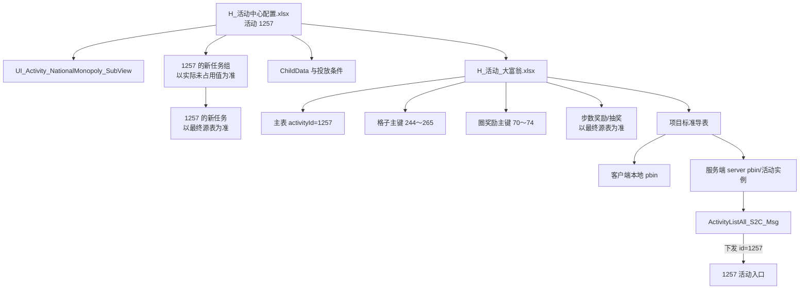
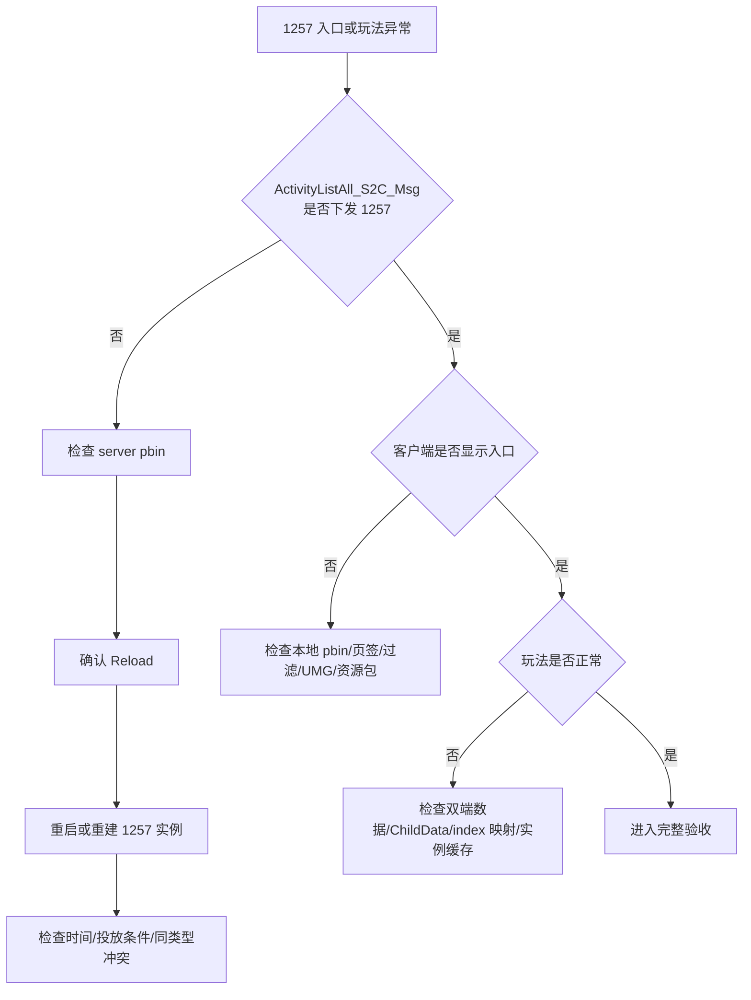

# 大富翁换皮实例：1255 到 1257

> **用途：**作为旧活动 `1255` 复制为新活动 `1257` 的实例操作单，仅记录本例已确认值、待确认项、加载验证和验收记录。通用规则不在本文重复展开。  
> **换皮主题/美术需求代称：**黄油小熊；此代称**不代表已确认的正式活动标题**。正式标题仍为“待填写/以最终源表为准”。  
> **通用模板：**[大富翁换皮通用模板](/dev-notes/%E6%B4%BB%E5%8A%A8%E5%BC%80%E5%8F%91-%E6%8D%A2%E7%9A%AE%E6%A8%A1%E6%9D%BF-%E5%A4%A7%E5%AF%8C%E7%BF%81%E6%8D%A2%E7%9A%AE%E6%93%8D%E4%BD%9C-%E5%A4%A7%E5%AF%8C%E7%BF%81%E6%8D%A2%E7%9A%AE%E9%80%9A%E7%94%A8%E6%A8%A1%E6%9D%BF/)  
> **更新日期：**2026-07-31

---

## 目录

1. [实例边界与已确认信息](#1-实例边界与已确认信息)
2. [实例配置关系](#2-实例配置关系)
3. [需求与冲突确认](#3-需求与冲突确认)
4. [ID 规划](#4-id-规划)
5. [活动中心与任务配置](#5-活动中心与任务配置)
6. [大富翁主表与各子表](#6-大富翁主表与各子表)
7. [UMG 与美术](#7-umg-与美术)
8. [导表与三层加载](#8-导表与三层加载)
9. [入口显示标准与排查](#9-入口显示标准与排查)
10. [实例验收 Checklist](#10-实例验收-checklist)
11. [实例提交与执行记录](#11-实例提交与执行记录)
12. [iWiki 来源](#12-iwiki-来源)

---

## 1. 实例边界与已确认信息

通用适用边界和三层定义见[通用模板第 1 章](/dev-notes/%E6%B4%BB%E5%8A%A8%E5%BC%80%E5%8F%91-%E6%8D%A2%E7%9A%AE%E6%A8%A1%E6%9D%BF-%E5%A4%A7%E5%AF%8C%E7%BF%81%E6%8D%A2%E7%9A%AE%E6%93%8D%E4%BD%9C-%E5%A4%A7%E5%AF%8C%E7%BF%81%E6%8D%A2%E7%9A%AE%E9%80%9A%E7%94%A8%E6%A8%A1%E6%9D%BF/#1-适用边界与三层区分)。本实例必须始终区分：

1. **源表配置层**：`H_活动中心配置.xlsx`、`H_活动_大富翁.xlsx` 中的设计值和关联关系。
2. **客户端本地 pbin 层**：客户端实际加载的本地配置、展示数据和 UMG 资源。
3. **服务端 server pbin / 活动实例层**：服务端实际配置、活动实例、任务状态、玩法逻辑和协议下发。

| 项目 | 本例取值 | 状态 |
|---|---|---|
| 旧活动 ID | `1255` | 已确认 |
| 新活动 ID | `1257` | 已确认 |
| 换皮主题/美术需求代称 | 黄油小熊 | 已知代称，不作为正式标题断言 |
| 目标 UMG | `UI_Activity_NationalMonopoly_SubView` | 已确认 |
| 活动中心源表 | `H_活动中心配置.xlsx` | 已确认 |
| 大富翁源表 | `H_活动_大富翁.xlsx` | 已确认 |
| 新格子主键 | `244～265` | 已确认 |
| 新圈奖励主键 | `70～74` | 已确认 |
| 旧任务组 | `65408～65410` | 已确认；1257 不可复用 |
| 新任务组 ID | 待填写/以实际未占用值为准 | 待最终占号并核对最新源表 |
| 新任务 ID | 待填写/以最终源表为准 | 不断言具体值 |
| 正式标题/副标题 | 待填写/以最终源表为准 | 不以主题代称替代正式标题 |
| 任务条件、跳转、奖励 | 待填写/以最终源表为准 | 待确认 |
| 格子、圈、步、抽奖奖励 | 待填写/以最终源表为准 | 待确认 |
| 活动货币、单次消耗、清理 | 待填写/以最终源表为准 | 待确认 |
| 是否改代码 | 默认不改 | 前提是复用标准玩法并保持 UMG 绑定契约 |

---

## 2. 实例配置关系

通用关系见[通用模板第 2 章](/dev-notes/%E6%B4%BB%E5%8A%A8%E5%BC%80%E5%8F%91-%E6%8D%A2%E7%9A%AE%E6%A8%A1%E6%9D%BF-%E5%A4%A7%E5%AF%8C%E7%BF%81%E6%8D%A2%E7%9A%AE%E6%93%8D%E4%BD%9C-%E5%A4%A7%E5%AF%8C%E7%BF%81%E6%8D%A2%E7%9A%AE%E9%80%9A%E7%94%A8%E6%A8%A1%E6%9D%BF/#2-配置关系)。本例关系如下：



---

## 3. 需求与冲突确认

完整需求清单见[通用模板第 3 章](/dev-notes/%E6%B4%BB%E5%8A%A8%E5%BC%80%E5%8F%91-%E6%8D%A2%E7%9A%AE%E6%A8%A1%E6%9D%BF-%E5%A4%A7%E5%AF%8C%E7%BF%81%E6%8D%A2%E7%9A%AE%E6%93%8D%E4%BD%9C-%E5%A4%A7%E5%AF%8C%E7%BF%81%E6%8D%A2%E7%9A%AE%E9%80%9A%E7%94%A8%E6%A8%A1%E6%9D%BF/#3-需求输入清单)。本例需关闭以下事项：

- [ ] 正式标题、副标题和规则文案已填写，并清理 1255 的旧活动文本。
- [ ] 1257 的展示时间、活动时间和领奖时间已确认。
- [ ] 1255 是否停用、错开或与 1257 并行已有明确结论。
- [ ] 若 1255 与 1257 同类型、同时间开放，已由服务端确认多实例隔离能力。
- [ ] 任务、任务 ID、奖励、活动货币及清理规则均以最终需求和最终源表为准。
- [ ] 1257 的 `ChildData` 开关与实际启用功能一致。
- [ ] 黄油小熊仅作为美术需求代称使用，正式活动标题已另行确认或继续标记待填写。

> **同类型同时间风险：**1255 与 1257 均为大富翁类型时，同时间运行可能产生实例、状态、任务、货币、缓存或协议路由冲突。优先选择停用旧活动或错开时间；确需并行时，必须完成服务端专项确认和隔离验收。

---

## 4. ID 规划

占号方法见[通用模板第 4 章](/dev-notes/%E6%B4%BB%E5%8A%A8%E5%BC%80%E5%8F%91-%E6%8D%A2%E7%9A%AE%E6%A8%A1%E6%9D%BF-%E5%A4%A7%E5%AF%8C%E7%BF%81%E6%8D%A2%E7%9A%AE%E6%93%8D%E4%BD%9C-%E5%A4%A7%E5%AF%8C%E7%BF%81%E6%8D%A2%E7%9A%AE%E9%80%9A%E7%94%A8%E6%A8%A1%E6%9D%BF/#4-id-规划)。

| 配置对象 | 1255 | 1257 | 操作与约束 |
|---|---|---|---|
| 活动 ID | `1255` | `1257` | 使用已确认的新活动 ID |
| 任务组 ID | `65408～65410` | 待填写/以实际未占用值为准 | 新建每日、每周、累计三个组；禁止复用旧组 |
| 任务 ID | 以 1255 最终源表内任务为结构模板 | 待填写/以最终源表为准 | 建议全部使用新 ID，不断言具体值 |
| 格子主键 | 以 1255 最终源表内值为结构模板 | `244～265` | 共 22 个全局主键，全部归属 1257 |
| 圈奖励主键 | 以 1255 最终源表内值为结构模板 | `70～74` | 共 5 个全局主键，全部归属 1257 |
| 步数奖励主键 | 以最终源表为准 | 待填写/以最终源表为准 | 按本期需求和开关决定 |
| 抽奖主键/奖池 | 以最终源表为准 | 待填写/以最终源表为准 | 按本期格子和开关决定 |
| 活动货币 ID | 以最终源表为准 | 待填写/以最终源表为准 | 核对获得、消耗、有效期、清理和活动隔离 |

**本例占号结论：**

- `65408～65410` 是旧任务组，1257 **不可复用**。
- 新任务组 ID 必须以最新源表全列搜索、团队占号记录和待合入分支复核后的实际未占用值为准。
- 新任务 ID 同样必须占号；本文不写死任何未经确认的候选值。
- 合入前再次检查 `244～265`、`70～74` 及所有新占 ID，避免并行分支冲突。

---

## 5. 活动中心与任务配置

通用字段规则见[通用模板第 5 章](/dev-notes/%E6%B4%BB%E5%8A%A8%E5%BC%80%E5%8F%91-%E6%8D%A2%E7%9A%AE%E6%A8%A1%E6%9D%BF-%E5%A4%A7%E5%AF%8C%E7%BF%81%E6%8D%A2%E7%9A%AE%E6%93%8D%E4%BD%9C-%E5%A4%A7%E5%AF%8C%E7%BF%81%E6%8D%A2%E7%9A%AE%E9%80%9A%E7%94%A8%E6%A8%A1%E6%9D%BF/#5-活动中心配置)和[第 6 章](/dev-notes/%E6%B4%BB%E5%8A%A8%E5%BC%80%E5%8F%91-%E6%8D%A2%E7%9A%AE%E6%A8%A1%E6%9D%BF-%E5%A4%A7%E5%AF%8C%E7%BF%81%E6%8D%A2%E7%9A%AE%E6%93%8D%E4%BD%9C-%E5%A4%A7%E5%AF%8C%E7%BF%81%E6%8D%A2%E7%9A%AE%E9%80%9A%E7%94%A8%E6%A8%A1%E6%9D%BF/#6-任务与任务组)。

### 5.1 `H_活动中心配置.xlsx`

以 1255 为结构模板建立或复核 1257，逐字段检查：

| 字段/类别 | 1257 应用值 | 状态/验证 |
|---|---|---|
| `id` | `1257` | 核对全局唯一 |
| 正式标题/副标题 | 待填写/以最终源表为准 | 清理旧活动文案和隐藏字符；不得直接以美术代称断言 |
| 活动类型 | 大富翁活动 | 与 1255 并行时专项评估 |
| `activityUIDetail` | `UI_Activity_NationalMonopoly_SubView` | 精确匹配 |
| `activityTaskGroup` | 三个新任务组 ID | 待填写/以实际未占用值为准；不得使用 `65408～65410` |
| 展示/活动/领奖时间 | 待填写/以最终源表为准 | 处理 1255/1257 时间冲突 |
| 页签/排序/平台/版本/地区/渠道/白名单 | 待填写/以最终源表为准 | 逐项验证入口条件 |
| 活动货币/参数/清理 | 待填写/以最终源表为准 | 验证是否与 1255 共用及是否存在清理冲突 |
| 背景/缩略图/资源包 | 待填写/以最终美术资源和源表为准 | 核对无 1255 残留 |
| `ChildData` | 待填写/以最终源表为准 | 开关与圈/步/抽奖/任务功能一致 |

### 5.2 任务与任务组

1. 从 1255 的任务结构复制模板，但为 1257 分配新任务 ID。
2. 修改所有任务名称、描述、条件、参数、跳转和奖励；具体值以最终源表为准。
3. 新建每日、每周、累计三个任务组。
4. 新任务组 ID 以最新源表和占号记录中的实际未占用值为准。
5. 三个新组均不得复用 `65408～65410`。
6. `taskIdList` 只引用 1257 的新任务。
7. 回填 1257 的 `activityTaskGroup`，并验证英文分号格式。

| 任务组 | 1257 任务组 ID | 任务 ID | 状态 |
|---|---|---|---|
| 每日 | 待填写/以实际未占用值为准 | 待填写/以最终源表为准 | 待验证 |
| 每周 | 待填写/以实际未占用值为准 | 待填写/以最终源表为准 | 待验证 |
| 累计 | 待填写/以实际未占用值为准 | 待填写/以最终源表为准 | 待验证 |

---

## 6. 大富翁主表与各子表

通用字段和格子规则见[通用模板第 7 章](/dev-notes/%E6%B4%BB%E5%8A%A8%E5%BC%80%E5%8F%91-%E6%8D%A2%E7%9A%AE%E6%A8%A1%E6%9D%BF-%E5%A4%A7%E5%AF%8C%E7%BF%81%E6%8D%A2%E7%9A%AE%E6%93%8D%E4%BD%9C-%E5%A4%A7%E5%AF%8C%E7%BF%81%E6%8D%A2%E7%9A%AE%E9%80%9A%E7%94%A8%E6%A8%A1%E6%9D%BF/#7-大富翁主表与各子表)。本例源表为 `H_活动_大富翁.xlsx`。

### 6.1 主表

| 字段 | 1257 值 | 状态 |
|---|---|---|
| `activityId` | `1257` | 核对仅一条主配置 |
| `costItem` | 待填写/以最终源表为准 | 核对活动货币和单次消耗，不断言具体值 |
| `stepWeight` | 待填写/以最终源表为准 | 核对各点数权重及服务端有效性 |

### 6.2 格子表

- 格子主键：`244～265`，共 22 个。
- `activityId`：全部为 `1257`。
- `index`：按最终棋盘从 1 开始连续配置，并与 `UI_Activity_NationalMonopoly_SubView` 中相同数字的格子控件一一对应。
- 格子类型、基础奖励、宝藏奖励与上限、奖池、前进和加油站参数：**待填写/以最终源表为准**。

本例必须执行：

- [ ] 仅按最终设计使用格子类型，未使用类型不强行补齐。
- [ ] 起点只有一个。
- [ ] `index` 无重复、无断档，且与目标 UMG 数字控件一致。
- [ ] 主键 `244～265` 与格子 `index` 分开理解，不以主键连续代替界面序号。
- [ ] 加油站起点与落点成对，落点步数为零。
- [ ] 所有前进/跳转目标合法，跳转链不存在循环。
- [ ] 如使用宝藏格，已配置 `cumulativeCountLimit` 并验证上限行为。
- [ ] 如使用抽奖格，其 `poolId` 能关联 1257 的有效奖池。

### 6.3 圈奖励表

- 圈奖励主键：`70～74`，共 5 个。
- `activityId`：全部为 `1257`。
- 所需圈数与奖励内容：**待填写/以最终源表为准**。
- 不根据主键数量推断圈数，不擅自补连续圈奖励。

### 6.4 步数奖励与抽奖表

本文不对 1257 是否启用步数奖励或抽奖作未经确认的断言：

| 功能 | 1257 处理方式 |
|---|---|
| 步数奖励 | 待填写/以最终需求、`ChildData` 开关和最终源表为准；启用时配置全局唯一主键、正数步数阈值及奖励 |
| 抽奖 | 待填写/以最终格子设计、`ChildData` 开关和最终源表为准；启用时配置抽奖格、奖池、奖励、权重和保底 |

---

## 7. UMG 与美术

通用规范见[通用模板第 8 章](/dev-notes/%E6%B4%BB%E5%8A%A8%E5%BC%80%E5%8F%91-%E6%8D%A2%E7%9A%AE%E6%A8%A1%E6%9D%BF-%E5%A4%A7%E5%AF%8C%E7%BF%81%E6%8D%A2%E7%9A%AE%E6%93%8D%E4%BD%9C-%E5%A4%A7%E5%AF%8C%E7%BF%81%E6%8D%A2%E7%9A%AE%E9%80%9A%E7%94%A8%E6%A8%A1%E6%9D%BF/#8-umg-与美术)。

目标 UMG：

```text
UI_Activity_NationalMonopoly_SubView
```

执行要求：

- [ ] 活动配置中的 `activityUIDetail` 与目标 UMG 精确一致。
- [ ] 黄油小熊主题的背景、标题图、角色、棋盘、格子、骰子、任务、奖励和弹窗资源按最终美术清单完整提交。
- [ ] 正式标题仍以最终源表为准，不把“黄油小熊”代称直接当成正式标题。
- [ ] 22 个格子的 `index` 与 UMG 数字控件逐一对应。
- [ ] 未删除或重命名 Lua/蓝图绑定控件、动画和事件。
- [ ] 图集、Spine、特效、材质、声音、字体和国际化已检查。
- [ ] 所有新资源进入正确 Pak/Chunk/下载包。
- [ ] 1255 的旧文案、贴图和软引用已清理。
- [ ] `ChildData` 开关对应的功能界面显示或隐藏正确。

---

## 8. 导表与三层加载

通用流程和产物见[通用模板第 9 章](/dev-notes/%E6%B4%BB%E5%8A%A8%E5%BC%80%E5%8F%91-%E6%8D%A2%E7%9A%AE%E6%A8%A1%E6%9D%BF-%E5%A4%A7%E5%AF%8C%E7%BF%81%E6%8D%A2%E7%9A%AE%E6%93%8D%E4%BD%9C-%E5%A4%A7%E5%AF%8C%E7%BF%81%E6%8D%A2%E7%9A%AE%E9%80%9A%E7%94%A8%E6%A8%A1%E6%9D%BF/#9-导表与双端加载)。

### 8.1 源表配置层

1. 保存并关闭 `H_活动中心配置.xlsx` 和 `H_活动_大富翁.xlsx`。
2. 执行项目标准导表。
3. 检查 1257 的活动配置、新任务组/任务、主表、格子 `244～265`、圈奖励 `70～74`，以及按需配置的步数/抽奖数据。
4. 检查重复主键、外键、奖励、隐藏字符和分隔符。

### 8.2 客户端本地 pbin 层

1. 核对客户端产物中 1257 的配置关系。
2. 执行客户端本地 pbin GM/加载操作。
3. 验证目标 UMG、格子表现、任务展示和本地资源。

> **客户端本地 pbin GM 只切客户端。**它不能替代服务端 Reload，也不能证明 1257 活动实例已经创建。

### 8.3 服务端 server pbin / 活动实例层

1. 核对服务端产物中 1257 的主配置、任务和大富翁数据。
2. 执行 **Reload server pbin**。
3. 对 1257 执行服务重启或活动实例重建/刷新。
4. 重新登录或重新请求活动列表与活动详情。
5. 检查实例日志、任务状态、掷骰、移动和发奖。

### 8.4 三层核对表

| 检查项 | 源表配置 | 客户端本地 pbin | 服务端 server pbin / 活动实例 |
|---|---|---|---|
| 1257 活动配置 | 待填写 | 待填写 | 待填写 |
| 新任务组/任务 | 待填写 | 待填写 | 待填写 |
| 主表 `activityId=1257` | 待填写 | 待填写 | 待填写 |
| 格子 `244～265` | 待填写 | 待填写 | 待填写 |
| 圈奖励 `70～74` | 待填写 | 待填写 | 待填写 |
| 步数/抽奖 | 以最终源表为准 | 待填写 | 待填写 |
| 加载版本/实例 | 不适用 | 待填写 | 待填写 |

---

## 9. 入口显示标准与排查

1257 的活动入口以服务端协议为第一判断标准，必须确认：

```text
ActivityListAll_S2C_Msg
```

下发：

```text
id = 1257
```

- **未下发 1257**：优先检查服务端产物、Reload、实例重建、活动时间、投放条件和 1255/1257 同类型冲突，不要先修改 UMG。
- **已下发 1257 但无入口**：检查客户端本地 pbin、页签/排序/过滤、UMG 名和资源包。
- **有入口但界面或玩法异常**：检查双端主表/格子/奖励、`ChildData`、UMG 控件映射和实例缓存。



通用排查树见[通用模板第 11 章](/dev-notes/%E6%B4%BB%E5%8A%A8%E5%BC%80%E5%8F%91-%E6%8D%A2%E7%9A%AE%E6%A8%A1%E6%9D%BF-%E5%A4%A7%E5%AF%8C%E7%BF%81%E6%8D%A2%E7%9A%AE%E6%93%8D%E4%BD%9C-%E5%A4%A7%E5%AF%8C%E7%BF%81%E6%8D%A2%E7%9A%AE%E9%80%9A%E7%94%A8%E6%A8%A1%E6%9D%BF/#11-排查决策树)。

---

## 10. 实例验收 Checklist

### 10.1 配置

- [ ] 1257 活动配置字段均为最终值。
- [ ] 正式标题、副标题、任务 ID、奖励和活动货币已按最终源表确认；未确认项未被断言为正式值。
- [ ] `activityUIDetail` 为 `UI_Activity_NationalMonopoly_SubView`。
- [ ] 三个新任务组使用实际未占用 ID，且不是 `65408～65410`。
- [ ] 新任务组只引用 1257 的新任务。
- [ ] 格子主键 `244～265` 共 22 个，全部归属 1257。
- [ ] 圈奖励主键 `70～74` 共 5 个，全部归属 1257。
- [ ] 步数奖励、抽奖和 `ChildData` 与最终设计一致。
- [ ] 1255/1257 同类型同时间冲突已有明确结论。

### 10.2 双端与实例

- [ ] 源表配置已完成并成功导表。
- [ ] 客户端本地 pbin 已加载并核对 1257。
- [ ] 服务端 server pbin 已 Reload 并核对 1257。
- [ ] 1257 活动实例已重启、重建或按环境刷新。
- [ ] `ActivityListAll_S2C_Msg` 下发 `id=1257`。

### 10.3 功能与美术

- [ ] 22 个 `index` 与 UMG 数字格控件一致。
- [ ] 起点唯一，前进/跳转合法且无循环。
- [ ] 宝藏上限、圈/步/抽奖条件按最终设计通过测试。
- [ ] 掷骰消耗、权重、移动、绕圈、任务和发奖正确。
- [ ] 黄油小熊主题主界面和子界面无 1255 旧资源残留。
- [ ] 正式标题展示与最终源表一致。
- [ ] 资源包、动画、特效、声音和多分辨率表现正常。

---

## 11. 实例提交与执行记录

通用提交流程见[通用模板第 13 章](/dev-notes/%E6%B4%BB%E5%8A%A8%E5%BC%80%E5%8F%91-%E6%8D%A2%E7%9A%AE%E6%A8%A1%E6%9D%BF-%E5%A4%A7%E5%AF%8C%E7%BF%81%E6%8D%A2%E7%9A%AE%E6%93%8D%E4%BD%9C-%E5%A4%A7%E5%AF%8C%E7%BF%81%E6%8D%A2%E7%9A%AE%E9%80%9A%E7%94%A8%E6%A8%A1%E6%9D%BF/#13-提交流程)。本例提交说明至少包含：

- 活动 ID：`1257`，结构来源活动：`1255`。
- 新任务组 ID、新任务 ID：待填写/以实际未占用值和最终源表为准。
- 格子主键：`244～265`；圈奖励主键：`70～74`。
- 目标 UMG：`UI_Activity_NationalMonopoly_SubView`。
- 1255 停用、错时或并行方案，以及同类型冲突评估结论。
- 客户端本地 pbin、服务端 Reload 和 1257 实例刷新证据。
- `ActivityListAll_S2C_Msg` 下发 `1257` 的协议证据。

| 阶段 | 1257 操作 | 结果/证据 | 状态 |
|---|---|---|---|
| ID | 新任务组/任务占号 | 待填写 | ☐ |
| 活动中心 | 1257 配置行复核 | 待填写 | ☐ |
| 任务 | 新任务与三个新任务组 | 待填写/以最终源表为准 | ☐ |
| 主表 | `activityId=1257` | 待填写 | ☐ |
| 格子 | `244～265` / 22 个 | 待填写 | ☐ |
| 圈奖励 | `70～74` / 5 个 | 待填写 | ☐ |
| 步数/抽奖 | 以最终源表为准 | 待填写 | ☐ |
| UMG | `UI_Activity_NationalMonopoly_SubView` | 待填写 | ☐ |
| 资源 | 黄油小熊主题资源清单 | 待填写 | ☐ |
| 客户端 | 本地 pbin GM/加载 | 待填写 | ☐ |
| 服务端 | Reload server pbin | 待填写 | ☐ |
| 实例 | 1257 重启/重建 | 待填写 | ☐ |
| 协议 | `ActivityListAll_S2C_Msg` 下发 1257 | 待填写 | ☐ |
| 冲突 | 1255/1257 同类型并行结论 | 待填写 | ☐ |
| 验收 | 功能、美术、隔离 | 待填写 | ☐ |
| 提交 | 源表、配置产物、UMG 与资源 | 待填写 | ☐ |

---

## 12. iWiki 来源

| 文档 | iWiki ID | 本实例引用的规则 |
|---|---:|---|
| 父文档 | `4025863004` | 大富翁活动整体配置与操作入口 |
| 配置向子文档 | `4025863005` | 格子类型、起点唯一、`index` 对应 UMG 数字控件、跳转不可成环、宝藏次数上限、圈/步/抽奖条件 |
| 开发向子文档 | `4025863006` | `ChildData` 功能开关、客户端/服务端加载、活动实例及联调注意事项 |

父文档链接：<https://iwiki.woa.com/p/4025863004>

> iWiki 可能需要 OA 登录。若 iWiki、本文记录与当前项目字段不一致，以最新 iWiki、1257 最终源表和当前导表规则为准；所有待填写项在验收前必须关闭。

- 更新日期：**2026-07-31**

---

> 本文从 [LearnByCompany 原始文档](https://github.com/Sarfffff/LearnByCompany/blob/main/%E6%B4%BB%E5%8A%A8%E5%BC%80%E5%8F%91/%E6%8D%A2%E7%9A%AE%E6%A8%A1%E6%9D%BF/%E5%A4%A7%E5%AF%8C%E7%BF%81%E6%8D%A2%E7%9A%AE%E6%93%8D%E4%BD%9C/%E5%A4%A7%E5%AF%8C%E7%BF%81%E6%8D%A2%E7%9A%AE%E5%AE%9E%E4%BE%8B_1255%E5%88%B01257.md) 自动同步。
