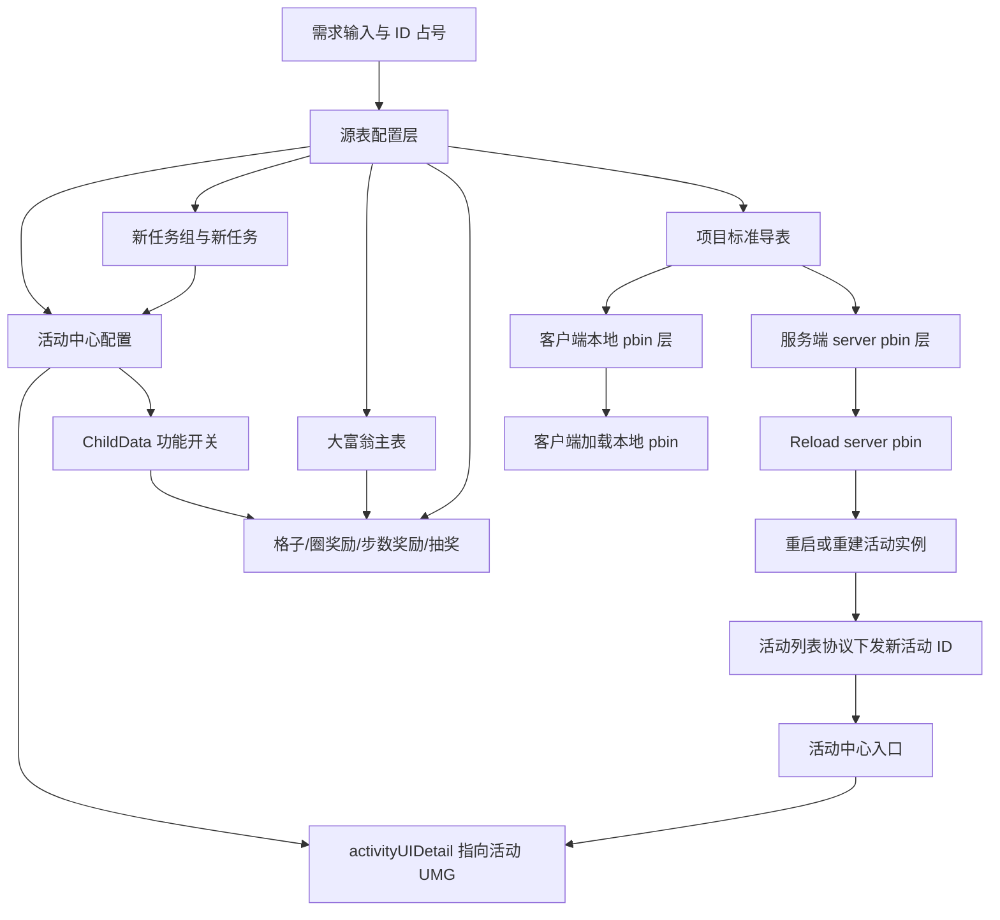
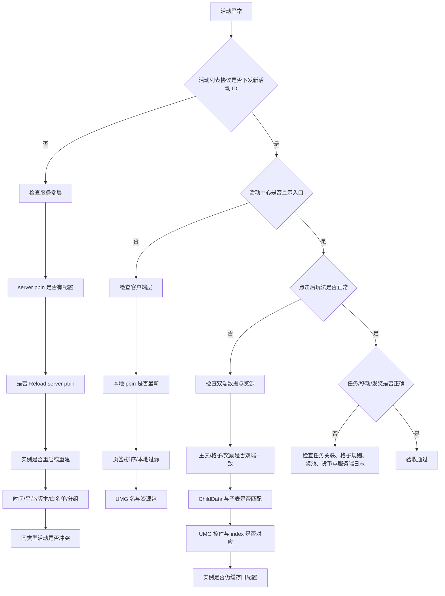

# 大富翁换皮通用模板

> **用途：**指导在不改动标准大富翁玩法逻辑的前提下，复制既有活动并完成配置、任务、UMG 美术、双端加载、入口验证、验收与提交。  
> **使用方式：**将文中的尖括号占位符替换为本期真实值；未确认时保留“待填写”，禁止根据历史活动猜测。  
> **更新日期：**2026-07-31

---

## 目录

1. [适用边界与三层区分](#1-适用边界与三层区分)
2. [配置关系](#2-配置关系)
3. [需求输入清单](#3-需求输入清单)
4. [ID 规划](#4-id-规划)
5. [活动中心配置](#5-活动中心配置)
6. [任务与任务组](#6-任务与任务组)
7. [大富翁主表与各子表](#7-大富翁主表与各子表)
8. [UMG 与美术](#8-umg-与美术)
9. [导表与双端加载](#9-导表与双端加载)
10. [入口显示机制](#10-入口显示机制)
11. [排查决策树](#11-排查决策树)
12. [验收 Checklist](#12-验收-checklist)
13. [提交流程](#13-提交流程)
14. [可复制执行记录](#14-可复制执行记录)
15. [常见错误与 iWiki 来源](#15-常见错误与-iwiki-来源)

---

## 1. 适用边界与三层区分

### 1.1 是否需要改代码

| 变更范围 | 通常是否改代码 | 执行要求 |
|---|---:|---|
| 替换标题、时间、任务、奖励、货币、背景、角色、贴图等 | 否 | 复用既有活动类型、Lua、协议和 UMG 契约 |
| 调整既有格子类型的组合、顺序和参数 | 否 | 遵守格子关联、跳转和奖励规则 |
| 在既有 UMG 中换资源，控件名、动画名、层级接口不变 | 否 | 完整回归所有子界面与动画 |
| 新增格子类型、玩法状态、协议字段或结算规则 | 是 | 客户端、服务端共同评估和开发 |
| 删除或重命名 Lua/蓝图绑定控件、动画、事件 | 通常是 | 同步修改绑定逻辑并全量回归 |
| 同类型活动同时开放 | 先评估 | 确认实例、任务、货币、缓存和协议是否按活动 ID 隔离 |

**默认不改代码的前提：**继续使用标准大富翁能力，且 `<活动UMG>` 保持既有脚本要求的控件、动画、事件和接口契约。

### 1.2 三层数据必须明确区分

| 层级 | 主要内容 | 生效方式 | 能证明什么 | 不能证明什么 |
|---|---|---|---|---|
| 源表配置 | 活动中心、任务、大富翁主表、格子、奖励等 Excel | 保存源表并成功导表 | 设计数据已经录入 | 客户端或服务端已经加载 |
| 客户端本地 pbin | 客户端活动配置、大富翁配置、任务展示数据 | 导出客户端产物并执行客户端本地 pbin 加载/GM | 当前客户端读到了新配置 | 服务端已创建活动、会下发入口或能正确发奖 |
| 服务端 server pbin / 活动实例 | 服务端配置、活动实例、任务状态、掷骰和发奖逻辑 | Reload server pbin，并按环境重启服务或重建活动实例 | 服务端已加载配置并可创建或刷新实例 | 客户端资源和 UMG 一定完整 |

> **核心原则：**“源表已填写”“客户端本地 pbin 已切换”“服务端活动已生效”是三件不同的事，必须分别验收。

---

## 2. 配置关系

关键关系：

- 活动中心配置以 `<新活动ID>` 为主标识，并通过 `activityUIDetail` 关联 `<活动UMG>`。
- `activityTaskGroup` 关联 `<新任务组ID>`；新任务组再关联 `<新任务ID集合>`。
- 大富翁主表及所有启用的子表通过 `activityId=<新活动ID>` 归属活动。
- `ChildData`、子表数据、UMG 展示和服务端能力必须一致。

---

## 3. 需求输入清单

在操作 Excel 前收齐以下信息：

- [ ] 旧活动 ID：`<旧活动ID>`
- [ ] 新活动 ID：`<新活动ID>`
- [ ] 正式标题、副标题、规则文案：`<活动标题>` / `<活动副标题>` / `<规则文案>`
- [ ] 展示时间、活动时间、领奖截止时间：`<展示时间>` / `<活动时间>` / `<领奖时间>`
- [ ] 目标 UMG：`<活动UMG>`
- [ ] 活动中心页签、排序、平台、版本、地区、渠道、白名单和分组条件
- [ ] 每日、每周、累计任务需求及刷新规则
- [ ] 任务跳转、任务奖励、自动发奖和前置条件
- [ ] 掷骰消耗：`<活动货币ID>-<单次消耗数量>`
- [ ] 活动货币的获得、有效期、清理时机及是否与旧活动共享
- [ ] 格子数量、棋盘路径和格子类型使用方案
- [ ] 格子奖励、圈奖励、步数奖励、抽奖池与保底需求
- [ ] `ChildData` 中需要开启的功能及对应子表、界面
- [ ] 新美术资源、国际化文本、声音、Spine、特效、材质、图集和资源包归属
- [ ] 旧活动是否停用；若并行，是否完成同类型多实例评估
- [ ] 联调服务器、客户端版本、服务端发布及活动实例重建负责人

---

## 4. ID 规划

> 所有 ID 必须基于最新源表和团队占号记录确认。合入前再次检查，避免并行分支抢号。

| 配置对象 | 旧值/模板 | 新值 | 唯一性与规则 | 状态 |
|---|---|---|---|---|
| 活动 ID | `<旧活动ID>` | `<新活动ID>` | 全局唯一 | 待填写 |
| 每日任务组 ID | `<旧每日任务组ID>` | `<新每日任务组ID>` | 新建，不复用旧活动组 | 待占号 |
| 每周任务组 ID | `<旧每周任务组ID>` | `<新每周任务组ID>` | 新建，不复用旧活动组 | 待占号 |
| 累计任务组 ID | `<旧累计任务组ID>` | `<新累计任务组ID>` | 新建，不复用旧活动组 | 待占号 |
| 任务 ID | `<旧任务ID集合>` | `<新任务ID集合>` | 建议全部新建，避免进度和领奖状态串用 | 待占号 |
| 格子主键 | `<旧格子主键区间>` | `<新格子主键区间>` | 全局唯一；不能把主键当格子序号 | 待占号 |
| 圈奖励主键 | `<旧圈奖励主键区间>` | `<新圈奖励主键区间>` | 全局唯一 | 待占号 |
| 步数奖励主键 | `<旧步数奖励主键区间>` | `<新步数奖励主键区间>` | 启用步数奖励时分配 | 按需 |
| 抽奖奖励主键 | `<旧抽奖主键区间>` | `<新抽奖主键区间>` | 启用抽奖格时分配 | 按需 |
| 抽奖池 ID | `<旧奖池ID>` | `<新奖池ID>` | 活动内关联清晰，避免误连其他活动 | 按需 |

### 占号检查

1. 在最新源表对应 ID 列全列搜索候选值。
2. 检查团队占号记录和待合入分支。
3. 导表后检查客户端、服务端产物是否出现重复键。
4. 提交前更新目标分支并复查一次。

---

## 5. 活动中心配置

源表：`<活动中心配置源表>`。

复制 `<旧活动ID>` 的活动配置行后逐字段修改，禁止只改活动 ID：

| 字段/类别 | 新活动模板值 | 检查要点 |
|---|---|---|
| `id` | `<新活动ID>` | 全局唯一 |
| 正式标题/副标题 | `<活动标题>` / `<活动副标题>` | 清理旧文案、制表符和异常换行 |
| 活动类型 | `<大富翁活动类型>` | 保持标准大富翁类型 |
| `activityUIDetail` | `<活动UMG>` | 精确资产名，不带 `.uasset` |
| `activityTaskGroup` | `<新每日任务组ID>;<新每周任务组ID>;<新累计任务组ID>` | 使用英文分号，不能复用旧组 |
| 展示/活动/领奖时间 | `<最终排期>` | 不机械继承旧活动；检查时区和边界 |
| 活动中心展示 | `<是否展示>` | 只是必要条件，不等于服务端一定下发 |
| 页签/排序/置底 | `<页签与排序>` | 确认入口所在位置 |
| 平台/版本/地区/渠道/白名单 | `<投放条件>` | 任一条件不满足都可能无入口 |
| 活动分组 | `<可见场景>` | 不遗留旧活动场景 |
| 活动货币/活动参数 | `<活动货币与参数>` | 明确发放、消耗、有效期和清理 |
| 背景/缩略图/资源包组 | `<新资源配置>` | 不遗留旧资源路径 |
| `ChildData` | `<功能开关配置>` | 开关、子表数据和 UMG 功能必须一致 |

### ChildData 功能开关规则

- `ChildData` 是对应子功能是否启用的重要配置来源，不能只靠 UMG 显示代替配置。
- 开启某功能时，必须同时具备子表数据、客户端界面和服务端能力。
- 关闭某功能时，UMG 应隐藏或禁用对应入口。
- 圈奖励、步数奖励、抽奖、任务等功能是否展示和可用，以本期 iWiki、实际字段定义和最终源表为准。
- 复制旧活动后逐项复核，防止“开关已开但无数据”或“数据已配但开关未开”。

---

## 6. 任务与任务组

### 6.1 推荐操作顺序

1. 复制旧活动任务作为结构模板。
2. 为新任务分配 `<新任务ID集合>`。
3. 修改任务名称、描述、条件、参数、跳转、奖励、有效期、自动发奖和前置关系。
4. 分别新建每日、每周、累计任务组。
5. 将各任务组的 `taskIdList` 指向对应的新任务 ID。
6. 将三个新任务组回填到新活动配置的 `activityTaskGroup`。
7. 验证刷新周期、进度累计和领奖状态不会与旧活动串用。

### 6.2 任务模板

| 新任务 ID | 任务组 | 名称/描述 | 条件与参数 | 跳转 | 奖励 | 刷新/累计规则 | 状态 |
|---|---|---|---|---|---|---|---|
| `<新任务ID-1>` | 每日 | `<任务文案>` | `<条件>` | `<跳转配置>` | `<奖励>` | 每日 | 待填写 |
| `<新任务ID-2>` | 每周 | `<任务文案>` | `<条件>` | `<跳转配置>` | `<奖励>` | 每周 | 待填写 |
| `<新任务ID-3>` | 累计 | `<任务文案>` | `<条件>` | `<跳转配置>` | `<奖励>` | 活动期累计 | 待填写 |

### 6.3 任务组模板

| 新任务组 ID | 类型 | `taskIdList` | 检查 |
|---|---|---|---|
| `<新每日任务组ID>` | 每日 | `<每日任务ID列表>` | 每日刷新，不引用旧任务 |
| `<新每周任务组ID>` | 每周 | `<每周任务ID列表>` | 每周刷新，不引用旧任务 |
| `<新累计任务组ID>` | 累计 | `<累计任务ID列表>` | 活动期累计，不错误重置 |

---

## 7. 大富翁主表与各子表

源表：`<大富翁配置源表>`。

### 7.1 主表

| 字段 | 模板值 | 规则 |
|---|---|---|
| `activityId` | `<新活动ID>` | 每个活动仅一条主配置 |
| `costItem` | `<活动货币ID>-<数量>` | 核对货币来源、消耗和清理 |
| `stepWeight` | `<1至6点权重>` | 顺序对应骰子点数；服务端权重总和必须有效 |

### 7.2 格子表与格子类型

通用字段：

| 字段 | 模板 | 规则 |
|---|---|---|
| `id` | `<新格子主键>` | 全局唯一 |
| `activityId` | `<新活动ID>` | 所有格子归属新活动 |
| `index` | `<格子序号>` | 从 1 开始，活动内唯一，并与 UMG 数字格控件一一对应 |
| `type` | `<格子类型>` | 只能使用项目已支持的类型 |
| `baseRewards` | `<基础奖励>` | 奖励类型格按需填写 |
| `cumulativeRewards` | `<宝藏累积奖励>` | 仅宝藏格按规则填写 |
| `cumulativeCountLimit` | `<宝藏累积次数上限>` | 宝藏格必须明确上限 |
| `poolId` | `<奖池ID>` | 仅抽奖格使用，并能关联抽奖表 |
| `forwardCfg` | `<步数,方向>` | 前进/加油站按规则填写 |

| 枚举 | 中文类型 | 关键规则 |
|---|---|---|
| `AMGT_EMPTY` | 空白 | 不配置奖励或跳转数据 |
| `AMGT_BEGIN` | 起点 | 一个活动只能有一个起点；经过/停留的圈数逻辑按玩法实现验收 |
| `AMGT_NORMAL_REWARD` | 常规奖励 | 配置基础奖励，验证按规则发放 |
| `AMGT_SPECIAL_REWARD` | 贵重奖励 | 配置贵重奖励及对应表现 |
| `AMGT_LOTTERY` | 抽奖 | 必须配置有效 `poolId`，奖池必须存在 |
| `AMGT_CUMULATIVE` | 宝藏 | 核对基础奖励、累积奖励和 `cumulativeCountLimit`；不得无上限累积 |
| `AMGT_FORWARD` | 前进 | 配置前进步数与 UMG 表现方向；检查目标合法 |
| `AMGT_JUMP` | 加油站 | 起点与落点成对；起点配置正向步数，落点步数为 0；跳转链不可成环 |
| `AMGT_DOUBLE_DICE` | 双倍骰子 | 验证骰子效果及清理时机 |
| `AMGT_CONFIRMED_DICE` | 指定点数 | 验证选点界面、可选范围和消耗 |
| `AMGT_END` | 终点 | 按棋盘拓扑使用，不能与起点规则冲突 |

**格子强校验：**

- [ ] 起点唯一。
- [ ] `index` 从 1 开始，活动内无重复、无断档，并对应 UMG 中相同数字的格子控件。
- [ ] 主键 `id` 与 `index` 概念分离，不能依赖主键连续驱动界面。
- [ ] 加油站成对，落点类型正确且落点步数为 0。
- [ ] 前进和跳转目标均在合法棋盘范围内。
- [ ] 跳转关系不存在短环或长环。
- [ ] 宝藏格配置累积次数上限，并验证达到上限后的表现与发奖。
- [ ] 奖励道具存在、数量合理、有效期正确。

### 7.3 圈奖励表

| `id` | `activityId` | `round` | `items` | 状态 |
|---|---|---:|---|---|
| `<新圈奖励主键>` | `<新活动ID>` | `<所需圈数>` | `<奖励>` | 待填写 |

规则：`round` 必须为正数；同一活动阈值清晰且建议升序；达到条件时只按设计领取一次；没有对应奖励的圈数不要擅自补齐。

### 7.4 步数奖励表

| `id` | `activityId` | `step` | `items` | 状态 |
|---|---|---:|---|---|
| `<新步数奖励主键>` | `<新活动ID>` | `<所需步数>` | `<奖励>` | 按需填写 |

规则：仅在需求和 `ChildData` 开关启用步数奖励时配置；`step` 为正数、阈值清晰且建议升序；累计口径、领奖次数与 UMG 进度一致。

### 7.5 抽奖表

| `id` | `activityId` | `poolId` | `items` | `weight` | `guaranteeCount` |
|---|---|---|---|---:|---:|
| `<新抽奖主键>` | `<新活动ID>` | `<新奖池ID>` | `<奖励>` | `<权重>` | `<保底次数>` |

规则：只有存在抽奖格且功能开关启用时才配置；同一奖池至少有一个有效奖励；总权重不能为零；保底次数和保底奖励必须匹配；抽奖格的 `poolId` 必须能关联该活动的奖池。

---

## 8. UMG 与美术

1. 活动配置中的 `activityUIDetail` 精确填写 `<活动UMG>`，不带 `.uasset` 后缀。
2. `index=<格子序号>` 的格子必须对应 UMG 中相同数字的格子控件；格子数、控件数和路径顺序一致。
3. 替换背景、标题、角色、棋盘、格子、骰子、进度条、奖励图标、任务页和弹窗等资源。
4. 不删除或重命名 Lua/蓝图绑定的控件、动画、事件和接口。
5. 同时检查主界面、任务界面、骰子选择、抽奖、奖励提示、圈/步进度等子界面。
6. 检查图集、Spine、特效、材质、声音、字体、国际化和软引用。
7. 检查尺寸、九宫格、锚点、裁剪、层级、刘海屏及多分辨率适配。
8. 确认新资源进入正确 Pak/Chunk/下载包，活动中心缩略图和资源包映射已更新。
9. `ChildData` 关闭的功能不应残留可点击入口；开启的功能必须有完整界面和数据。

---

## 9. 导表与双端加载

### 9.1 标准流程

1. 保存并关闭 Excel，避免锁文件或读取旧缓存。
2. 使用项目标准工具导出 `<活动中心配置源表>`。
3. 使用项目标准工具导出 `<大富翁配置源表>`。
4. 确认导表无重复主键、非法奖励、字段格式或外键错误。
5. 分别检查客户端产物和服务端产物。
6. 客户端执行本地 pbin 加载/GM。
7. 服务端执行 **Reload server pbin**。
8. 对已创建实例执行服务重启、活动实例销毁重建或环境规定的刷新操作。
9. 重新登录或重新拉取活动列表和活动详情。
10. 以协议、玩法行为和发奖结果完成端到端验收。

### 9.2 主要产物

| 配置来源 | 主要产物 |
|---|---|
| 活动配置 | `ActivityMainConfigForLetsGo_common` |
| 活动任务组 | `TaskGroupData_activity` |
| 活动任务 | `TaskConfData_activity` |
| 大富翁主表 | `ActivityMonopolyMainData` |
| 格子表 | `ActivityMonopolyGridData` |
| 圈奖励 | `ActivityMonopolyRoundRewardData` |
| 步数奖励 | `ActivityMonopolyStepRewardData` |
| 抽奖表 | `ActivityMonopolyLotteryData` |

### 9.3 三层验收记录

| 检查项 | 源表配置 | 客户端本地 pbin | 服务端 server pbin / 活动实例 |
|---|---|---|---|
| 新活动主配置 | `<结果>` | `<结果>` | `<结果>` |
| 新任务组/任务 | `<结果>` | `<结果>` | `<结果>` |
| 大富翁主表 | `<结果>` | `<结果>` | `<结果>` |
| 格子 | `<数量/范围>` | `<数量/范围>` | `<数量/范围>` |
| 圈/步/抽奖 | `<结果>` | `<结果>` | `<结果>` |
| 实际加载时间/版本 | 不适用 | `<客户端版本>` | `<服务端版本/实例>` |

> **注意：**客户端本地 pbin 加载只影响客户端，不能替代服务端 Reload，也不能证明新活动实例已经创建。

---

## 10. 入口显示机制

活动中心入口的判断顺序：

1. 服务端 server pbin 中存在 `<新活动ID>` 的有效活动配置。
2. 活动实例成功创建或刷新，并满足时间、平台、版本、地区、渠道、白名单、页签和分组条件。
3. 服务端活动列表协议下发 `<新活动ID>`。
4. 客户端加载最新本地 pbin，且未在本地过滤该活动。
5. `<活动UMG>` 和对应资源包可用，最终创建活动界面。

> 客户端源表或本地 pbin 中存在活动行，不等于入口已经开放。入口是否由服务端认可，应首先检查活动列表协议是否下发 `<新活动ID>`。

---

## 11. 排查决策树

---

## 12. 验收 Checklist

### 12.1 配置与关联

- [ ] `<新活动ID>` 全局唯一，所有子表 `activityId` 归属正确。
- [ ] 标题、副标题、规则、时间和投放条件为最终值。
- [ ] `<活动UMG>` 精确无误。
- [ ] 新任务组不复用旧活动任务组，新任务不会串用进度。
- [ ] 主表、格子、圈奖励、步数奖励、抽奖按需求完整配置。
- [ ] `ChildData` 开关、子表数据和 UMG 功能一致。
- [ ] 同类型活动并行风险已处理。

### 12.2 格子与奖励

- [ ] 格子类型的使用符合需求。
- [ ] 起点唯一，`index` 连续唯一并与 UMG 数字控件对应。
- [ ] 前进/加油站目标合法，加油站成对，跳转不可成环。
- [ ] 宝藏累积次数上限已配置并验证。
- [ ] 圈奖励、步数奖励条件和领取次数正确。
- [ ] 抽奖奖池、权重和保底条件正确。
- [ ] 所有奖励道具、数量、有效期和发放次数正确。

### 12.3 双端与入口

- [ ] 客户端产物包含新活动完整数据。
- [ ] 服务端产物包含新活动完整数据。
- [ ] 已执行客户端本地 pbin 加载/GM。
- [ ] 已执行 Reload server pbin。
- [ ] 已重启或重建活动实例。
- [ ] 活动列表协议下发 `<新活动ID>`。
- [ ] 入口页签、标题、缩略图、排序和资源下载正确。

### 12.4 功能与美术

- [ ] 掷骰消耗、点数权重、移动和绕圈正确。
- [ ] 所有已使用格子类型表现正确。
- [ ] 任务刷新、跳转、领奖和一键领取正确。
- [ ] 活动结束后的入口、任务、货币和状态清理正确。
- [ ] 主界面及所有子界面无旧活动资源和文案残留。
- [ ] 控件、动画、Spine、特效、材质、声音和多分辨率适配正常。

---

## 13. 提交流程

1. 更新最新配置分支并再次检查占号。
2. 提交源表变更，附 `<新活动ID>`、`<新任务组ID>`、格子和奖励主键范围。
3. 提交 UMG、美术、国际化和资源包映射，附完整资源清单。
4. 保存导表日志和客户端、服务端产物核验结果。
5. 由服务端负责人确认 server pbin 加载及实例重建方式。
6. 由客户端负责人确认本地 pbin、资源包和 UMG 加载。
7. 提测单中写明旧活动处理方案、同类型并行结论和回滚方案。
8. 禁止只提交生成产物而遗漏源表，也禁止只提交源表而遗漏必须入库的资源。

---

## 14. 可复制执行记录

| 阶段 | 操作 | 负责人 | 时间 | 结果/证据 | 状态 |
|---|---|---|---|---|---|
| 需求 | 输入清单确认 | `<负责人>` | `<时间>` | `<需求链接>` | ☐ |
| 占号 | 全局 ID 复核 | `<负责人>` | `<时间>` | `<占号记录>` | ☐ |
| 源表 | 活动中心配置 | `<负责人>` | `<时间>` | `<表内行/截图>` | ☐ |
| 源表 | 任务与任务组 | `<负责人>` | `<时间>` | `<ID列表>` | ☐ |
| 源表 | 主表与格子 | `<负责人>` | `<时间>` | `<范围/数量>` | ☐ |
| 源表 | 圈/步/抽奖 | `<负责人>` | `<时间>` | `<范围/条件>` | ☐ |
| 资源 | UMG 与美术 | `<负责人>` | `<时间>` | `<资源清单>` | ☐ |
| 导表 | 客户端产物 | `<负责人>` | `<时间>` | `<日志/版本>` | ☐ |
| 导表 | 服务端产物 | `<负责人>` | `<时间>` | `<日志/版本>` | ☐ |
| 加载 | 客户端本地 pbin | `<负责人>` | `<时间>` | `<环境>` | ☐ |
| 加载 | server pbin Reload | `<负责人>` | `<时间>` | `<环境/日志>` | ☐ |
| 实例 | 重启/重建活动实例 | `<负责人>` | `<时间>` | `<实例信息>` | ☐ |
| 协议 | 活动列表下发 | `<负责人>` | `<时间>` | `<协议记录>` | ☐ |
| 验收 | 功能与美术 | `<负责人>` | `<时间>` | `<测试报告>` | ☐ |
| 提交 | 配置/资源提交 | `<负责人>` | `<时间>` | `<变更单>` | ☐ |

---

## 15. 常见错误与 iWiki 来源

### 15.1 常见错误

| 现象/错误 | 常见原因 | 正确处理 |
|---|---|---|
| 新活动复用旧任务组 | 复制活动行后只改活动 ID | 新建实际未占用的任务组，并建立新任务关联 |
| 文档写死未经确认的新 ID | 只看局部空号，未做占号复核 | 保留“以实际未占用值为准”，在最新源表和占号记录中确认 |
| Excel 已填但游戏无入口 | 混淆源表、客户端和服务端三层 | 导表后分别加载客户端 pbin、Reload server pbin、重建实例 |
| 客户端本地 pbin 加载后认为服务端已生效 | 本地加载只切客户端 | 服务端仍需 Reload 和重启/重建活动实例 |
| 协议未下发却持续修改 UMG | 服务端没有认可或创建活动 | 先查活动列表协议、server pbin、时间、条件和实例 |
| 协议已下发但无入口 | 客户端过滤、页签、UMG 或资源包错误 | 检查客户端本地 pbin、入口条件和资源下载 |
| 有入口但棋盘为空或错位 | 双端格子缺失，或 `index` 与 UMG 不对应 | 检查双端格子数量、序号和数字控件映射 |
| 两个同类型活动只有一个正常 | 活动实例、状态或协议路由冲突 | 停用旧活动、错开时间或完成多实例专项改造 |
| 加油站跳转异常或卡死 | 起落点不成对、目标非法或形成循环 | 校验起点正步数、落点步数为零，并检查完整跳转图无环 |
| 宝藏奖励无限累积 | 未配置或未验证次数上限 | 配置 `cumulativeCountLimit` 并测试达到上限后的行为 |
| 抽奖格打开失败 | `poolId` 无对应奖池或功能开关未开 | 对齐抽奖格、奖池、`ChildData`、权重和保底 |
| 圈/步奖励不显示 | 条件、`ChildData`、子表或实例缓存不一致 | 检查阈值、开关、双端产物并重建实例 |
| UMG 打开后按钮失效 | 换皮时改了绑定控件或动画名 | 恢复绑定契约，或同步修改逻辑并全量回归 |
| 本地正常、测试环境缺资源 | 新资源未进入 Pak/Chunk 或提交不完整 | 检查软引用、资源包映射、下载和提交清单 |
| 导表成功但仍读旧值 | 客户端、服务端或实例仍有缓存 | 分层确认加载版本，Reload 并重启/重建实例 |

### 15.2 iWiki 来源与关键规则索引

| 文档 | iWiki ID | 本模板保留的关键规则 |
|---|---:|---|
| 父文档 | `4025863004` | 大富翁活动整体配置与操作入口 |
| 配置向子文档 | `4025863005` | 格子类型、起点唯一、`index` 对应 UMG 数字控件、跳转不可成环、宝藏次数上限、圈/步/抽奖条件 |
| 开发向子文档 | `4025863006` | `ChildData` 功能开关、客户端/服务端加载、活动实例及联调注意事项 |

父文档链接：<https://iwiki.woa.com/p/4025863004>

> iWiki 可能需要 OA 登录。若 iWiki 后续更新或与项目当前字段定义不一致，以最新 iWiki、最新源表和当前导表规则为准。

### 15.3 日期

- 更新日期：**2026-07-31**

---

> 本文从 [LearnByCompany 原始文档](https://github.com/Sarfffff/LearnByCompany/blob/main/%E6%B4%BB%E5%8A%A8%E5%BC%80%E5%8F%91/%E6%8D%A2%E7%9A%AE%E6%A8%A1%E6%9D%BF/%E5%A4%A7%E5%AF%8C%E7%BF%81%E6%8D%A2%E7%9A%AE%E6%93%8D%E4%BD%9C/%E5%A4%A7%E5%AF%8C%E7%BF%81%E6%8D%A2%E7%9A%AE%E9%80%9A%E7%94%A8%E6%A8%A1%E6%9D%BF.md) 自动同步。
